## MQCloud - 集客户端SDK，运维，监控，预警等功能的[RocketMQ](https://github.com/apache/rocketmq)企业级一站式服务平台
**它具备以下特性：**

* 跨集群：可以同时管理多个集群，对使用者透明。

* 预警功能：针对生产或消费堆积，失败，异常等情况预警，处理。

* 简单明了：用户视图-拓扑、流量、消费状况等指标直接展示；管理员视图-集群运维、监控、流程审批等。

* 安全：用户隔离，操作审批，数据安全。

* 更多特性正在开发中。

* 下图简单描述了MQCloud大概的功能：

  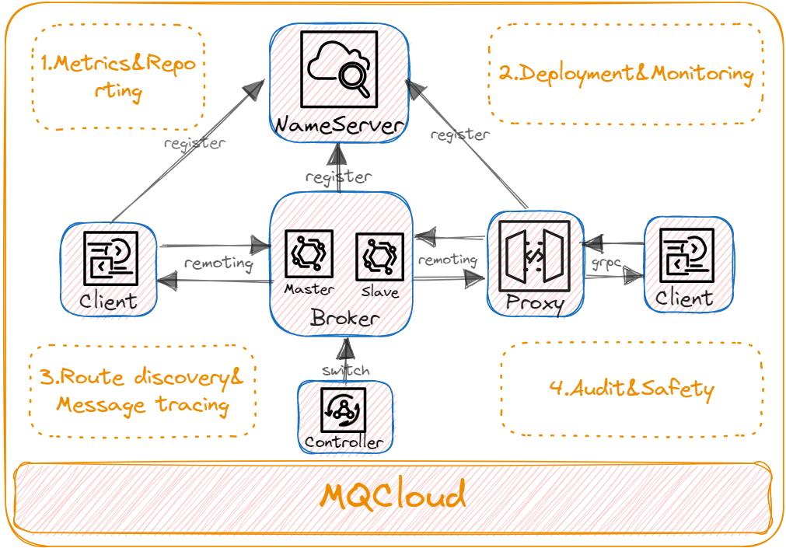

## RocketMQ版本说明
为了支持更多的统计和监控，我们对rocketmq源码进行了少量修改，及部分bug修复和优化，建议采用[搜狐版本RocketMQ](https://github.com/sohutv/mqcloud/wiki/%E5%85%B6%E4%BB%96%E8%AF%B4%E6%98%8E#user-content-rocketmq)配合MQCloud使用，获取更佳体验。

## 特性概览

* 用户topic列表-不同用户看到不同的topic，管理员可以管理所有topic

  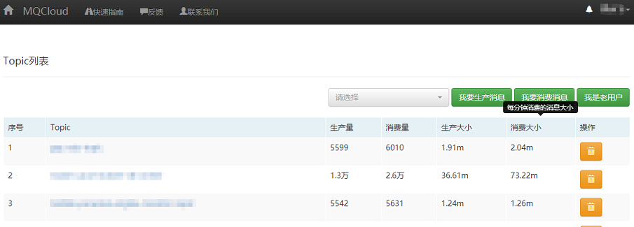

* topic详情-分三块 基本信息，今日流程，拓扑

  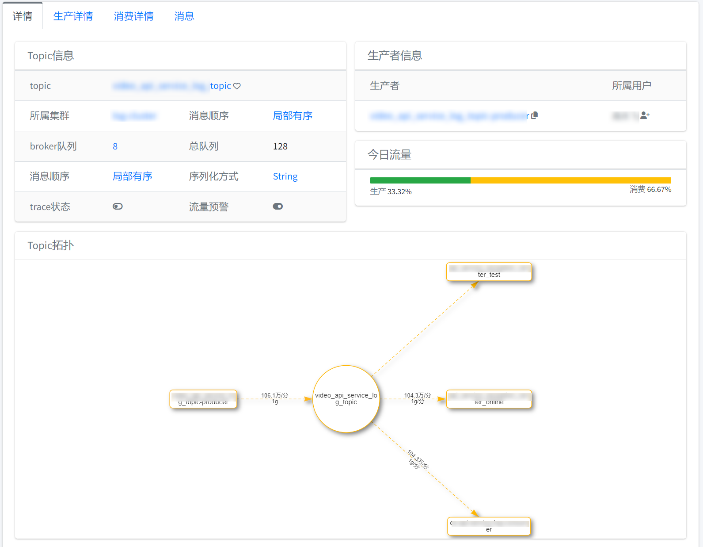

* 生产详情

  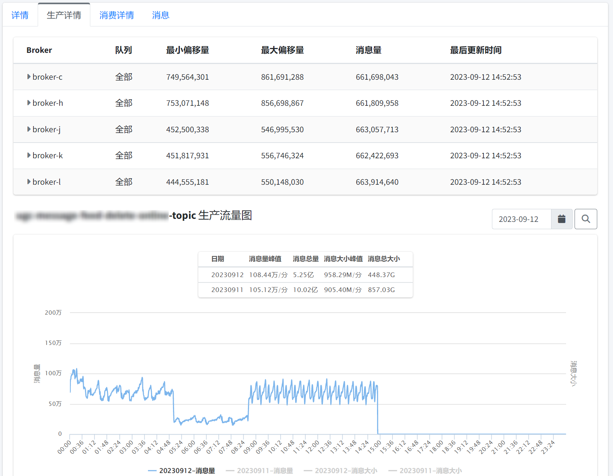

* 消费详情

  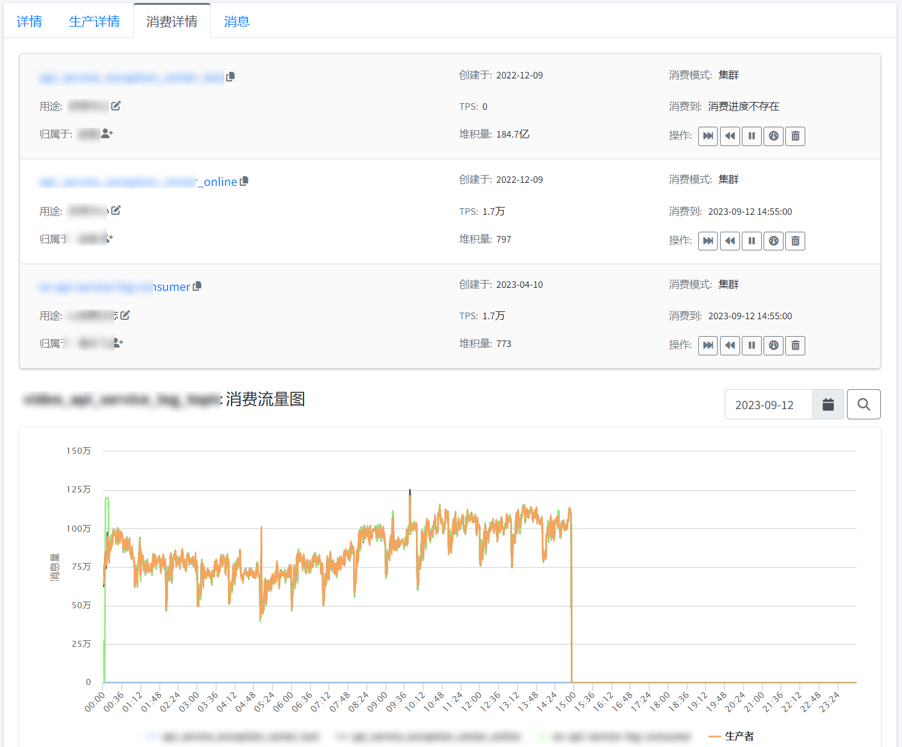

* 某个消费者具体的消费详情-可以查询重试消息和死消息

  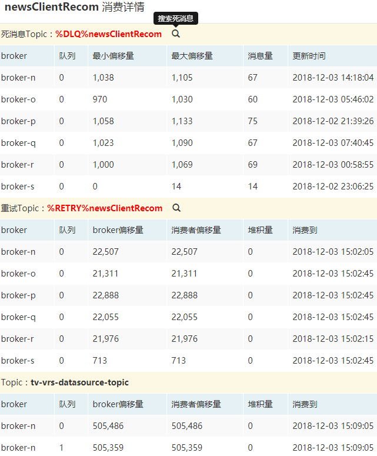

* 消息

  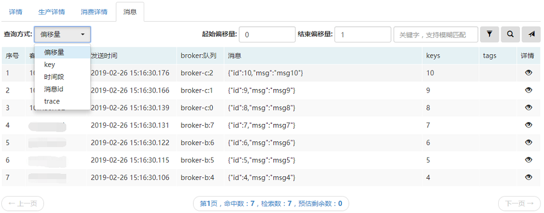

* 消息消费情况

  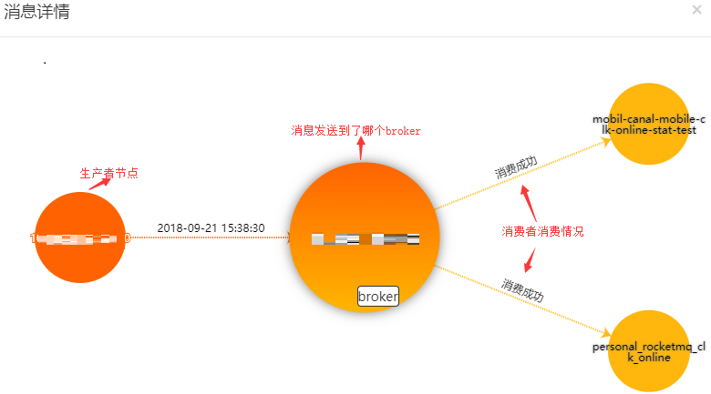

* 集群发现

  

* 集群管理

  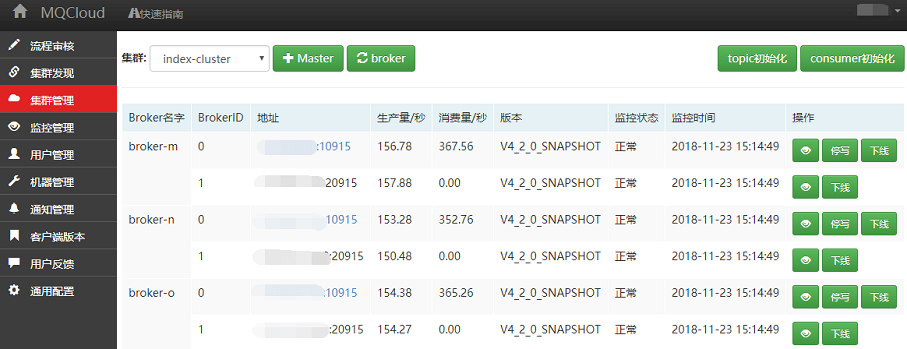

* 集群流量

  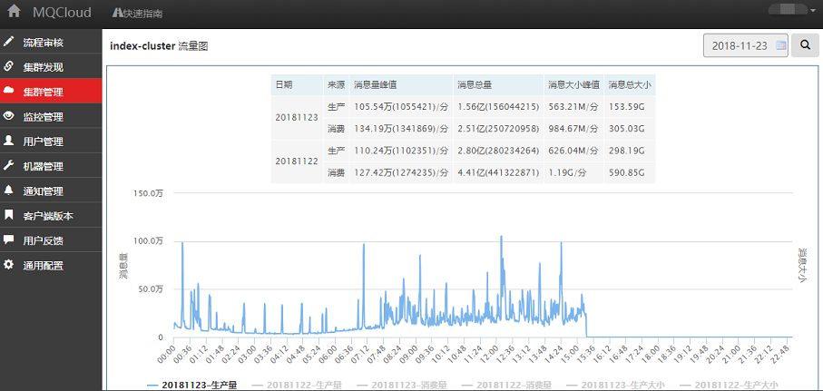

* 创建broker

  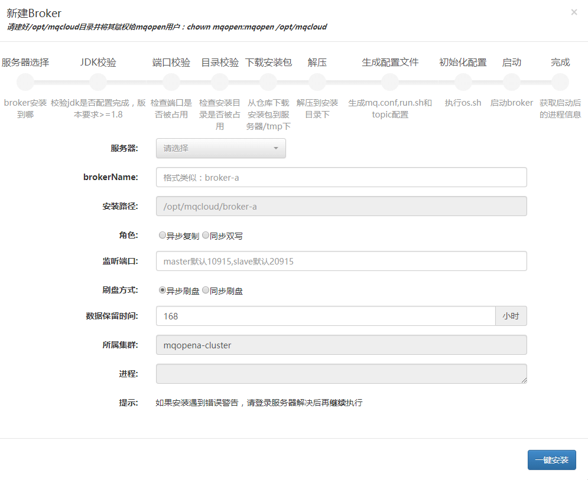

----------

## 目前运维的规模
1. 服务器：40台+
2. 集群：5个+
3. topic：370个+
4. 生产消费消息量/日：10亿条+
5. 生产消费消息大小/日：1T+
----------

## 联系方式

MQCloud QQ交流群：474960759

使用方式请参考[wiki](https://github.com/sohutv/sohu-tv-mq/wiki)。
