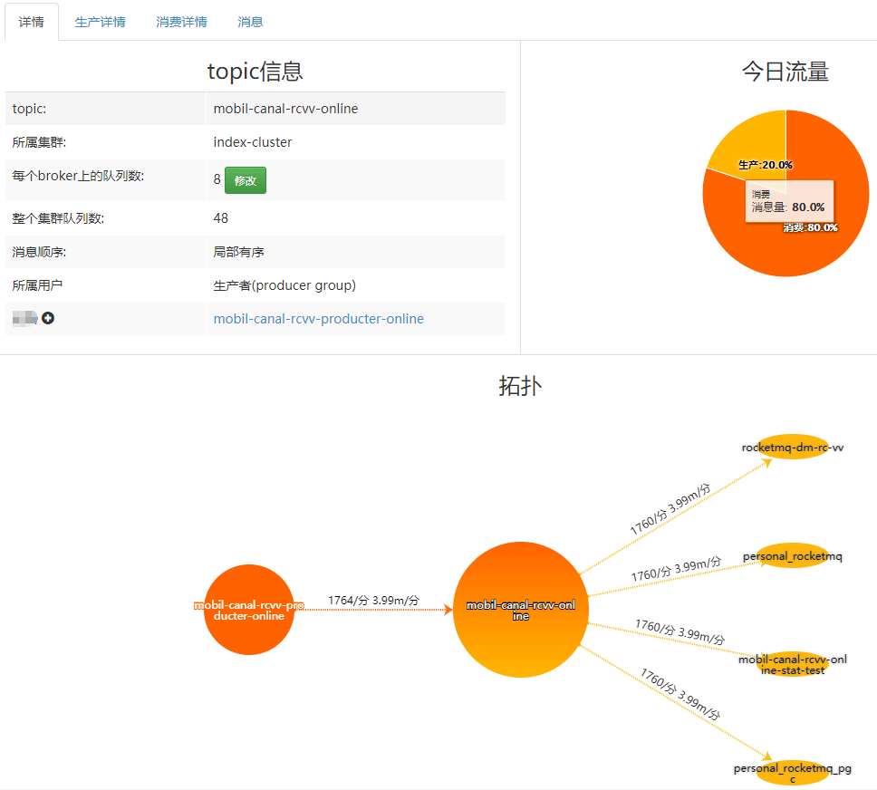
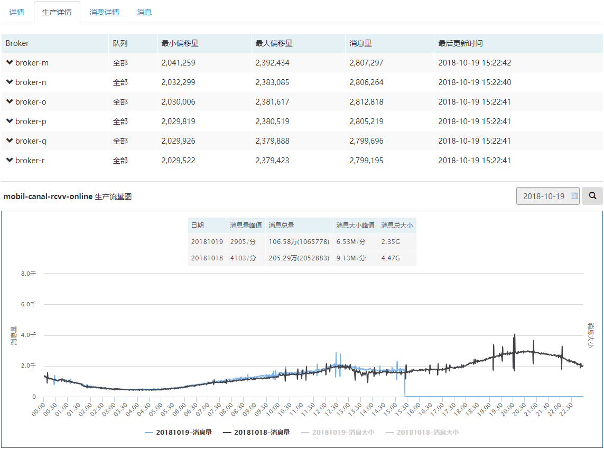
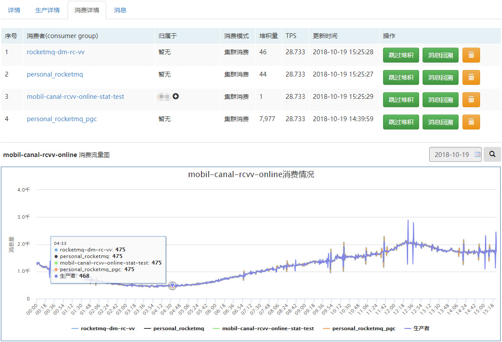
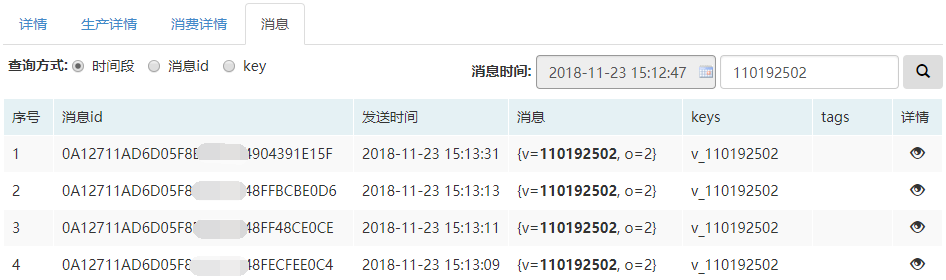
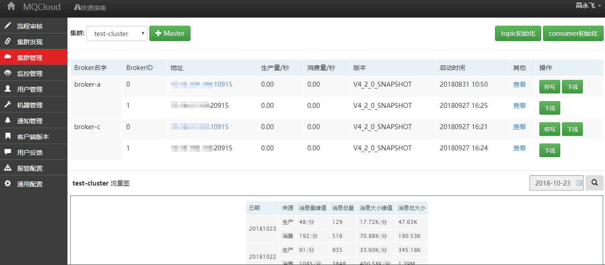
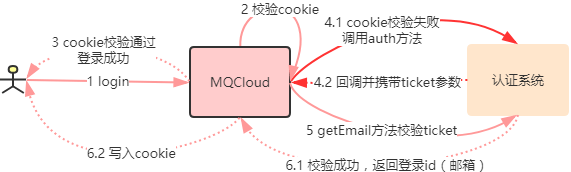

## MQCloud - [RocketMQ](https://github.com/apache/rocketmq)的企业级运维平台
**它具备以下特性：**

* 跨集群：可以同时管理多个集群，对使用者透明。

* 预警功能：针对生产或消费堆积，失败，异常等情况预警，处理。

* 简单明了：用户视图-拓扑、流量、消费状况等指标直接展示；管理员视图-集群运维、监控、流程审批等。

* 安全：用户隔离，操作审批，数据安全。

* 更多特性正在开发中。

* 下图简单描述了MQCloud大概的功能：

  


----------

## 特性概览
* 用户topic列表-不同用户看到不同的topic，管理员可以管理所有topic

  

* topic详情-分三块 基本信息，今日流程，拓扑

  

* 生产详情

  

* 消费详情

  

* 消息

  

* 消息消费情况

  

* 运维后台

  

* 创建broker

  

----------

## 目前运维的规模
1. 服务器：20台+
2. 集群：4个+
3. topic：250个+
4. 生产消费消息量/日：10亿条+
5. 生产消费消息大小/日：1T+
----------

## 模块介绍及编译
1. 模块介绍

   1. mq-client-common-open与mq-client-open为客户端模块，它封装了rocketmq-client，客户端需要依赖它才能和MQCloud进行交互。
   2. mq-cloud-common与mq-cloud为MQCloud的web端，实现管理监控等一系列功能。

2. 编译

   1. mq-client-common-open与mq-client-open最低依赖jdk1.7。
   2. mq-cloud依赖jdk1.8，其采用spring-boot实现。
   3. 编译：
      1. 在sohu-tv-mq/下，执行mvn clean install -pl "!mq-cloud"（linux系统请将"!mq-cloud"改成'!mq-cloud'执行），将编译并install mq-client-common-open，mq-client-open，mq-cloud-common模块
      2. 在sohu-tv-mq/mq-cloud/下，执行mvn clean package，将编译并打包mq-cloud.war


----------

## 配置数据库及运行
1. 数据库配置

   数据库使用mysql，不同的环境需要修改不同的配置文件，默认为local环境，默认配置参见`application-local.yml`：

   ```
   url: jdbc:mysql://127.0.0.1:3306/mq-cloud?useUnicode=true&characterEncoding=UTF-8
   username: mqcloud
   password: mqcloud
   ```

   线上数据库配置在`application-online.yml` 中。

2. 初始化数据

   初始化sql脚本，参见[init.sql](https://github.com/sohutv/sohu-tv-mq/blob/master/mq-cloud/sql/init.sql)。

3. 运行

   1. 开发工具内运行：

      经过编译后，模块的依赖会解析成功，可以直接执行`com.sohu.tv.mq.cloud.Application` 中的main函数即可。

   2. 外部运行：

      使用[下载](https://github.com/sohutv/sohu-tv-mq/releases)或编译的war包，执行

      ```
      java -Dspring.profiles.active=online -DPROJECT_DIR=日志路径 -jar mq-cloud.war
      ```

4. 访问

   直接访问mqcloud_ip:8080即可，默认管理员用户名：admin@admin.com 密码为：admin

----------

## 集群创建

1. 添加机器

   在`机器管理`模块，使用`+机器`功能将要部署name server和broker的linux机器都添加进来。

2. 修改通用配置

   1. 在`通用配置`模块，将`domain`选项修改为mqcloud部署的服务器地址(或域名)+端口，一定要带端口(原因请参考admin的`快速指南->集群管理->集群发现`中的介绍)，即使端口是80。

      *如果部署在本机，请勿使用127.0.0.1或localhost，因为部署RocketMQ broker实例时，它需要访问`domain`来获取name server地址列表。*

3. 集群发现

   1. 在`集群发现`模块，使用`+集群记录` 功能添加集群记录。
   2. 各项含义请参考提示，创建成功会在`cluster`表多一条记录。
   3. 使用`+NameServer` 功能来部署归属于该集群的name server实例(或者使用`关联NameServer`功能来关联已有的name server实例)。

4. 创建broker实例

   1. 在`集群管理`模块，使用`+Master` 功能创建broker实例。

5. 已有集群如何使用MQCloud管理？

   1. 执行上面步骤中的`1. 添加机器`。
   2. 执行上面步骤中的`2. 修改通用配置`。
   3. 执行上面步骤中的`3. 集群发现`。
   4. 导入topic：使用`集群管理`模块的`topic初始化`完成。
   5. 导入consumer：使用`集群管理`模块的`consumer初始化`完成。
   6. 用户使用`mq-client-open`客户端包（也可以使用原生RocketMQ客户端），并通过`我是老用户`完成绑定。

6. 如果添加了新的集群，最好将MQCloud重启一下，这样可以将新的集群加入到监控采集任务中。

----------

## 客户端的使用

1. 【可选】客户端增加如下依赖：

   ```
   <dependency>
       <groupId>com.sohu.tv</groupId>
       <artifactId>mq-client-open</artifactId>
   </dependency>
   ```

   *当然可以使用RocketMQ原生客户端，但是客户端统计，版本等将无法上报。*

2. 初始化后设置

   `RocketMQConsumer`和`RocketMQProducer`在调用`start()`方法前需要进行如下配置：

   ```
   setMqCloudDomain("通用配置模块的domain");
   ```

   如果消息希望序列化，还需要如下配置(采用[protostuff](https://protostuff.github.io/))：

   ```
   setMessageSerializer(new DefaultMessageSerializer<Object>());
   ```

3. 消息序列化相关

   如果发送消息时使用参数为Message对象的方法，那么消息不会经过序列化，方法类似如下：

   ```
   /**
    * 发送消息
    *
    * @param message 消息
    * @return 发送结果
    */
   public Result<SendResult> publish(Message message) {
       try {
           SendResult sendResult = producer.send(message);
           return new Result<SendResult>(true, sendResult);
       } catch (Exception e) {
           logger.error(e.getMessage(), e);
           return new Result<SendResult>(false, e);
       }
   }
   ```

   如果发送消息时使用参数为Object对象的方法，那么消息将会进行序列化，方法类似如下：

   ```
   /**
    * 发送消息
    * 
    * @param messageObject 消息数据
    * @param tags tags
    * @param keys key
    * @param delayLevel 延时级别
    * @return 发送结果
    */
   public Result<SendResult> publish(Object messageObject, String tags, String keys, MessageDelayLevel delayLevel) {
       Message message = null;
       try {
           message = buildMessage(messageObject, tags, keys, delayLevel);
       } catch (Exception e) {
           logger.error(e.getMessage(), e);
           return new Result<SendResult>(false, e);
       }
       return publish(message);
   }
   ```

   另外，如果使用序列化消息的发送方法，需要在MQCloud的`common_config`表中加入如下配置(用于MQCloud消息查询时反序列化使用)：

   ```
   INSERT INTO `common_config` (`key`, `value`, `comment`) VALUES ( 'messageSerializerClass', 'com.sohu.tv.mq.serializable.DefaultMessageSerializer', '消息序列化工具，如果发送和消费使用了该类，MQCloud也需要配置该类');
   ```

4. 其余的使用参照 用户端 -> 快速指南 -> 客户端接入模块。
----------

## 其他说明
1. 关于`common_config`表

   配置项大多用于剥离开源和公司内部的配置、实现等。

2. 关于rocketmq.zip

   版本为4.2.0，建议使用4.x版本。下载来源[https://www.apache.org/dyn/closer.cgi?path=rocketmq/4.2.0/rocketmq-all-4.2.0-bin-release.zip](https://www.apache.org/dyn/closer.cgi?path=rocketmq/4.2.0/rocketmq-all-4.2.0-bin-release.zip)。

   其中做的修改如下：

   1. rocketmq/conf下的四个日志配置文件：logback_*.xml

      ```
      将${user.home}修改为了${ROCKETMQ_HOME}，原因：默认RocketMQ往用户目录下打日志，而用户目录一般在根目录，往往分区比较小，所以改成了rocketmq所在目录。
      ```

   2. rocketmq/bin下的runserver.sh，runbroker.sh

      ```
      gc日志目录由/dev/shm改为了${BASE_DIR}/logs
      ```

   3. os.sh

      ```
      echo 'deadline' > /sys/block/${DISK}/queue/scheduler
      echo "---------------------------------------------------------------"
      sysctl vm.extra_free_kbytes
      sysctl vm.min_free_kbytes
      sysctl vm.overcommit_memory
      sysctl vm.drop_caches
      sysctl vm.zone_reclaim_mode
      sysctl vm.max_map_count
      sysctl vm.dirty_background_ratio
      sysctl vm.dirty_ratio
      sysctl vm.dirty_writeback_centisecs
      sysctl vm.page-cluster
      sysctl vm.swappiness
      su - admin -c 'ulimit -n'
      cat /sys/block/$DISK/queue/scheduler
      修改为：
      if [ ! $DISK ]; then
          echo 'deadline' > /sys/block/${DISK}/queue/scheduler
      fi
      if [ ! $DISK ]; then
          cat /sys/block/$DISK/queue/scheduler
      fi
      echo "`date +%Y%m%d-%H%M%S`" >> /opt/mqcloud/.mq_cloud_inited
      ```

3. 关于nmon.zip

   用于收集和监控服务器状况，来自于[http://nmon.sourceforge.net](http://nmon.sourceforge.net)。

4. 邮件预警实现

   默认的空实现类是：`com.sohu.tv.mq.cloud.service.impl.DefaultAlertMessageSender`。可以自己实现邮件发送方法。配置到`通用配置`里修改`alertClass`配置项。

5. 登录实现

   默认的登录采用用户名密码：`com.sohu.tv.mq.cloud.service.impl.DefaultLoginService`。当然注册和登录都没有进行太多安全性考虑，主要是基于MQCloud要部署到内网使用。

   另外还支持sso登录，可以自行实现类似如下类：

   ```
   public class SSOLoginService extends AbstractLoginService {

       @Override
       protected void auth(HttpServletRequest request, HttpServletResponse response) {
           // 跳到sso去登录认证
       }

       @Override
       protected String getEmail(String ticketKey) {
           // sso回调并携带ticket，这里调用sso进行校验ticket，获取登录id(email)
           return null;
       }

       @Override
       public void init() {
           
       }
   }
   ```

   如果采用sso认证登录，auth和getEmail方法的作用参考如下：

   

6. 版本管理

   因为使用者会依赖mq-client-*相关模块，所以如果涉及到mq-client-\*中的代码修改，需要在父pom中修改version，然后执行`mvn -N versions:update-child-modules `，这样所有的子模块的版本均会更新(`com.sohu.tv.mq.util.Version`中的版本号也会自动修改)。
