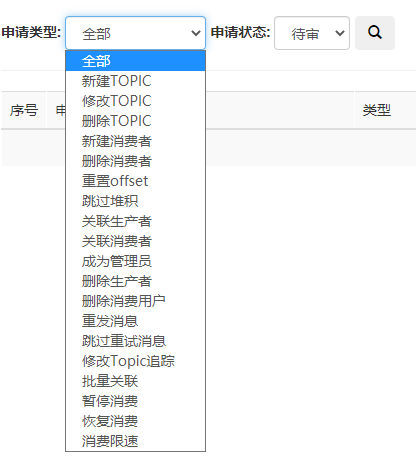
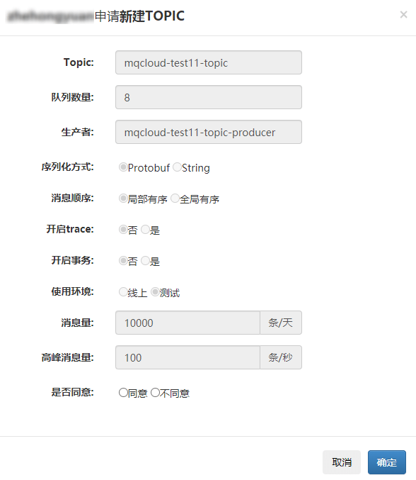
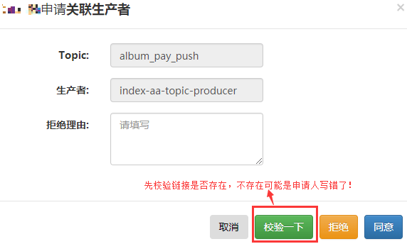
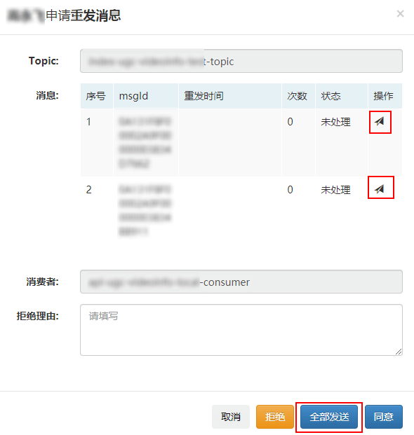

## 一、<span id="auditList">审核列表</span>

MQCloud将涉及到对rocketmq的操作均转换为申请单，进入到了审核列表：



此列表可以根据两个维度过滤：

1. 申请类型：代表用户相关的操作。
2. 申请状态：代表此申请处理进度。

审核流程避免了用户直接操作rocketmq及相关数据，由管理员审批后进行实施，提高了安全性。

当然，如果大量申请单的话，管理员一一审批可能有些繁琐，MQCloud提供了自动审批功能。只需要在application.yml中配置上：

```
mqcloud.autoAuditType: 5,6 #自动审核类型，值来自：com.sohu.tv.mq.cloud.bo.Audit.TypeEnum  
```

这样，配置的类型会自动进行审批。

## 二、<span id="auditDetail">审核详情</span>

以申请新建topic为例，介绍一下审核详情：



这里不再介绍每一项的具体含义，在[生产和消费](../userGuide/produceAndConsume#createTopic)部分已经描述过了。这里说明一下，每个申请单都会有**是否同意**的选项，可以审批通过，也可以拒绝，拒绝时需要填写拒绝理由。

另外，不同的申请单有不同的操作，比如关联生产者：



会有**校验一下**的按钮，因为rocketmq无法查询某个topic的生产者，所以生产者是用户自己填写的，有可能填错，用此按钮可以校验用户填写的生产者是否有链接，如果校验没有链接，需要咨询申请人，是否填错等。

还比如重发消息：



需要先发送消息，并保证成功后，再进行审批。类似的不再一一列举。

## 三、<span id="attention">注意事项</span>

由于审核可能涉及到操作rocketmq，所以审核的时候需要仔细。

1. **跳过堆积**：会将客户端偏移量重置到审核时的前一分钟，客户端无需重启。
2. **跳过重试消息**：需要使用mqcloud的客户端才可以，rocketmq原生是不支持的。