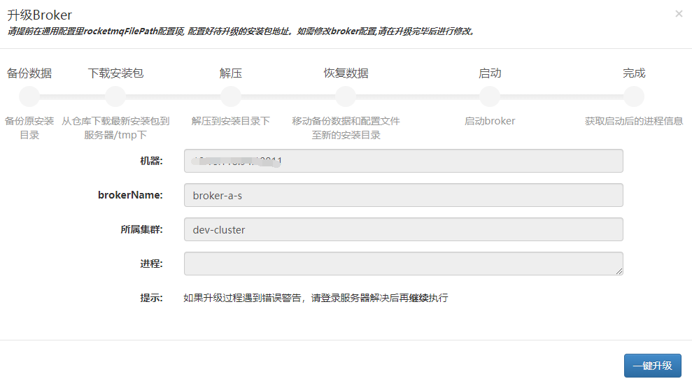
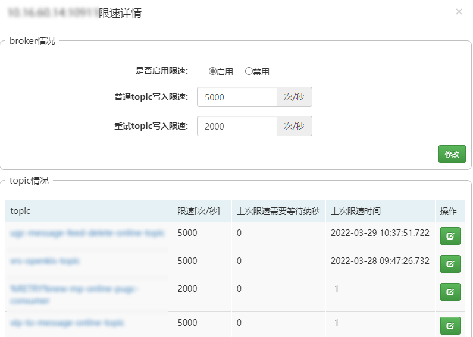
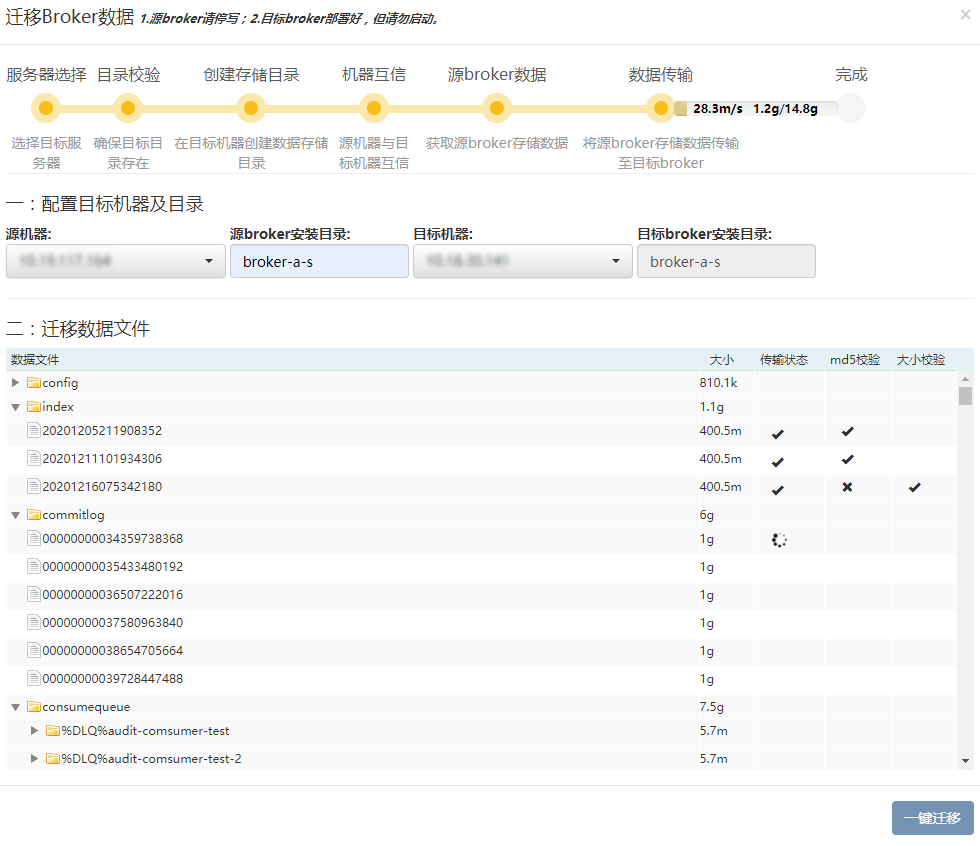

## 一、<span id="clusterList">集群管理</span>

此模块用于broker集群运维，状态展示，流量监控等。


## 二、<span id="addbroker">添加broker</span>


由于broker支持的配置项繁多，mqcloud开发配置模板来支持这些配置项，甚至支持自定义配置项，可以参考[配置模板](./brokerConfig)使用，以下几项重点说明一下：

* 安装路径：即broker的上级目录的绝对路径，需以/结尾。
* 实际安装路径：
  * master: 安装路径 + brokerName
  * slave: 安装路径 + brokerName-s
* storePathRootDir和storePathCommitLog不可修改，统一放到实际安装路径的data目录下。

*安装路径选项是为了支持部署多个broker到同一个服务器的不同硬盘上*。

broker发生变更时（新增或下线），需要手动执行**刷新broker**功能来更新broker列表。

## 三、<span id="upgradebroker">升级broker</span>



在broker下线后，可以进行升级操作。升级的基本过程为：首先备份原安装目录文件，然后根据最新的安装包进行安装操作，最后将备份的数据及配置文件移动到最新的安装目录里。

**注意：** 升级之前需要提前在[通用配置](./commonConfig)里**rocketmqFilePath**选项设置好待安装文件路径。

## 四、<span id="ext">管理外部集群</span>

mqcloud支持管理非mqcloud创建的broker，具体请参考[创建集群](https://github.com/sohutv/mqcloud/wiki/%E5%88%9B%E5%BB%BA%E9%9B%86%E7%BE%A4)。

## 五、<span id="brokerList">broker列表</span>

mqcloud支持的是一个master对应一个slave模式。管理员在列表页可以使用如下功能：

1. 点击broker的名字查看broker存储性能的百分位情况：

   

2. 点击master的id可以查看master的流量：

   

3. 点击broker的地址可以查看broker的线上配置（修改过的配置将会加粗显示）：

   

4. 点击broker的漏斗图标可以查看broker的限流配置及历史限速记录：
   
   

   broker的限速设置基于Topic维度，分为全局限速设置及单个Topic限速设置，全局设置是在未配置单个Topic限速的情况下生效。

5. 点击broker实例后的**停写**按钮可以实现写权限擦除功能，用于broker平滑下线使用（slave可以直接下线，无需停写）。

6. 停写后的broker，点击**下线**按钮，可以实现关闭broker实例的功能。

7. 下线后的broker，会出现**启动**按钮和**升级**按钮，分别对应启动broker和升级broker两种功能。

   若broker下线后想从集群移除，需要执行**刷新broker**功能。

8. online环境的mqcloud会对broker实例进行存活性监控，一旦探活失败，将会通过邮件通知管理员。

## 六、<span id="clusterTraffic">集群流量</span>

mqcloud根据broker的流量进行聚合，得到了集群的流量情况，可以通过此图查看集群整体流量情况。

## 七、<span id="migrate">数据迁移</span>

broker迁移到别的机器时，往往需要将broker的数据同时迁移，而broker的数据基本包括如下几项：

```
data
|-- commitlog
|-- config
|-- consumequeue
|-- index
```

这些数据有时多达几十G甚至上百G，使用linux命令拷贝这些数据往往存在如下问题：

1. 数据量很大，小文件太多，拷贝起来很耗时。
2. 拷贝完毕无法校验是否正确。
3. 如果大批量迁移broker数据，手动执行拷贝极易出错。

鉴于以上问题，MQCloud提供了**数据迁移**的功能，可以从如下两个入口进入数据迁移模块：

1. MQCloud管理后台->集群管理->数据迁移按钮（适用于在任意两个broker间迁移数据）
2. MQCloud管理后台->集群管理->下线broker->数据迁移（适用于迁移下线的broker数据）

迁移模块如下：



说一下几个参数含义：

1. 源机器：需要迁移数据的机器。
2. 源broker绝对路径：需要迁移数据的broker安装目录的绝对路径。
3. 目标机器：需要将数据迁移到的机器。
4. 目标broker绝对路径：需要将数据迁移到的broker安装目录的绝对路径。

说一下迁移过程：

1. 首先会校验一下目标broker的目录是否存在。
2. 接着会在目标broker的目录创建数据存储目录。
3. 源机器和目标机器进行自动互信。
4. 获取源broker的存储数据文件列表。
5. 数据迁移，迁移过程中会有提示进度条，上面有三个数据，从左往右含义如下：
   * 数据迁移速率
   * 已迁移大小
   * 总大小

说一下迁移文件列表各项含义：

1. 数据文件：包含了broker的各项数据文件。

2. 大小：

   * 文件夹的大小为其下的文件大小之和。
   * 文件的大小为ls -l命令列出来的大小（并非实际大小）。

3. 传输状态：

   * 大于10M的文件传输过程中会显示loading标识
   * 传输成功显示对勾
   * 传输失败显示×，鼠标放上去会提示失败信息

4. md5校验

   传输成功的文件会进行md5校验，md5若校验通过，证明大小也是一致的。

5. 大小校验

   md5校验失败的文件会进行大小校验。

**最后说一下几个注意事项**：

1. 源broker（即需要迁移数据的broker）请停止写入。
2. 目标broker请先部署好，但是请勿启动。

迁移过程其实就是将`源broker:data目录`下的数据通过ssh协议传输到`目标broker:data目录`下。

为什么不采用linux的rsync？因为只需要传输一次即可。

为什么不采用linux的nc？经过测试，传输大文件时，跟网卡和网络带宽有关，跟协议关系不大，另外nc有些linux并未预装。

另外，对于consumequeue其下的小文件过多，故如果其下的topic有多个队列，将采用压缩传输。