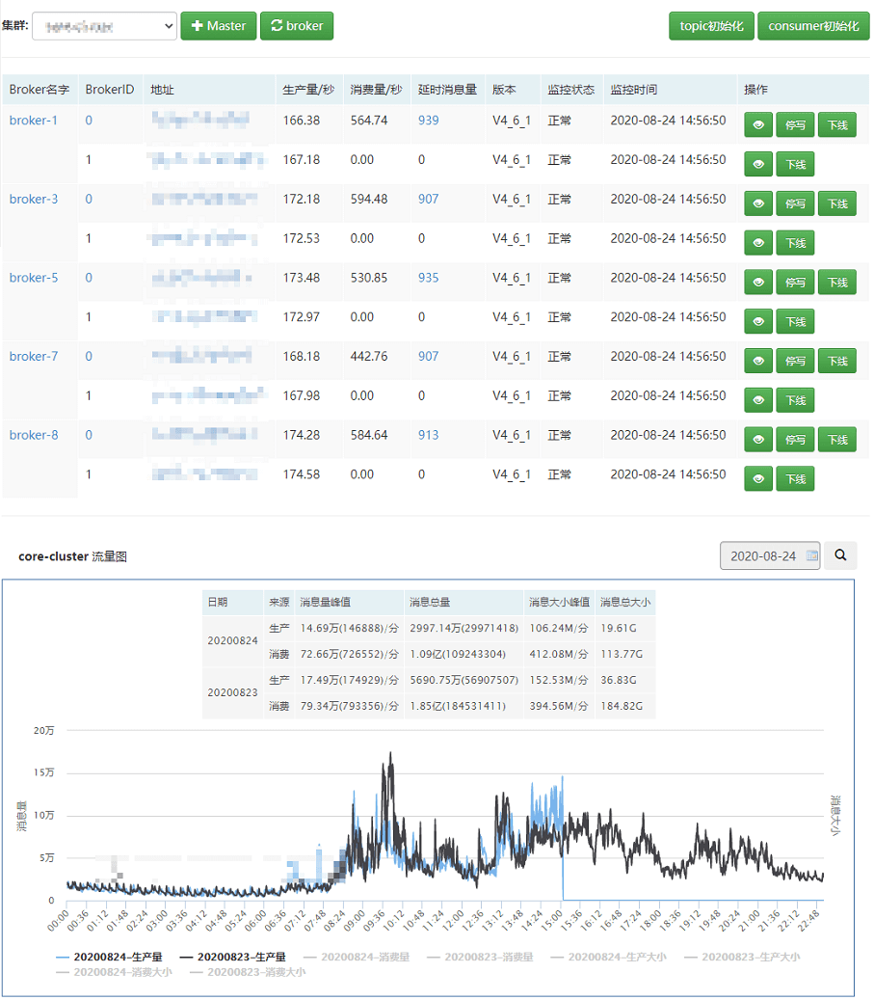
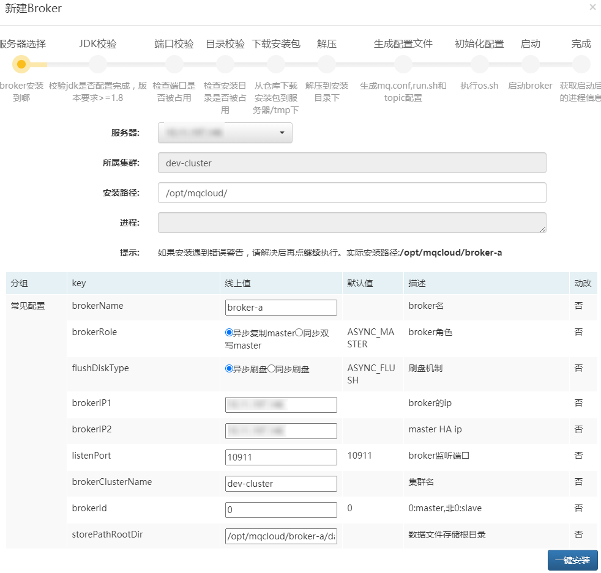
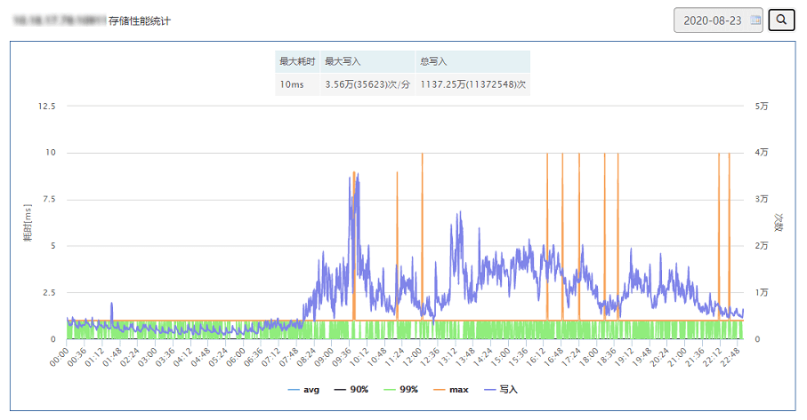
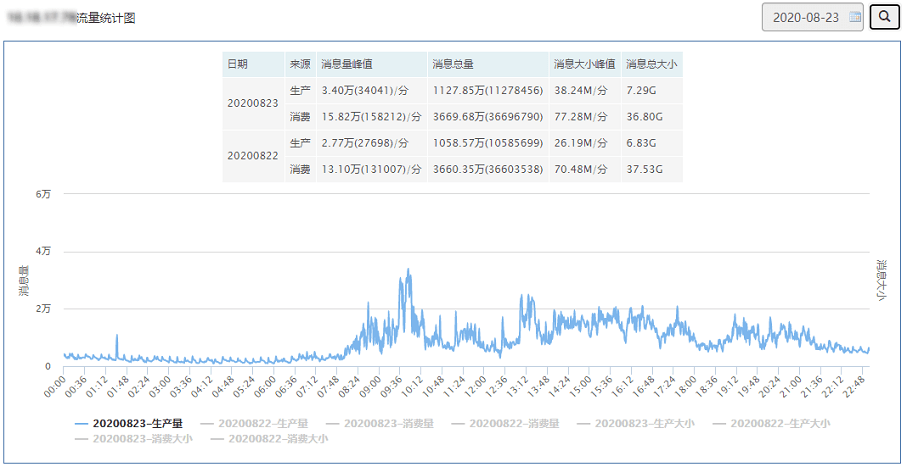
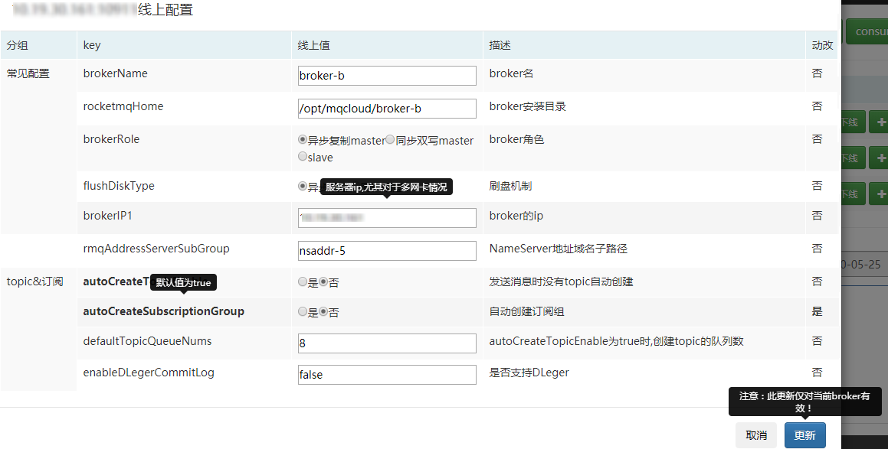

## 一、集群管理

此模块用于broker集群运维，状态展示，流量监控等。

## 二、添加broker

由于broker支持的配置项繁多，mqcloud开发配置模板来支持这些配置项，甚至支持自定义配置项，可以参考[配置模板](./brokerConfig)使用。

broker发生变更时（新增或下线），需要手动执行**刷新broker**功能来更新broker列表。

## 三、管理外部集群

mqcloud支持管理非mqcloud创建的broker，具体请参考[创建集群](https://github.com/sohutv/mqcloud/wiki/%E5%88%9B%E5%BB%BA%E9%9B%86%E7%BE%A4)。

## 四、broker列表

mqcloud支持的是一个master对应一个slave模式。管理员在列表页可以使用如下功能：

1. 点击broker的名字查看broker存储性能的百分位情况：

   

2. 点击master的id可以查看master的流量：

   

3. 点击broker的地址可以查看broker的线上配置（修改过的配置将会加粗显示）：

   

4. 点击broker实例后的**停写**按钮可以实现写权限擦除功能，用于broker平滑下线使用（slave可以直接下线，无需停写）。

5. 停写后的broker，点击**下线**按钮，可以实现关闭broker实例的功能。

6. 下线后的broker，会出现**启动**按钮，点击即可直接启动该broker。

   若broker下线后想从集群移除，需要执行**刷新broker**功能。

7. online环境的mqcloud会对broker实例进行存活性监控，一旦探活失败，将会通过邮件通知管理员。

## 五、集群流量

mqcloud根据broker的流量进行聚合，得到了集群的流量情况，可以通过此图查看集群整体流量情况。