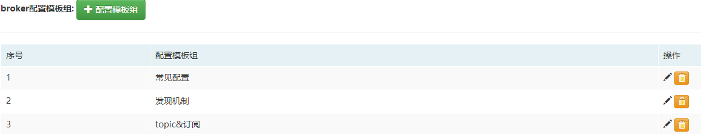
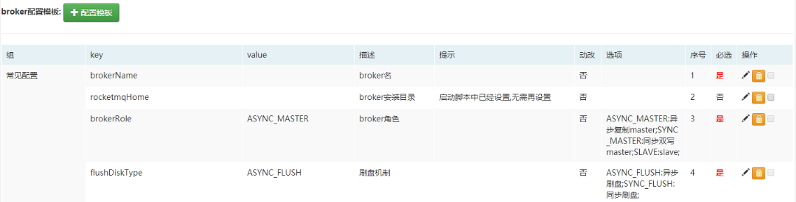
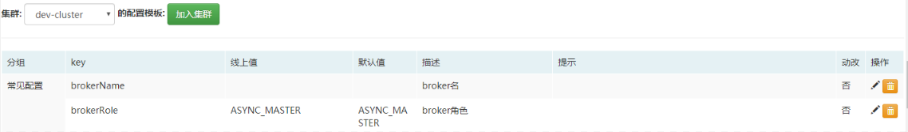
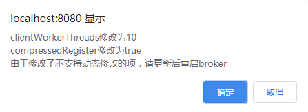

## 一、<span id="background">背景</span>

Broker作为RocketMQ的核心，其配置有百项之多，而且好多涉及到性能调优，调整时往往需要根据服务器的状况谨慎调整。

MQCloud作为其运维平台，需要考虑如下事情：

1. broker配置项繁杂，需要清晰明了的进行管理。
2. 已存在broker参数调整时，进行提示和建议，另外需要考虑如下情况：
   1. 调整后无需重启broker即可生效。
   2. 调整后需要重启broker才能生效。
3. 新部署broker时参数继承，这里的`继承`是指一些优化后的经过线上broker检验的参数，希望新部署broker时自动使用这些参数。

## 二、<span id="bkconfigTemplate">broker配置模板</span>

针对上述问题，MQCloud采用如下方式来解决：

1. broker配置模板组，为了便于区分和管理broker参数，MQCloud对参数进行了分组(这些分组信息可以根据实际情况进行修改)：

   

   **序号**越小的排序靠前显示。

2. <span id="brokerConfigTemplate">broker配置模板</span>，可以将broker的默认配置参数加入到这里：

   

   它有如下两个作用：

   1. 查看`broker线上配置`时，将会与broker配置模板中的key一一匹配，并分组展示。
   2. 这些配置项可以添加到[集群配置模板](#clusterConfigTemplate)中，在部署新broker时采用这些配置。

   每一列的含义解释如下：

   - 组：该配置所属的分组，可以修改。
   - key：broker配置key，来自[BrokerConfig](https://github.com/apache/rocketmq/blob/master/common/src/main/java/org/apache/rocketmq/common/BrokerConfig.java)，[MessageStoreConfig](https://github.com/apache/rocketmq/blob/master/store/src/main/java/org/apache/rocketmq/store/config/MessageStoreConfig.java)，[NettyServerConfig](https://github.com/apache/rocketmq/blob/master/remoting/src/main/java/org/apache/rocketmq/remoting/netty/NettyServerConfig.java)，[NettyClientConfig](https://github.com/apache/rocketmq/blob/master/remoting/src/main/java/org/apache/rocketmq/remoting/netty/NettyClientConfig.java)。
   - value：配置的默认值。
   - 描述：key的含义。
   - 提示：对于如何配置value的一点提示。
   - 动改：是否支持动态修改，这里的**动态**是指修改后不用重启broker即可生效。
   - 选项：如果该配置的值是几个选项中选择一个，可以在这配置，格式为 value:显示值;value2:显示值2。
   - 序号：序号越小在分组中排序越靠前。
   - 必选：如果该属性是部署broker时必填的，需要设置为必选。
   - 操作：支持修改和删除；后面的复选框用于[集群配置模板](#clusterConfigTemplate)中，勾选后，可以添加至[集群配置模板](#clusterConfigTemplate)中。

3. <span id="clusterConfigTemplate">集群配置模板</span>，部署新的broker时，采用这些配置。`加入集群`按钮用于将[broker的配置模板](#brokerConfigTemplate)中选中的项加入到该集群配置模板中：

   

   其中`线上值`是指该集群中的broker采用的特有配置，如果不修改将采用[broker的配置模板](#brokerConfigTemplate)中的默认值，其余属性与[broker的配置模板](#brokerConfigTemplate)中的一致。

   **注意：** MQCloud之前部署broker修改了如下三项：

   ```
   useReentrantLockWhenPutMessage=true
   sendMessageThreadPoolNums=48
   waitTimeMillsInSendQueue=500
   ```

   原因是由于默认写消息使用的spin锁和单线程机制经常导致超时，建议管理员将[集群配置模板](#clusterConfigTemplate)中的对应的3项结合自己的性能状况修改。

## 三、<span id="bkOnlineConfig">broker线上配置</span>

在[集群管理](/admin/cluster/list)模块，点击broker的地址，将会弹出broker线上配置：


每一列的含义解释如下：

- 分组：该配置所属的分组。

- key：broker配置key，**注意:** 如果线上值与默认值不一致，key将会加粗显示，鼠标放上去会提示默认值。

- 线上值：broker线上的值，可以直接修改，如果有对应的**提示**，鼠标放上去将会显示。

- 描述：key的含义。

- 动改：是否支持动态修改，这里的`动态`是指修改后不用重启broker即可生效。

- 更新：如果修改了线上值，可以使用`更新`按钮来更新到线上(**注意:** 修改不支持动态修改的项需要重启broker， 另外，此操作仅会对当前broker生效；如果部署新的broker时也使用该参数，需要到[集群配置模板](#clusterConfigTemplate)中进行配置)，更新提示如下：

  

## 四、<span id="deployBroker">部署broker</span>

部署broker的选项均来自于[集群配置模板](#clusterConfigTemplate)：


其中`brokerIP1`和`brokerIP2`以及`storePathRootDir`与`storePathCommitLog`具有自动填充功能，无需设置默认值。