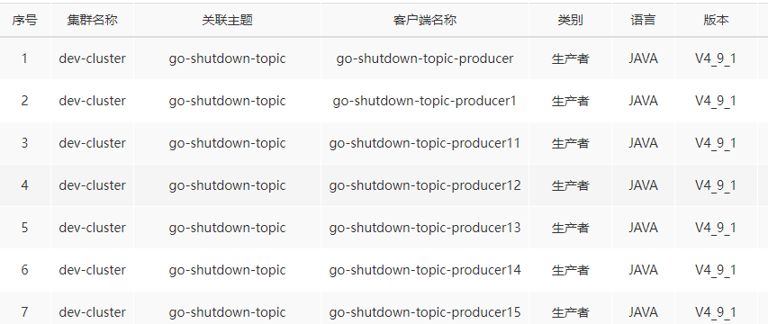
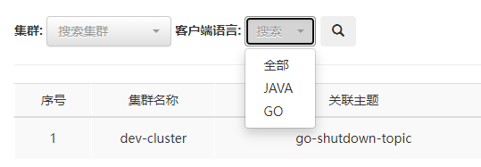
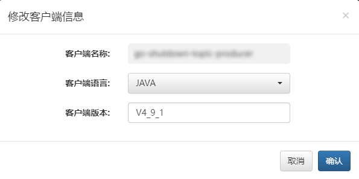
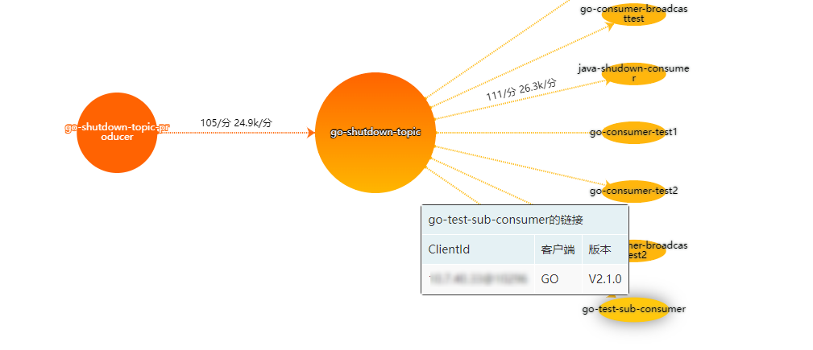
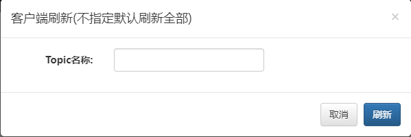

## 一、客户端语言

此模块主要用于对MQCloud管理生产者语言、版本信息进行管理。该模块数据由系统定时采集活跃的客户端信息进行生成。

## 二、多维度检索

客户端的检索主要基于以下维度进行的

* 集群：Topic的创建集群
* 语言：客户端开发语言

可依据需要选择具体的限制条件进行检索，多个条件进行搜索时，结果为多个条件的交集。

## 三、手动修改

修改选中客户端的语言及版本信息，人工修改的信息优先级高于系统自动采集，所以人为更新后将影响详情页的客户端链接信息

## 四、手动刷新

可以指定Topic进行客户端信息的刷新，包含生产者和消费者，注意当系统已完整采集该Topic数据或当前Topic无活跃的客户端，刷新操作将会取消。