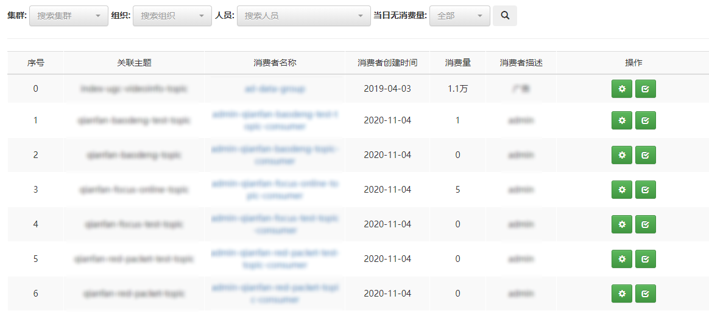
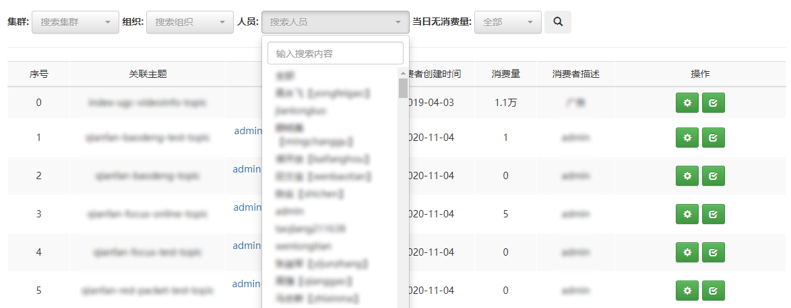
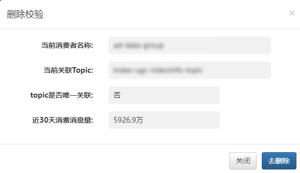

## 一、消费管理

此模块主要用于对MQCloud管理的消费者多维度检索、属性修改以及删除校验等。

## 二、多维度检索

Consumer的检索主要基于以下维度进行的

* 集群：Topic的创建集群
* 组织：Topic关联人员所处的业务组或部门
* 人员：Topic关联的人员，其中关联人员包含以下几类
    * 该Topic关联的Producer的所属人员
    * 该Topic关联的Consumer的所属人员
* 是否无消费者：Topic是否未关联消费者

可依据需要选择具体的限制条件进行检索，多个条件进行搜索时，结果为多个条件的交集。

## 三、属性修改

修改选中Consumer的消费模式

**注意：修改消费属性后，客户端需重启后才能生效**

## 四、检查Conusmer

检查Topic是对该Topic的生产消费情况进行搜集展示，防止误删，该页面罗列出当前Consumer关联信息，以及最近30天内的生产消费情况。

* 去删除：点击该按钮后，将跳转至对应的Consumer详情页面进行删除。