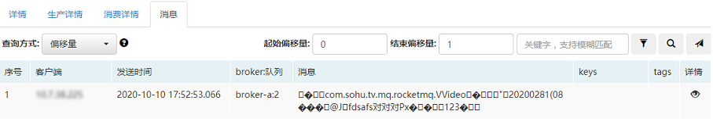

#### 1. <span id="topic">消息乱码如何解决？</span>

若发送消息时，发送的对象（非jdk包含）采用了MQCloud提供的Protostuf方式进行序列化，那么在MQCloud中查询消息时将会出现乱码的情况，类似如下：



原因是由于**反序列化时，找不到对应的类导致的**。

MQCloud针对此种情况定制了单独的类加载器，并支持在线动态更新。

管理员只需要如下操作即可消除乱码：

1. 找业务方获取对应类（其依赖的非jdk包含的类也需要）编译好的class文件，将其打包为jar包，假设jar包名为msgType202010121010.jar，其结构应为如下所示：

   ```
   msgType202010121010.jar
   └── msg-type
       ├── A.class
       ├── B.class
   ```

2. 到MQCloud管理后台的`通用配置`模块，配置`messageTypeLocation`选项，该选项告知MQCloud该从何处加载jar包（注意，jar包名需要与上次的不同，建议带时间戳作为后缀，否则MQCloud不会更新），支持如下格式：

   1. classpath\*:msg-type/\*.class

      即需要将jar包放置到classpatch中，MQCloud将会从classpatch的所有jar中查询包含msg-type文件夹下的所有class。

   2. jar:file:///tmp/msgType202010121010.jar!/**/*.class

      即需要将jar包放置到磁盘/tmp/msgType.jar处。

   3. jar:http://127.0.0.1:8080/msgType202010121010.jar!/**/*.class

      此种方式为远程加载，如果部署多个MQCloud实例时，推荐此种方式。

   注意：推荐第2,3种方式，因为可以不用重启MQCloud即可更新jar包。

3. 到MQCloud管理后台的`通用配置`模块，配置`classList`选项，将消息体为对象的topic配置到这里，以便MQCloud知道哪些topic的消息需要特殊的反序列化。

默认每10分钟更新一次，可以通过如下类似日志查看更新情况：

```
MessageTypeClassLoader-53 - init classpath*:msg-type/*.class with classNameUrlMap:{...}
MessageService-929 - messageTypeLocation changed from jar:file:///tmp/msgType.jar!/*/.class to jar:file:///tmp/msgType202010121010.jar!/*/.class
```

