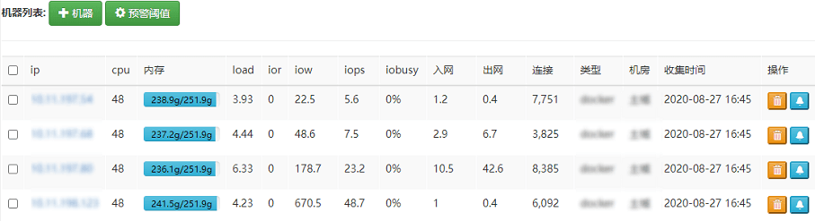
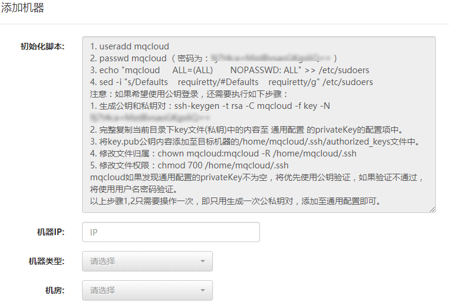
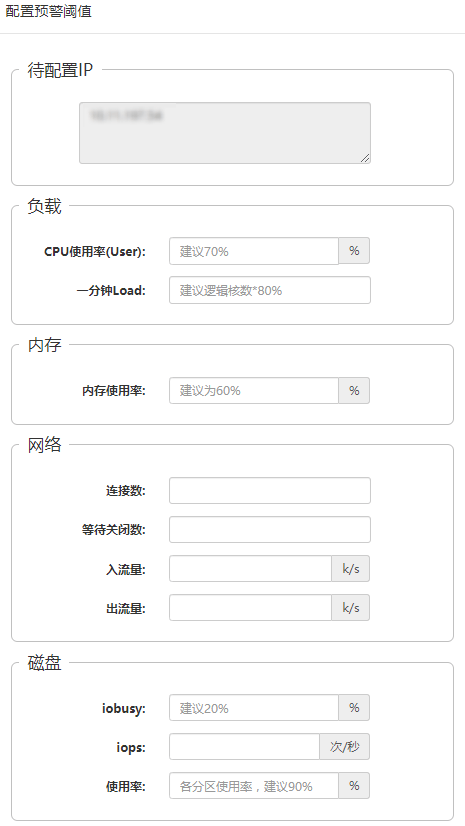

## 一、机器列表

该模块用于添加机器，配置预警等，参考下图：

## 二、添加机器

1. 添加机器前首先要进行初始化设置，以便mqcloud可以与机器互通，大概分为如下几步：
   1. 创建mqcloud用户及密码。
   2. 对mqcloud用户授予root权限。
   3. 如果需要公钥登录，还需要进行额外的配置，具体参考上图。
2. 选择机器类型和机房，用于一些展示和区分。

添加完机器后，mqcloud会定时去收集机器的状况，用于统计和预警。

## 三、机器预警

如果需要监控某台机器，可以点击机器记录后面的铃铛按钮进行阈值设置，或者批量勾选进行批量设置：

这里说明一下，如果某个监控项不填，就不会针对该项进行报警。

