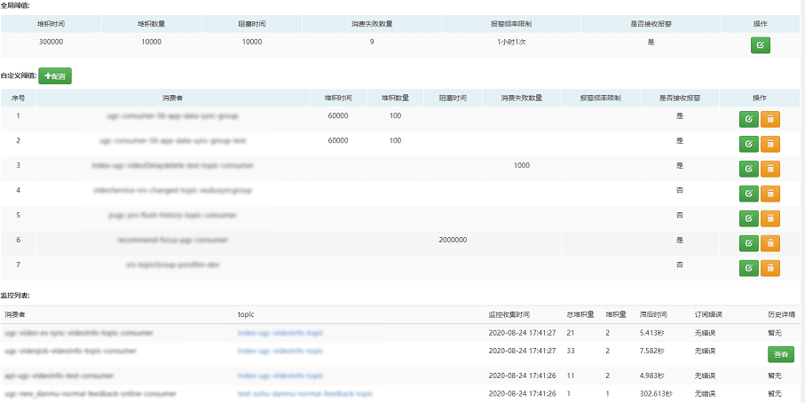

## 监控管理

这里的监控管理是指监控消费者的情况及指标，如下：

这里分别来说一下，一共三块：

1. 全局阈值（阈值是指超过即进行预警）

   默认所有的消费者都采用全局阈值。

2. 自定义阈值

   针对有特殊需求的消费者使用自定义的阈值。

3. 监控列表

   监控列表里记录了监控的情况，但是如果指标为0并不会记录，因为记录为0的指标也没有什么意义。

下面对全局阈值的指标进行一些解释和说明：

1. 堆积时间&堆积数量

   这两个指标是从broker的维度检测消费者消费消息是否存在堆积情况。

   这两个指标是与的关系，即只有消息堆积时间和堆积数量均达到阈值，才会进行堆积预警。

   默认为每5分钟检测一次，消息堆积超过5分钟并且堆积的消息达到10000条进行预警。

2. 阻塞时间

   这个指标是从客户端的维度检测消费者消费消息是否存在阻塞情况。

   默认为每5分钟检测一次，阻塞达到10秒进行预警。

3. 消费失败数量

   消费者消费失败达到9条进行预警，默认每小时执行一次检测任务。

4. 是否接收报警

   如果设置为否，则针对该消费者的预警将都不发送。

5. 报警频率限制

   默认报警频率为每条/小时。

自定义阈值的含义与全局阈值的含义相同，只不过是针对具体某个消费者设置的，其优先级高于全局阈值。

当然除了上面这些指标外，还有如下指标，如下：

1. 订阅错误

   如果一个消费者订阅了两个topic，将会导致消费混乱，这里会进行预警，其报警频率也受默认频率限制。

2. 偏移量错误

   消费者消费的消息在broker不存在时，一般是偏移量错误，其报警频率也受默认频率限制。​
