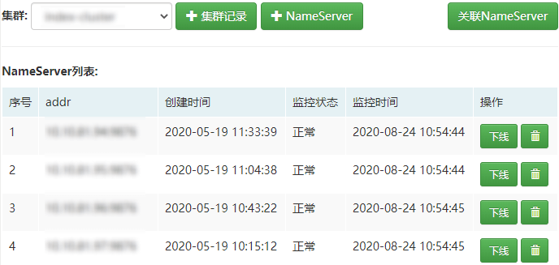
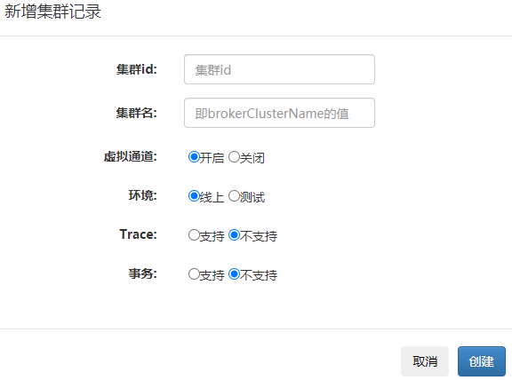

## 一、集群发现

该模块主要用于NameServer集群的创建和运维，参见：

下面介绍下每块的功能：

1. +集群记录

   用于创建集群记录，本质为在`cluster`表中新增一条记录，不会操作rocketmq。

2. +NameServer

   用于创建NameServer实例，创建完成后该实例即归属于当前集群。

3. 关联NameServer

   如果希望使用mqcloud管理现有的集群，可以使用此功能，把NameServer实例关联进来。

4. NameServer列表

   用于展示当前集群下的NameServer实例，并且支持下线和删除。

   **下线：** 将会kill掉NameServer实例，并将该实例的记录从`name_server`表中删除。 

   **删除：** 仅仅将该实例的记录从`name_server`表中删除，不会kill掉NameServer实例。

   **注意：** 删除功能仅用于NameServer实例已经挂掉，需要从域名映射摘掉的情形，如果NameServer实例还在运行，执行删除功能的话，将会导致生产或消费异常，这是rocketmq的bug并且官方目前并未完全修复，具体[参考](https://github.com/apache/rocketmq/issues/2090)。

建议这块参考[NameServer寻址](../developerGuide/nameServer)来看，会更加明白其中的原理。

## 二、新增集群记录

1. 集群id需要为数字，并且不能重复，其用于发现NameServer列表。
2. 集群名即brokerClusterName。
3. 虚拟通道：rocketmq3.x及以下需要关闭。
4. 环境：线上环境会启动定时任务进行数据收集。
5. Trace：用于指示该集群是否是trace集群，mqcloud的客户端可以将trace数据发往独立的trace集群，与业务集群可以实现隔离。
6. 事务：用于指示该集群是否支持事务，若业务需要支持事物特性，创建topic时，可以选择建在事务集群；由于事务集群某些配置必然与普通集群不一样，所以可以创建一个独立集群用于事务topic。

## 三、创建NameServer实例

用于部署name server，并且会建立cluster表和name_server表的关联：

1. **一键安装**将会分步骤进行，任何一个步骤失败自动暂停，解决问题后，点击**继续**执行。
2. 安装成功后将会在**进程信息**处列出启动的NameServer进程。

## 四、NameServer监控

online环境的mqcloud会对NameServer实例进行存活性监控，一旦NameServer实例探活失败，将会通过邮件通知管理员。