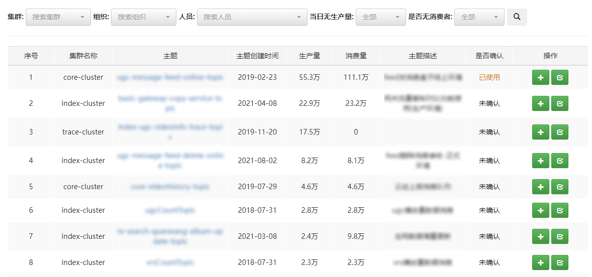
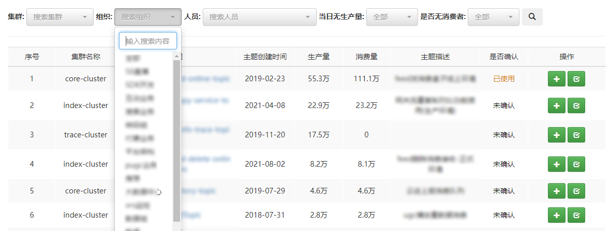
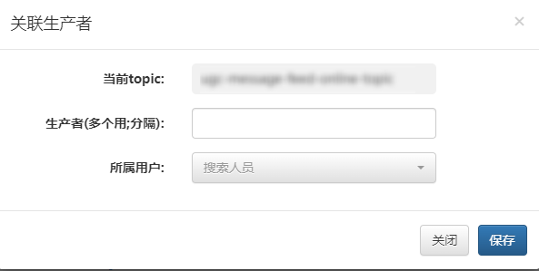
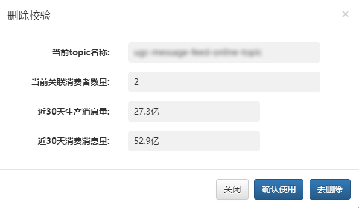

## 一、主题管理

此模块主要用于对MQCloud管理的主题多维度检索、主题状态确认以及增加关联生产者等。

## 二、多维度检索

Topic的检索主要基于以下维度进行的

* 集群：Topic的创建集群
* 组织：Topic关联人员所处的业务组或部门
* 人员：Topic关联的人员，其中关联人员包含以下几类
  * 该Topic关联的Producer的所属人员
  * 该Topic关联的Consumer的所属人员
* 当日无生产量：当日Topic是否无消息发送
* 是否无消费者：Topic是否未关联消费者

可依据需要选择具体的限制条件进行检索，多个条件进行搜索时，结果为多个条件的交集。

## 三、关联生产者

关联生产者主要是对已有的Topic关联新的生产者

## 四、检查Topic

检查Topic是对该Topic的生产消费情况进行搜集展示，防止误删，该页面罗列出当前Topic关联的消费者数量，以及最近30天内的生产消费情况。

* 确认使用：点击该按钮后，展示列表出将标识出该Topic已使用
* 去删除：点击该按钮后，将跳转至对应的Topic详情页面进行删除。