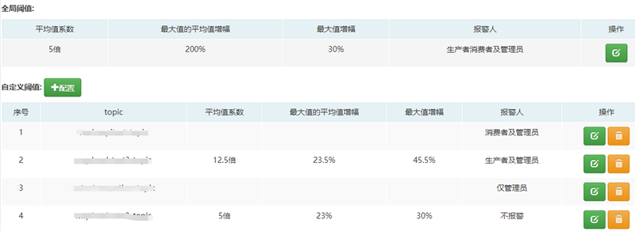

## 流量监控

流量管理是指对于开启了流量预警功能的topic，通过某些统计分析方法，对topic流量进行统计分析、阈值设定和邮件预警。
如下：

#### 图例说明：

1. 全局阈值（阈值是指设定的某些条件）

   开启了流量预警的topic默认采用全局阈值。

2. 自定义阈值

   针对某些topic的流量特性使用自定义的阈值。

#### 流量统计分析方法介绍
目前采用的方法是基于前x天内每天流量最大值的统计分析。 

1. 假设某个topic开启了流量预警功能，统计分析时首先获取其前x天(最多30天)内所有的流量数据。

2. 以天为维度，对于每一天的流量，求出平均值，若某时刻的流量值大于平均值乘以**平均值系数**的值，则该时刻
流量值会被判定为异常流量值而在统计分析时被剔除(即不会使用该时刻的流量值作为统计数据)。

3. 在剔除异常流量值后，获取每天流量值的最大值。前x天共获取x个最大值，分别取平均值和最大值，记为avgMax和maxMax。
    1. avgMax: 前x天流量，每天流量最大值(剔除异常流量值后)的平均值
    2. maxMax: 前x天流量值的最大值(剔除异常流量值后)

#### 阈值说明：

1. 平均值系数

   该指标用于统计分析时判定剔除异常流量值，可设置为浮点型，如5.5倍。

2. 最大值的平均值增幅

    该指标是指avgMax的增长百分比。检测时若流量值大于 avgMax * (1 + 最大值的平均值增幅%)，则预警。可以设置
为浮点型，如200.5%。

3. 最大值增幅

   该指标是指maxMax的增长百分比。检测时若流量值大于 maxmMax * (1 + 最大值增幅%)，则预警。可以设置为浮点型，如30.5%。

4. 报警人

   可以设置预警邮件接收人，如果设置不报警，则在流量检测时自动跳过该topic。

自定义阈值的含义与全局阈值的含义相同，只不过是针对具体某个topic设置的，其优先级高于全局阈值。