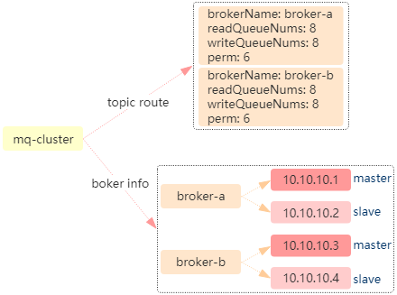
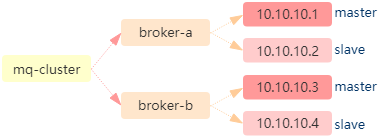

## 一、<span id="topic">topic相关的api</span>

1. 创建topic：**MQAdminExt.createAndUpdateTopicConfig(String addr, TopicConfig config)**

   **释义**：在broker上创建topic。

   **用途**：新建topic使用。

2. 删除topic：

   1. **MQAdminExt.deleteTopicInBroker(Set<String> addrs, String topic)**

      **释义**：在broker上删除topic。

      **用途**：删除topic使用。

   2. **MQAdminExt.deleteTopicInNameServer(Set<String> addrs, String topic)**

      **释义**：在name server上删除topic。

      **用途**：删除topic使用。

3. 查询topic路由：MQAdminExt.examineTopicRouteInfo(String topic)

   **释义**：从name server获取topic的路由信息，返回如下数据结构：

   

   **用途**：用于获取topic路由信息的所有地方。

4. <span id="fetchAllTopicList">获取所有topic的列表：MQAdminExt.fetchAllTopicList()</span>

   **释义**：获取broker上的所有的topic。

   **用途**：适用于全量获取topic。

5. 获取所有topic的配置：MQAdminExt.getAllTopicConfig(String brokerAddr, long timeoutMillis)

   **释义**：获取broker上的所有的topic及配置。

   **用途**：适用于全量获取topic，比如部署新broker实例时，copy所有topic的配置。

6. 获取topic的生产情况：MQAdminExt.examineTopicStats(String topic)

   **释义**：实时获取broker端的topic的偏移量（数据来自于消费者的主动上报）。

   **用途**：实时展示生产者的消息量，最新生产时间等。

## 二、<span id="producer">生产者相关的api</span>

1. 诊断生产者链接：MQAdminExt.examineProducerConnectionInfo(String producerGroup, String topic) 

   **释义**：获取生产者的链接信息。

   **用途**：适用于展示生产者链接状况。

## 三、<span id="consumer">消费者相关的api</span>

1. 创建消费者：**MQAdminExt.createAndUpdateSubscriptionGroupConfig(String addr, SubscriptionGroupConfig config)**

   **释义**：在broker上创建消费者订阅。

   **用途**：新建消费者使用。

2. 删除消费者：**MQAdminExt.deleteSubscriptionGroup(String addr, String groupName)**

   **释义**：删除broker上的订阅组。

   **用途**：消费者下线使用。

3. 消费者偏移量重置：

   1. 消费者在线：**MQAdminExt.resetOffsetByTimestamp(String topic, String group, long timestamp, boolean isForce)**

      **释义**：broker回调客户端，重置客户端的偏移量至timestamp。

      **用途**：适用于客户端在线的情况，即客户端还在运行着（不管客户端是广播消费还是集群消费此种方式都可以直接重置偏移量）。

   2. 消费者不在线：**MQAdminExt.resetOffsetByTimestampOld(String consumerGroup, String topic, long timestamp, boolean force)**

      **释义**：重置客户端的偏移量至timestamp。

      **用途**：适用于客户端离线的情况，因为它直接重置的是broker端的消费者的偏移量，不适用于广播消费模式。

4. <span id="examineConsumeStats">获取消费者偏移量：MQAdminExt.examineConsumeStats(String consumerGroup)</span>

   **释义**：实时获取broker端的消费者的偏移量（数据来自于消费者的主动上报）。

   **用途**：实时展示集群模式消费者的堆积，延迟等指标。

5. 获取消费者状态：MQAdminExt.getConsumeStatus(String topic, String group, String clientAddr)

   **释义**：broker回调客户端，获取客户端统计的每个队列的消费的偏移量。

   **用途**：展示消息是否被消费。

6. <span id="examineConsumerConnectionInfo">获取消费者链接：MQAdminExt.examineConsumerConnectionInfo(String consumerGroup)</span>

   **释义**：获取消费者的链接，返回结果包括订阅信息和链接clientId等，详细如下：

   ```
   public class ConsumerConnection {
       private HashSet<Connection> connectionSet;
       private ConcurrentMap<String/* Topic */, SubscriptionData> subscriptionTable;
       private ConsumeType consumeType;
       private MessageModel messageModel;
       private ConsumeFromWhere consumeFromWhere;
   }
   // 链接信息
   public class Connection {
       private String clientId;
       private String clientAddr;
       private LanguageCode language;
       private int version;
   }
   // 订阅信息
   public class SubscriptionData {
       public final static String SUB_ALL = "*";
       private String topic;
       private String subString;
   }
   ```

   **用途**：获取消费者的所有实例的链接信息（可以用于广播消费模式，因为广播消费不会上报偏移量到broker，只能通过broker反调的模式）。

7. <span id="getConsumerRunningInfo">获取消费者客户端实例的运行时信息：MQAdminExt.getConsumerRunningInfo(String consumerGroup, String clientId, boolean jstack)</span>

   **释义**：broker回调客户端，获取客户端运行时信息，其返回数据结构如下，详细[参见](https://github.com/apache/rocketmq/blob/master/common/src/main/java/org/apache/rocketmq/common/protocol/body/ConsumerRunningInfo.java)：

   ```
   public class ConsumerRunningInfo extends RemotingSerializable {
       private Properties properties = new Properties();

       private TreeSet<SubscriptionData> subscriptionSet = new TreeSet<SubscriptionData>();

       private TreeMap<MessageQueue, ProcessQueueInfo> mqTable = new TreeMap<MessageQueue, ProcessQueueInfo>();

       private TreeMap<String/* Topic */, ConsumeStatus> statusTable = new TreeMap<String, ConsumeStatus>();

       private String jstack;
   }
   ```

   **用途**：MQCloud用于分析订阅关系，客户端阻塞情况等。

8. 获取所有的消费者配置：MQAdminExt.getAllSubscriptionGroup(String brokerAddr, long timeoutMillis)

   **释义**：获取broker上的所有的消费者订阅及配置。

   **用途**：适用于全量获取订阅信息，比如部署新broker实例时，copy所有订阅的配置。

9. 获取topic的消费者：MQAdminExt.queryTopicConsumeByWho(String topic)

   **释义**：从broker上查询topic有哪些消费者。

   **用途**：适用于从topic反查消费者的情况。

## 四、<span id="message">消息相关的api</span>

1. MQAdmin.queryMessage(String topic, String key, int maxNum, long begin, long end)

   **释义**：按照key查询topic的消息。

   **用途**：适用于发送消息时传递了参数keys的topic。

2. MQAdmin.viewMessage(String topic, String msgId)

   **释义**：按照msgId查询topic的消息。

   **用途**：适用于发送消息成功后，记录的消息id的情况。

## 五、<span id="broker">broker相关的api</span>

1. MQAdminExt.examineBrokerClusterInfo()

   **释义**：获取集群下所有的broker的信息，返回如下数据结构：

   ```
   // 集群信息
   public class ClusterInfo {
       private HashMap<String/* brokerName */, BrokerData> brokerAddrTable;
       private HashMap<String/* clusterName */, Set<String/* brokerName */>> clusterAddrTable;
   }
   // broker路由
   public class BrokerData {
       private String cluster;
       private String brokerName;
       private HashMap<Long/* brokerId */, String/* broker address */> brokerAddrs;
   }
   ```

   例子如下：

   

   **用途**：需要集群数据的地方。

2. <span id="viewBrokerStatsData">MQAdminExt.viewBrokerStatsData(String brokerAddr, String statsName, String statsKey)</span>

   **释义**：获取broker上的统计数据，broker端统计介绍[参见](./statMonitorWarning)。

   **用途**：统计topic的生产和消费流量，并用于预警。

3. <span id="fetchBrokerRuntimeStats">MQAdminExt.fetchBrokerRuntimeStats(String brokerAddr) </span>

   **释义**：获取broker运行时状况。

   **用途**：监测broker是否存活。

4. **MQAdminExt.wipeWritePermOfBroker(final String namesrvAddr, String brokerName)**

   **释义**：擦除name server上broker的写权限。

   **用途**：broker下线时，先将broker写权限擦除。客户端每30秒会拉取一次topic队列的路由信息，然后判断broker是否可写。这样，客户端写流量逐渐停止，broker便可以安全切下线。

## 六、<span id="nameserver">NameServer相关的api</span>

1. MQAdminExt.getNameServerAddressList()

   **释义**：获取name server列表的地址，该api本质没有远程调用，name server列表维护在客户端的缓存中。

   **用途**：需要name server列表地址的地方，MQCloud用于构建一个私有的PullConsumer拉取消息。

2. <span id="getNameServerConfig">MQAdminExt.getNameServerConfig(List<String> nameServers)</span>

   **释义**：获取name sever配置。

   **用途**：监控name server是否存活。


