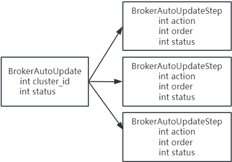
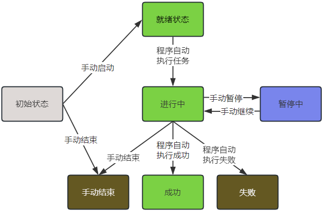
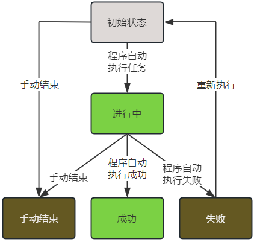
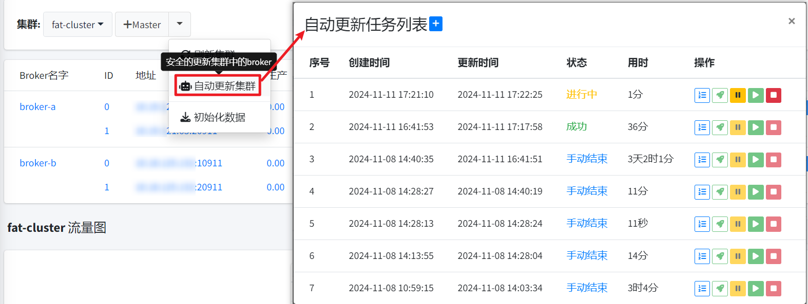
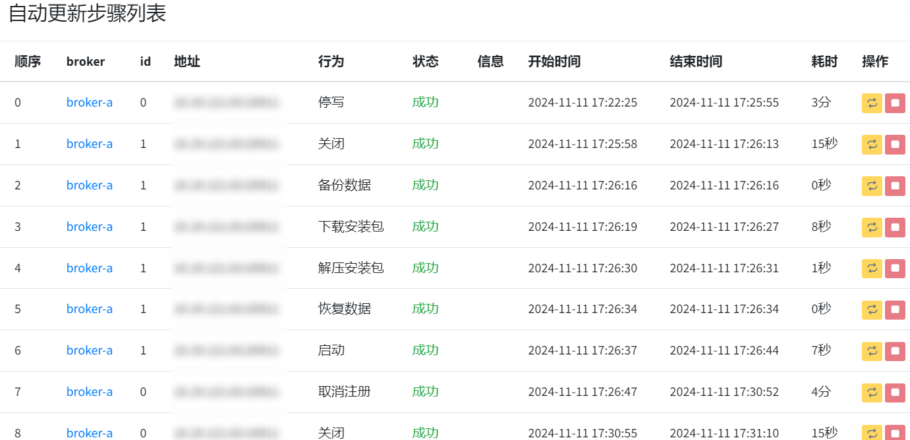

# 一、为什么需要broker的自动更新机制？

这里需要从broker集群的更新步骤说起，下面先看几种broker集群的情况。

#### 一、单个slave节点

针对单个slave节点，更新步骤最简单，类似如下：

- **关闭**：停止broker进程。
- **备份数据**：需要将broke整个目录进行备份，比如broker-a改为broker-a.bak。
- **部署新broker**：例如将新的RocketMQ构建物部署为新的broker-a。
- **恢复数据**：例如将broker-a.bak/data移动到broker-a/data下
- **启动**：启动broker进程。

上面几个步骤，有几个耗时的阶段，因为需要检测步骤执行是否成功，具体如下：

- **关闭**：关闭后，需要检测broker进程是否完全退出，因为broker中组件繁杂，安全退出时，会对其中的组件一一执行退出操作，等broker进程彻底退出后才能执行后续步骤，否则可能造成数据不完整。
- **启动**：如果broker的数据量很大，比如T级别，那么broker启动需要校验和加载数据，将是一个很耗时的过程，需要等broker完整的启动并可以正常进行远程通信，才能算正常启动。

这里将上述流程的多个步骤先称作`普通更新步骤`，在后续内容中将引用该词汇。

#### 二、单个master节点

通常的更新步骤如下：

* **停写**：broker将会擦除其上的topic的写权限，客户端将不再往该broker发送消息。
* **执行`普通更新步骤`**。
* **恢复写入**：为broker上的topic添加写权限，客户端将会向该broker发送消息。

为什么master节点会多两个步骤？因为slave默认是只读的，而master是可写的，所以要想安全的更新master就需要额外执行两个步骤，而这两个步骤却是比较耗时的，如下：

* **停写**：停写后，需要检测broker是否还有客户端发送消息，在确保broker上没有**外部消息**写入了，才能执行后续步骤。

  这里要解释下什么是**外部消息**， 因为broker支持延迟消息（业务端主动发送或消费失败的重试消息），定时消息（5.x基于时间轮实现的），事务消息，pop消费等，此种类型的消息统称为`二级消息`，即此类消息先暂存在broker内置的topic中存储，满足一定条件后，才会变成普通消息。这些`二级消息`都在broker内部流转，除了`二级消息`之外的都是**外部消息**，即是否是真实的外部客户端写入的消息。

  所以，停写后还需要检测broker是否还有外部客户端发送消息，以此作为停写成功的判断条件。

  至于`二级消息`的高可用性，需要通过别的机制保障，比如5.x的备代理主机制。

  关于**外部消息**的写入指标，可以通过`BROKER_PUT_NUMS_WITHOUT_SYSTEM_TOPIC`获取（注意，只适用于5.x的broker）。

* **恢复写入**：恢复写入后，需要检测broker是否有正常的消息写入或有生产者正常连接该broker，才算恢复成功。

#### 三、主从部署

这里只列举一个master对应一个slave的情况，因为一个master对应多个slave步骤类似。

主从部署更新步骤间涉及到主从的交互更新，所以更新步骤会更复杂，具体如下：

* **master停写**。
* **slave执行`普通更新步骤`**。
* **master取消注册**：即向master发送取消注册的指令，master不再向NameServer发送心跳，NameServer将认为该master已下线，客户端将自动剔除与该broker的链接。
* **master执行`普通更新步骤`**。
* **master注册**： master主动向NameServer发送心跳，NameServer将添加该broker路由。
* **master恢复写入**。

上面的**master取消注册**与**master注册**是MQCloud为了安全更新master单独做的，可以保障在更新master时，所有的客户端链接都安全的与master断开，进一步保障了安全性。

可以看出，主从部署的集群更新起来更为复杂，涉及到了master与slave关闭顺序，如果不停写master，直接更新slave，可能造成slave数据不完整，导致启动不了。

另外，上面的更新步骤中，同样有个步骤比较耗时：

* **master取消注册**：master取消注册后，客户端将自动剔除掉master节点，而broker中有检测链接是否活跃的机制，从而会自动剔除客户端的所有链接，那么就需要获取到broker上的所有的链接，等待全部剔除。

**总的来说，不同情况的部署对应不同情况的更新步骤，而每个更新步骤又有不同的安全检测条件，只有达到该安全检测条件，才能执行下一个步骤。**

MQCloud虽然做了一键更新，但是仅仅针对单个broker，并且某些安全检测条件需要人工到broker部署的机器上查看。

那么这里就引出了开始的问题**为什么需要自动更新broker的机制？**

1. broker更新中某些步骤需要人工确认是否更新成功。
2. broker更新过程中操作繁杂，存在误操作的情况。
3. 更新单个broker通常耗时很长，通常在5分钟左右。
4. 针对主从部署，更新步骤更为复杂，耗费大量时间。

综上，这里需要一种自动更新机制，能够自动检测各种部署情况，指定一系列的更新步骤，并可以按顺序一条一条的执行更新步骤，并支持检测更新结果，从而保障更新的安全性和提升运维效率。

# 二、broker的自动更新机制设计

MQCloud是支持多集群部署的，所以首先需要区分不同的集群，即每个集群有自己的更新步骤。

其次、针对一个集群来说，broker的部署结构无非是上面描述的三种情况，而针对三种情况都可以指定步骤更新顺序，例如如下简单数据结构即可满足：

`BrokerAutoUpdate`代表了一个更新任务，它具备如下属性：

1. cluster_id：标识该任务时更新哪一个集群。
2. status：任务的状态。

`BrokerAutoUpdateStep`代表了一个更新任务中的一个具体的更新步骤，它具备如下属性：

1. action：代表了更新步骤需要执行的操作。
2. order：代表了更新步骤的顺序。
3. status：更新步骤的状态。

下面具体做一下说明，针对`BrokerAutoUpdate`来说，它是一条任务，任务就涉及到不同的状态，状态如下：

1. 初始状态：表示新建的任务，还未开始执行。
2. 就绪状态：表示等待执行执行。
3. 进行中：表示任务正在执行中。
4. 暂停中：因为更新耗时过长，需要支持暂停，以便应对突发情况。
5. 成功：任务执行完毕且执行成功。
6. 失败：任务执行完毕且执行失败。
7. 手动结束：针对未执行完毕的任务，可以支持提前手动结束，以便应对突发情况。

状态流转图如下：

1. `初始状态`的任务可以手动启动或手动结束。
2. `就绪状态`的任务只能被自动更新任务自动执行，转变为`进行中`。
3. `进行中`的任务可以手动暂停。
4. `进行中`的任务最终执行`成功`或`失败`或`手动结束`。

而针对`BrokerAutoUpdateStep`来说，它代表了具体一条更新步骤，一个broker的更新即是多条`BrokerAutoUpdateStep`的有序组合。

`BrokerAutoUpdateStep`不仅有状态，而且还需要有行为，即需要做什么操作。

这里先列举一下`BrokerAutoUpdateStep`的状态，由于它是程序自动执行，所以状态没有`BrokerAutoUpdate`那么多状态，状态如下：

1. 初始状态：表示新建的步骤，还未开始执行。
2. 进行中：表示步骤正在被自动执行中。
3. 成功：步骤执行完毕且达到状态检测OK。
4. 失败：步骤执行失败。
5. 手动结束：针对初始状态的步骤，可以手动结束，以便跳过执行该步骤。

状态流转图如下：

1. `初始状态`的步骤可以手动结束或被自动更新任务执行。
2. `进行中`的步骤可以手动结束或被自动更新任务执行`成功`或`失败`。
3. `失败`的步骤可以手动重新执行。

以上是`BrokerAutoUpdateStep`的状态流转，而对于`BrokerAutoUpdateStep`来说，更重要的是操作行为，其拥有的行为如下：

1. 停写：master停止写入。
2. 取消注册：master不再向NameServer发送心跳。
3. 关闭：关闭broker进程。
4. 备份数据：备份broker整个部署目录。
5. 部署broker：下载RocketMQ安装包并部署到目标broker。
6. 恢复数据：将备份的broker数据挪到新部署的broker里。
7. 启动：启动broker进程。
8. 注册：master将向NameServer发送心跳。
9. 恢复写入：broker开启写权限。

以下是不同部署情况更新步骤的执行流程：

# 三、broker的自动更新机制实现

相关源码实现可以在MQCloud中搜索`BrokerAutoUpdate`相关的类以及`com.sohu.tv.mq.cloud.service.action`包下的类，这里不再介绍。

集群更新任务入口及列表如下：

具体更新步骤如下：

`自动更新步骤列表`由于是后台任务自动更新，所以该页面是自动刷新的，可以实时观察更新进度。

