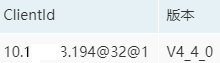

## <span id="intro">一、简介</span>

MQCloud对RocketMQ原生API进行了封装，提供了一个[增强版的SDK](../userGuide/client)： [mq-client-open](https://github.com/sohutv/mqcloud/tree/master/mq-client-open)。它提供了类似特性：耗时、异常等统计、上报，序列化，自动配置，降级隔离，trace发送单独集群等等，与MQCloud配合使用，将极大提升开发效率，并能实时监控客户端的情况，下面将会一一进行介绍（当然MQCloud并不强制使用提供的SDK，只使用MQCloud做监控也同样支持）。

## <span id="start">二、启动</span>

mq-client-open启动时将会往MQCloud发送http请求，拉取生产者或消费者的配置信息，并同时上报自己使用的版本。

对于生产者来说，目前的配置信息有：

1. 集群id
2. 是否开启trace（*MQCloud1.6后支持RocketMQ4.4.0的trace特性*）
3. 是否启用vip通道（*所谓vip通道，是RocketMQ3.5.8以后新增的特性，即broker会启动一个端口（配置端口-2）作为vip通道，生产者可以把消息发往此通道，消费者从旧端口消费，实现生产和消费通道分离*）。
4. unitName（用于发现不同的集群，具体可以参考<a href="nameServer#http">NameServer寻址</a>部分）

对于消费者来说，目前的配置信息有：

1. 集群id 
2. 是否开启trace
3. 消费方式（*广播或集群*）。
4. unitName

为什么要启动时候拉取这些信息呢？

1. 客户端可以只用配置topic名字和group名字即可，剩余的信息可以自动配置。

2. 校验客户端是否配置错误，配置错误将一直循环请求配置信息，卡主启动流程，防止业务方配置错误无法生产或消费消息但是却不知道，将这种明显的问题扼杀在早期。

3. vip通道作为新特性，如果broker版本较低，客户端版本较高，可能导致发送消息失败，此时需要设置vipChannelEnabled=false，而mq-client-open可以知道集群的情况，自动设置此参数。

4. 由于MQCloud是可以运维多个集群的，所以需要具体知道某个topic在哪个集群上，从而可以根据所在集群发现集群信息，具体参见<a href="nameServer#http">NameServer寻址</a>。

   有人可能会问，这样是不是必须要求topic在所有集群全局唯一？我们觉得这不是问题，因为通过MQCloud创建topic建议是：小组名-业务名-topic，MQCloud也会在数据层面保证唯一性。

   另外，ConsumerGroup也必须是唯一的，如果不唯一，可能导致消费问题，具体参见[这里](https://blog.csdn.net/a417930422/article/details/50663639)。

## <span id="serial">三、序列化</span>

RocketMQ的原生客户端是不提供序列化的(*可能官方认为序列化属于业务的事情*)。MQCloud的mq-client-common-open中默认是提供了[protostuff](https://protostuff.github.io/docs/)作为序列化工具，类似如下：

```
/**
 * 构建消息
 * @param messageObject 消息
 * @param tags tags
 * @param keys key
 * @param delayLevel 延时级别
 * @return
 * @throws Exception 
 */
public Message buildMessage(Object messageObject, String tags, String keys, MessageDelayLevel delayLevel)
        throws Exception {
    byte[] bytes = getMessageSerializer().serialize(messageObject);
    Message message = new Message(topic, tags, keys, bytes);
    if (delayLevel != null) {
        message.setDelayTimeLevel(delayLevel.getLevel());
    }
    return message;
}
```

protostuff其内部是protobuf，而protobuf源自于google，其压缩能力和性能在此不再多说。

但是，由于RocketMQ是有两种角色的，生产者和消费者。如果生产者使用了此种方式序列化消息，那么消费者就没得选择。所以，MQCloud又提供了一种额外的扩展`com.sohu.tv.mq.serializable.StringSerializer`，其就是String.getBytes。这样客户端就可以直接传输String了，比如流行的JSON。

*这里需要注意一点，生产者和消费者要约定好使用何种序列化，并且此种序列化针对某个topic后续基本不可改了，否则会导致消费者消费消息时无法反序列化。*

## <span id="producer">四、生产者</span>

1. 发送方式

   MQCloud对同步发送，异步发送，oneway发送，顺序发送，事务发送均作了相应封装，详细的可以运行起MQCloud后参见<a href="../userGuide/client#producer">生产者接入</a>，里面有详细的使用介绍。

   *这里说明一点，关于顺序发送，MQCloud提供了如下封装的API：*

   ```
   /**
    * 相同的id发送到同一个队列
    * hash方法：id % 队列数
    */
   class IDHashMessageQueueSelector implements MessageQueueSelector {
       public MessageQueue select(List<MessageQueue> mqs, Message msg, Object idObject) {
           long id = (Long) idObject;
           int size = mqs.size();
           int index = (int) (id % size);
           return mqs.get(index);
       }
   }
   // 设置到producer
   producer.setMessageQueueSelector(new IDHashMessageQueueSelector());
   // 消息发送
   long id = 123L;
   Map<String, Object> map = new HashMap<String, Object>();
   map.put("id", id);
   Result<SendResult> sendResult = producer.publishOrder(map, String.valueOf(id), id);
   ```

   *需要发送者检查返回结果，保障消息一定发送成功才行。*

   *另外，这只是发送到某个队列的时候保障顺序，如果要求严格的全局有序，即使broker宕掉的情况下，也不能乱序，那么就需要在创建topic的时候指定全局有序，RocketMQ会将topic路由存储在NameServer上，不会随着broker变化而变化了，这样将牺牲可用性来换取一致性，可以参考[这里的顺序消息部分](https://blog.csdn.net/a417930422/article/details/52585495)。*

2. 延迟容错

   默认MQCloud会启用RocketMQ提供的延迟容错配置：`producer.setSendLatencyFaultEnable(true)`。

   即通过统计每个队列的发送耗时和异常提供策略来选择broker发送消息。

3. 耗时异常统计

   详细参考<a href="statMonitorAndWarn">统计监控预警</a>中的介绍。

4. 熔断机制

   RocketMQ作为中间件，可能会发生整体集群不可用的极端情况，针对这种情况，有些业务如果对MQ不是强依赖，可以使用MQCloud提供的隔离版api，内部采用[hystrix](https://github.com/Netflix/Hystrix/releases)做熔断隔离，保障集群故障时不影响业务方。

## <span id="consumer">五、消费者</span>

1. 消息拉取方式

   因为pull模式需要业务自己拉取消息及存储offset，所以MQCloud只封装了push模式，即从外部看来是消息从broker源源不断的push到客户端，内部实际是RocketMQ帮忙pull过来的，push模式已经满足大部分的业务使用了。

2. 消息消费方式

   广播模式&集群模式MQCloud做了统一的封装，这个在MQCloud平台申请消费消息时，会让使用者选择`广播模式`或`集群模式`。然后使用MQCloud提供的[客户端](https://github.com/sohutv/mqcloud/blob/master/mq-client-open/src/main/java/com/sohu/tv/mq/rocketmq/RocketMQConsumer.java)启动时，会自行从MQCloud拉取配置信息，并进行相关设置，MQCloud在[代码层面](https://github.com/sohutv/mqcloud/blob/master/mq-client-open/src/main/java/com/sohu/tv/mq/rocketmq/MessageConsumer.java)屏蔽了这两种消费方式在RocketMQ api层面的差异，使用者只需设置topic和consumer group和回调方法即可。

   *对于**广播模式消费**，默认的offset存储于~/.rocketmq_offsets下，对于使用docker的用户，每次镜像重构会导致offset丢失，丢失后默认会使用broker队列的最大offset。如果不想丢失，可以指定jvm参数`-Drocketmq.client.localOffsetStoreDir=`为持久化存储来存储目录 即可。* 

3. 消息的顺序

   对于要求顺序消费消息的业务，回调方法与普通的一样，只是设置此参数为true即可：`com.sohu.tv.mq.rocketmq.RocketMQConsumer.consumeOrderly`。

   设置该参数后，RocketMQ保障同一时刻，某个topic的某个队列，只能被同一consumerGroup的消费者的一个client进行消费，其采用对topic的队列进行远程加锁和本地加锁的方式实现，[源码参考](https://github.com/apache/rocketmq/blob/master/client/src/main/java/org/apache/rocketmq/client/impl/consumer/ConsumeMessageOrderlyService.java)。

   *注意，默认情况下，为了保障顺序性，消费失败的消息会进行本地重试消费，至到消费成功或达到最大重试次数。*

4. 消息重试

   RocketMQ从4.x在push模式消费增加了consumeTimeout，默认如果该消息从拉取下来超过15分钟未被消费，那么将会被发到重试队列进行重试。对于接到消息后长时间执行任务的业务来说显然是不太合适的，MQCloud将此时间增加到了2小时。

## <span id="clientId">六、Client ID</span>

持有同样ClientID的客户端只能跟同一个集群交互，那么如果用户想发送消息到两个集群改怎么办？

首先说一下RocketMQ ClientID的生成规则：

`ip@instanceName@unitName` 

释义，共有三部分组成：

1. ip，即客户端的ip
2. instanceName，默认为固定字符串'default'，如果用户没有更改，RocketMQ会转换为jvm的进程号。
3. unitName，默认为空，但是MQCloud里使用unitName代表了集群id

所以，我们在MQCloud里看到一些客户端链接的时候，都是类似下面的三段：



如果使用MQCloud提供的客户端，MQCloud会设置unitName为集群id，所以可以自动区分不同的集群。