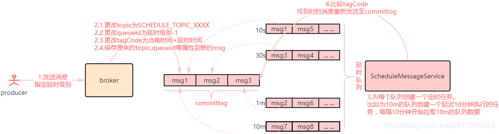
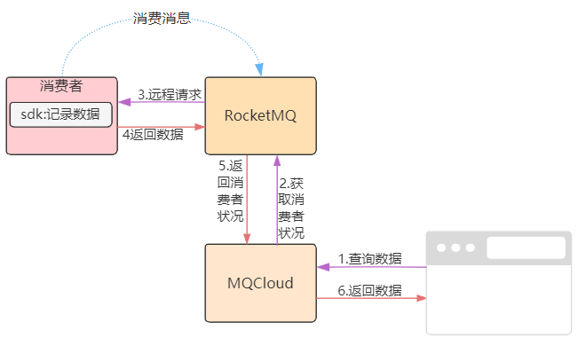
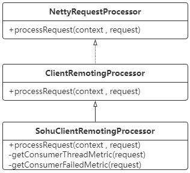
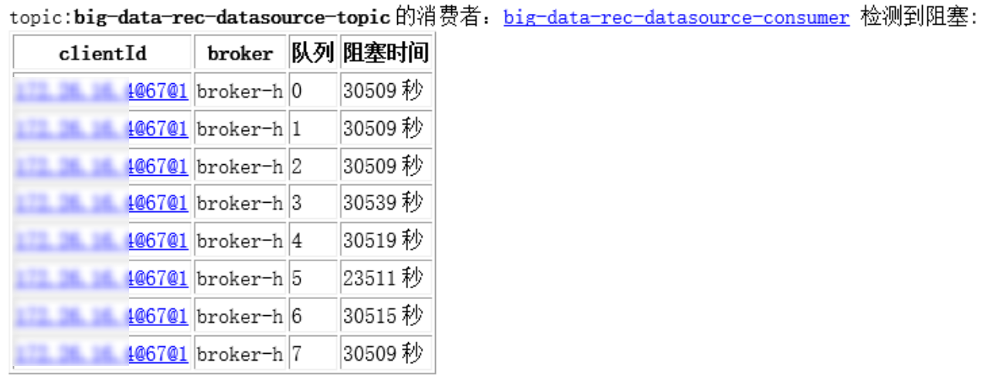
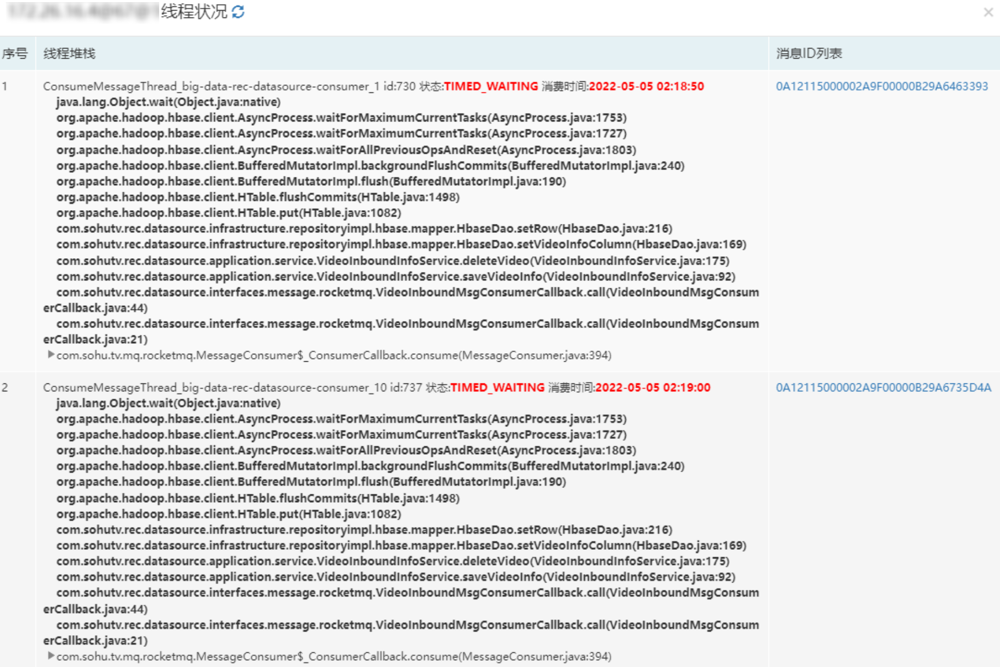
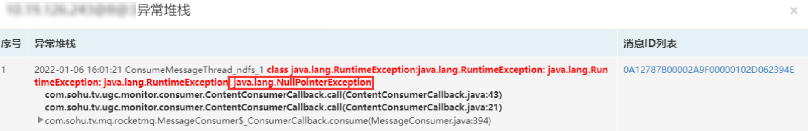
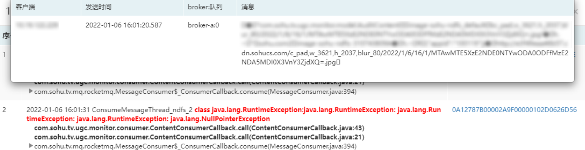

## <span id="question">一、消息队列消费有哪些问题？</span>

消息队列是一种用于服务间异步通信的中间件，主要应用于服务内流量削峰或服务间解耦等场景。

通常情况下，使用消息队列的业务分为两个角色，即生产者和消费者。由生产者发送消息，消费者进行消费。

由于生产和消费是异步进行的，消费者消费消息时通常会遇到如下情况：

**1. 消费的问题：**

* **消息堆积**

  通常由于消费者的业务处理速度过慢，无法跟上生产者的速度，导致消息堆积在消息队列中间件中。

* **消费失败**

  消费者消费消息时由于业务自身的bug或者依赖的资源不可用种种原因，导致无法正常消费这条消息。

而这两个问题通常都会带来如下影响：

**2. 带来的影响**

* **消息堆积的影响**

  无法及时处理的消息可能导致后续的消息继续堆积，继而导致整体消费的延迟，最终导致业务层面出现延迟或整体服务无法响应。

* **消费失败的影响**

  消费失败会导致该条消息消费延迟或消费丢失，最终导致业务层面的逻辑问题。

通常消息中间件对于这两种消费问题都提供了相应的策略，对于RocketMQ来说，它提供了如下处理策略：

**3. RocketMQ的处理策略**

* **消息堆积的处理策略**

  RocketMQ提供了跳过堆积消息的方法：通过重置消费者偏移量，使得业务端可以追上最新的发送进度。但是代价就是跳过的消息丢掉了，而且此种策略对于正在消费中的消息是无效的。试想一下，**如果业务端消费某条消息的业务是进行一个耗时的任务，即使跳过堆积的消息，对于这个耗时任务，仍然会继续执行**。

* **消费失败的处理策略**

  RocketMQ提供了一种重试功能：即将消费失败的消息重新发回到消息队列，按照预设的间隔，消费者会重新拉取到该条消息进行消费，直至达到最大重试次数，还未消费成功，则将消息投递到死信队列中，不再消费。

  具体流程图参考如下：

  

  这种处理策略保障了消费失败的消息有被重新消费的可能，**但是如果消费达到最大次数，此条消息将不再被重试了，就会存在消息丢失的风险**。

消息中间件提供的处理策略，只适用于某些场景，但是无法从根本上解决问题，因为本质原因如下：

**4. 本质的原因**

* **消费堆积的根本原因其实是消费速度过慢**。
* **消费失败的根本原因是业务方面由于某些情况不能处理此条消息**。

所以，要想**从根本上解决这两种问题，就需要首先进行问题的定位**，只有知道了发生问题的原因，才有可能从根本上解决问题。

## <span id="difficult">二、问题定位困难</span>

* 对于消费堆积的情况，业务端进行定位的办法通常是打印线程栈，通过查看线程状态，找到问题线程，从而找到耗时的代码。

  例如，直接到服务器上执行jstack命令，得到类似如下堆栈：

  ```
  "ConsumeMessageThread_mqcloud-json-test-consumer_1@3109" prio=5 tid=0x29 nid=NA runnable
    java.lang.Thread.State: RUNNABLE
  	  at java.net.DualStackPlainSocketImpl.waitForConnect(DualStackPlainSocketImpl.java:-1)
  	  at java.net.DualStackPlainSocketImpl.socketConnect(DualStackPlainSocketImpl.java:85)
  	  at java.net.AbstractPlainSocketImpl.doConnect(AbstractPlainSocketImpl.java:350)
  	  - locked <0xd91> (a java.net.DualStackPlainSocketImpl)
  	  at java.net.AbstractPlainSocketImpl.connectToAddress(AbstractPlainSocketImpl.java:206)
  	  at java.net.AbstractPlainSocketImpl.connect(AbstractPlainSocketImpl.java:188)
  	  at java.net.PlainSocketImpl.connect(PlainSocketImpl.java:172)
  	  at java.net.SocksSocketImpl.connect(SocksSocketImpl.java:392)
  	  at java.net.Socket.connect(Socket.java:589)
  	  at sun.security.ssl.SSLSocketImpl.connect(SSLSocketImpl.java:673)
  	  at sun.net.NetworkClient.doConnect(NetworkClient.java:175)
  	  at sun.net.www.http.HttpClient.openServer(HttpClient.java:463)
  	  at sun.net.www.http.HttpClient.openServer(HttpClient.java:558)
  	  - locked <0xd92> (a sun.net.www.protocol.https.HttpsClient)
  	  at sun.net.www.protocol.https.HttpsClient.<init>(HttpsClient.java:264)
  	  at sun.net.www.protocol.https.HttpsClient.New(HttpsClient.java:367)
  	  at sun.net.www.protocol.https.AbstractDelegateHttpsURLConnection.getNewHttpClient(AbstractDelegateHttpsURLConnection.java:191)
  	  at sun.net.www.protocol.http.HttpURLConnection.plainConnect0(HttpURLConnection.java:1138)
  	  at sun.net.www.protocol.http.HttpURLConnection.plainConnect(HttpURLConnection.java:1032)
  	  at sun.net.www.protocol.https.AbstractDelegateHttpsURLConnection.connect(AbstractDelegateHttpsURLConnection.java:177)
  	  at sun.net.www.protocol.http.HttpURLConnection.getInputStream0(HttpURLConnection.java:1546)
  	  - locked <0xd93> (a sun.net.www.protocol.https.DelegateHttpsURLConnection)
  	  at sun.net.www.protocol.http.HttpURLConnection.getInputStream(HttpURLConnection.java:1474)
  	  at sun.net.www.protocol.https.HttpsURLConnectionImpl.getInputStream(HttpsURLConnectionImpl.java:254)
  	  - locked <0xd94> (a sun.net.www.protocol.https.HttpsURLConnectionImpl)
  	  at com.sohu.tv.mq.rocketmq.HttpUtil.get(HttpUtil.java:58)
  	  at com.sohu.tv.mq.rocketmq.HttpUtil.get(HttpUtil.java:31)
  	  at com.sohu.tv.mq.rocketmq.RocketMQConsumerJsonTest$1.call(RocketMQConsumerJsonTest.java:31)
  	  at com.sohu.tv.mq.rocketmq.RocketMQConsumerJsonTest$1.call(RocketMQConsumerJsonTest.java:29)
  	  at com.sohu.tv.mq.rocketmq.consumer.SingleMessageConsumer.consume(SingleMessageConsumer.java:23)
  	  at com.sohu.tv.mq.rocketmq.consumer.AbstractMessageConsumer.consume(AbstractMessageConsumer.java:115)
  	  at com.sohu.tv.mq.rocketmq.consumer.AbstractMessageConsumer.consumeMessage(AbstractMessageConsumer.java:62)
  	  at com.sohu.tv.mq.rocketmq.RocketMQConsumer$2.consumeMessage(RocketMQConsumer.java:192)
  	  at org.apache.rocketmq.client.impl.consumer.ConsumeMessageConcurrentlyService$ConsumeRequest.run
  ```

  这种方法有如下两个明显的缺点：

    1. 可能无法抓到发生问题的线程栈，因为执行抓取命令时，问题线程可能已近执行完毕了。
    2. 另外jstack会触发jvm的safepoint机制，导致jvm整体暂停，频繁执行jstack显然是不可取的。

* 而对于消费异常的情况，业务端通常需要查看相关日志，看看是否有异常堆栈，从而推断消费失败的原因。

这两种方式通常都需要业务开发人员到服务器上进行操作，不仅费时费力，而且好多情况下可能还无法定位，尤其如果问题是由于数据问题导致的。**比如由于某条消息导致业务耗时，而其他消息不会引起此种问题**，那么业务端往往就很难定位了。

如果能够提供一种可以远程一键定位的方法，在web端可以实时展示消费中的线程栈及消费的消息，还有消费的异常栈及导致异常的消息，那么业务端将会快速定位问题所在。

## <span id="resolution">三、一键定位方案</span>

针对消费堆积的情况，采用如下方法实现问题定位；



整体流程如下：

* 首先在客户端sdk内进行埋点，记录关键数据。
* 接着用户通过web端(MQCloud)查询堆积情况。
* MQCloud通过发送查询请求到RocketMQ（这里需要扩展RocketMQ通信协议，以便支持自定义的指令）
* RocketMQ反向查询客户端sdk内记录的数据，再将数据返回至用户端。

*注：**MQCloud**是搜狐开源的集客户端sdk、监控、运维等功能一站式消息服务平台。*

**这里的核心就是关键数据怎么记录？**

上面已经分析过，消费堆积时，必然是由于消费线程消费某条消息过慢导致，所以当消费线程消费消息时，需要记录下如下统计数据：

* **消费的线程**
* **消费的消息id**
* **消费开始时间**

知道这些数据后，便可以很容易的知道，哪个线程消费的哪些消息消耗了多长时间，简要代码如下：

```
/**
 * 消息统计
 */
public class MessageMetric {
    // 开始时间
    private long startTime;
    // 消费的消息id列表
    private List<String> msgIdList;
}

/**
 * 消费线程状况记录
 */
public class ConsumeThreadStat {

    // 线程消息统计map
    private ConcurrentMap<Thread, MessageMetric> threadMessageMetricMap = new ConcurrentHashMap<>();

    /**
     * 统计线程及消息
     */
    public void set(MessageMetric messageMetric) {
        threadMessageMetricMap.put(Thread.currentThread(), messageMetric);
    }

    /**
     * 移除
     */
    public void remove() {
        threadMessageMetricMap.remove(Thread.currentThread());
    }
}
```

通过在客户端sdk埋点，消费消息时进行记录，消费成功清除统计数据，简要代码如下：

```
/**
 * 消费逻辑
 */
public ConsumeStatus consume(MessageContext<C> context) {
    // 1.解析消息
    List<MQMessage<T>> messageList = parse(context.msgs);
    // 2.获取消费线程统计实例
    ConsumeThreadStat metric = consumeStatManager.getConsumeThreadMetric(consumer);
    try {
        // 3.保存统计数据
        metric.set(buildThreadConsumeMetric(messageList));
        // 消费消息，省略
    } finally {
        // 4.清除统计数据
        metric.remove();
    }
    return ConsumeStatus.OK;
}
```

**在客户端sdk内统计的这些数据，如何才能让业务端快速而且容易的获得？**

其实方法无非两种，要么上报到数据平台进行统计，要么进行实时查询。

如果实时上报，一则数据量很大，二则必然消耗客户端网络。

由于此数据基本是瞬时数据，而需要关心的数据仅仅是消费慢的状况（大部分正常消费的状况并不需要关心），所以采用实时查询的方案更符合本案例。

由于客户端和RocketMQ的Broker建立了长链接（拉取消息，上报偏移量等使用），Broker具备反向通信的能力，即由Broker来查询某个客户端内的数据，故扩展RocketMQ的Broker通信接口即可支持此数据查询，简要代码如下：

```
/**
 * sohu mq实现，为了添加扩展某些方法
 */
public class SohuMQAdmin extends DefaultMQAdmin {
    
    /**
     * 获取消费者客户端统计，往broker发送反查指令
     */
    public ConsumerRunningInfo getConsumeMetrics(String consumerGroup, String clientId, String command, long timeoutMillis) {
        String topic = MixAll.RETRY_GROUP_TOPIC_PREFIX + consumerGroup;
        TopicRouteData topicRouteData = this.examineTopicRouteInfo(topic);
        List<BrokerData> brokerDatas = topicRouteData.getBrokerDatas();
        if (brokerDatas != null) {
            return null;
        }
        for (BrokerData brokerData : brokerDatas) {
            String addr = brokerData.selectBrokerAddr();
            if (addr != null) {
                GetConsumerRunningInfoRequestHeader requestHeader = new GetConsumerRunningInfoRequestHeader();
                requestHeader.setConsumerGroup(consumerGroup);
                requestHeader.setClientId(clientId);
                RemotingCommand request = RemotingCommand.createRequestCommand(RequestCode.GET_CONSUMER_RUNNING_INFO, requestHeader);
                request.addExtField(command, Constant.COMMAND_TRUE);
                RemotingCommand response = getRemotingClient().invokeSync(MixAll.brokerVIPChannel(isVipChannelEnabled(), addr), request, timeoutMillis);
                assert response != null;
                switch (response.getCode()) {
                    case ResponseCode.SUCCESS: {
                        byte[] body = response.getBody();
                        if (body != null) {
                            ConsumerRunningInfo info = ConsumerRunningInfo.decode(body, ConsumerRunningInfo.class);
                            return info;
                        }
                    }
                    default:
                        break;
                }
                throw new MQClientException(response.getCode(), response.getRemark());
            }
        }
    }
}
```

同时，需要扩展客户端指令处理机制，以便接到Broker发送的查询指令时，进行正确响应，类图如下：



代码实现如下：

```
/**
 * sohu 客户端远程处理器
 */
public class SohuClientRemotingProcessor implements NettyRequestProcessor {
    private RocketMQConsumer rocketMQConsumer;

    public RemotingCommand processRequest(ChannelHandlerContext ctx, RemotingCommand request) throws Exception {
        switch (request.getCode()) {
            case RequestCode.GET_CONSUMER_RUNNING_INFO:
                return this.getConsumerRunningInfo(ctx, request);
            default:
                break;
        }
        return null;
    }

    /**
     * 获取运行时信息
     */
    public RemotingCommand getConsumerRunningInfo(ChannelHandlerContext ctx,
            RemotingCommand requestHeader) throws RemotingCommandException {
        HashMap<String, String> map = request.getExtFields();
        ConsumerRunningInfo consumerRunningInfo = null;
        if (map != null && Constant.COMMAND_TRUE.equals(map.get(Constant.COMMAND_THREAD_METRIC))) {
            consumerRunningInfo = getConsumerThreadMetric(requestHeader);
        } else {
            consumerRunningInfo = super.getConsumerRunningInfo(requestHeader);
        }
        RemotingCommand response = RemotingCommand.createResponseCommand(null);
        if (null != consumerRunningInfo) {
            response.setCode(ResponseCode.SUCCESS);
            response.setBody(consumerRunningInfo.encode());
        } else {
            response.setCode(ResponseCode.SYSTEM_ERROR);
            response.setRemark(String.format("The Consumer Group <%s> not exist", requestHeader.getConsumerGroup()));
        }
        return response;
    }

    /**
     * 获取消费线程堆栈
     */
    public ConsumerRunningInfo getConsumerThreadMetric(GetConsumerRunningInfoRequestHeader requestHeader) {
        // 获取线程统计
        ConsumeThreadStat consumeThreadStat = ConsumeStatManager.getInstance().getConsumeThreadMetrics(requestHeader.getConsumerGroup());
        if (consumeThreadStat == null) {
            return null;
        }
        List<StackTraceMetric> threadMetricList = toStackTraceMetricList(consumeThreadStat);
        ConsumerRunningInfo consumerRunningInfo = new ConsumerRunningInfo();
        consumerRunningInfo.getProperties().put(Constant.COMMAND_VALUE_THREAD_METRIC, JSONUtil.toJSONString(threadMetricList));
        return consumerRunningInfo;
    }
}

/**
 * 线程栈消息统计
 */
public class StackTraceMetric {
    // 开始时间
    private long startTime;
    // 消费的消息id
    private List<String> msgIdList;
    // 线程id
    private long id;
    // 线程名
    private String name;
    // 线程状态
    private State state;
    // 线程堆栈
    private StackTraceElement[] stackTraceArray;
    // 消息
    private String message;
}
```

经过扩展RocketMQ通信机制后，可以实时获取到客户端的线程消费消息的数据，从而使得实时展示消费慢的线程状况成为可能。

配合MQCloud的消费阻塞检测预警功能，当收到消费阻塞预警邮件时，一键展示阻塞的线程，使得一键定位问题变得非常容易。

MQCloud的消费阻塞预警如下：



点击预警邮件中的链接可以直接跳到消费详情页面，查询阻塞的线程：



如上图所示，不但可以看到线程堆栈，线程状态，消费开始时间，而且可以看到对应的消息，从而可以很容易定位阻塞的原因。

**针对消费异常的情况，其实与消费堆积的定位流程一样的，唯一的区别仅仅是统计数据不同。**

消费异常数据统计简要代码如下：

```
/**
 * 消息异常统计
 */
public class MessageExceptionMetric extends MessageMetric {
    // 异常
    private Throwable exception;
    // 线程id
    private long threadId;
    // 线程名
    private String threadName;
}

/**
 * 消费失败统计
 */
public class ConsumeFailedStat {
    // 计数数组的下标
    private volatile AtomicLong indexer = new AtomicLong();

    private MessageExceptionMetric[] messageExceptionMetricArray;

    public ConsumeFailedStat(int size) {
        messageExceptionMetricArray = new MessageExceptionMetric[size];
    }

    public void set(MessageExceptionMetric messageExceptionMetric) {
        int index = (int) (indexer.getAndIncrement() % messageExceptionMetricArray.length);
        // 溢出重置
        if (index < 0) {
            indexer.set(0);
            index = 0;
        }
        messageExceptionMetricArray[index] = messageExceptionMetric;
    }
}
```

通过在客户端sdk埋点，消费消息异常时进行记录，简要代码如下：

```
/**
 * 消费逻辑
 */
public ConsumeStatus consume(MessageContext<C> context) {
    // 1.解析消息
    List<MQMessage<T>> messageList = parse(context.msgs);
    try {
        // 消费消息，省略
    } catch (Throwable e) {
        // 2.记录异常数据
        ConsumeStatManager.getInstance().getConsumeFailedStat(group)
            .set(buildMessageExceptionMetric(mqMessage, e));
        return ConsumeStatus.FAIL;
    }
    return ConsumeStatus.OK;
}

/**
 * 构建异常消费统计
 */
public MessageExceptionMetric buildMessageExceptionMetric(MQMessage<T> mqMessage, Throwable e) {
    MessageExceptionMetric messageMetric = new MessageExceptionMetric();
    messageMetric.setStartTime(System.currentTimeMillis());
    messageMetric.setThreadId(Thread.currentThread().getId());
    messageMetric.setThreadName(Thread.currentThread().getName());
    messageMetric.setException(e);
    List<String> idList = new LinkedList<>();
    idList.add(mqMessage.buildOffsetMsgId());
    messageMetric.setMsgIdList(idList);
    return messageMetric;
}
```

与消费堆积一样，MQCloud针对消费失败的情况也有相应的预警，如下：


点击预警邮件中的链接可以直接跳到消费详情页面，查询消费失败的堆栈：



点击消息id后，还可以查询到导致该异常的消息内容：



业务人员根据异常堆栈和消息内容，可以很容易定位到问题所在，从而节省了处理问题的时间。

## <span id="summary">四、总结</span>

通过实时收集消费者线程堆栈，异常堆栈及对应消息等状况，并通过扩展RocketMQ内部通信协议，使得实时诊断消费阻塞和消费失败等常见问题变得可行，并通过MQCloud进行web展示，从而定位客户端的阻塞和异常问题变得轻松自如，节省了业务遇到此类问题时，进行繁琐诊断的时间，提升了业务端的开发效率。

## <span id="ref">五、参考文献</span>

1. [RocketMQ通信](https://github.com/apache/rocketmq/blob/develop/docs/cn/design.md)
2. [MQCloud](https://github.com/sohutv/mqcloud)