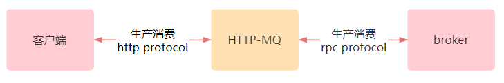
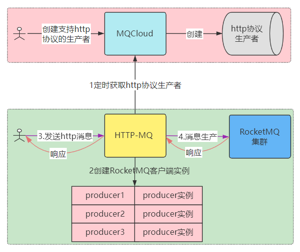
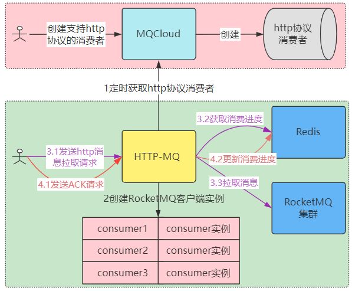
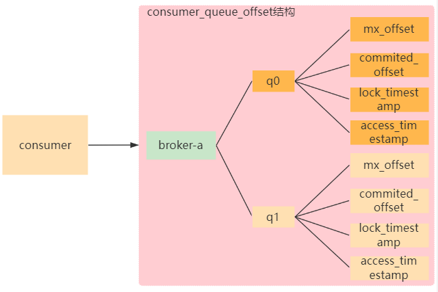
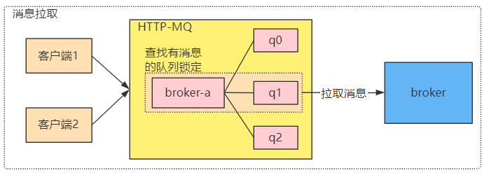
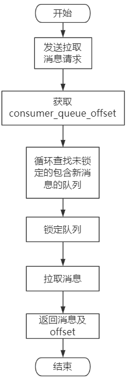
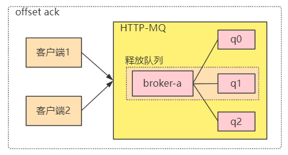
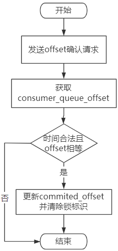
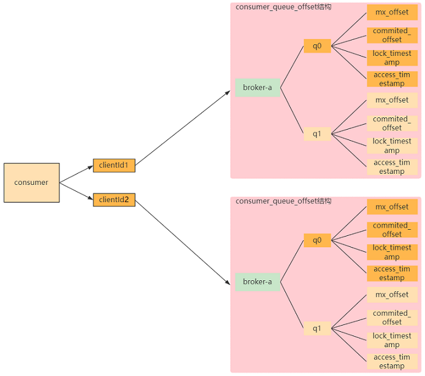

## <span id="why">一、为什么需要支持HTTP协议？</span>

由于RocketMQ是采用java语言开发的消息中间件，它默认提供了java语言的客户端，用于跟RocketMQ的组件进行交互。

如果非java语言想要使用RocketMQ进行消息的生产或消费，那么就需要使用由开源社区的开发者提供的相应语言的客户端，包括但不限于如下语言的客户端：

* c++
* go
* python

而RocketMQ客户端与RocketMQ组件交互采用私有通信协议，并且客户端承担了很多逻辑，比如：

* 通信管理
* 路由管理
* 消费均衡
* 偏移量管理
* 等等

这些问题导致其他语言在实现RocketMQ客户端时很复杂，继而导致非java语言客户端往往存在很多潜在的问题。

另外，由于不同语言的客户端由开源社区维护，更新往往不及时，导致很多功能其实没有实现，各个版本在兼容性方面也存在很大问题。

尤其是当其他语言的客户端出现生产或消费问题时，需要同时精通此语言和RocketMQ原理的人员，如此高昂的成本，导致问题往往难以定位，会极大的影响业务的进展。

这里还存在一个问题，就是如果业务方使用的语言没有对应的RocketMQ客户端实现时，则没有办法使用RocketMQ服务了，比如javascript，c，c#，php等等。

基于以上种种问题，迫切需要一种通用的客户端，即所有语言都支持的协议，用于跟RocketMQ交互。

在这里，HTTP协议呼之欲出，因为几乎所有的语言都实现了HTTP协议。只要基于HTTP协议，开发一个通用的代理服务，用于跟RocketMQ交互，屏蔽与RocketMQ交互的细节，从而使得其他语言可以通过代理服务进行消息的生产和消费。同时，当其他语言客户端与代理服务交互出现问题时，可以在代理服务端很容易定位和解决。


## <span id="resolution">二、HTTP协议的RocketMQ解决方案</span>

经过调研，阿里云支持HTTP协议的MQ，但是它是商业版收费的。而业界并没有完备的基于HTTP协议的RocketMQ代理解决方案。

这里进行一下可行性分析。

通过HTTP协议代理RocketMQ的难点有哪些？

1. 既然是HTTP协议，那么代理服务必然就是web服务，而web服务为了做到高可用，必须是**无状态的**。

   否则涉及到数据存储，高可用和一致性将无法同时保障。

2. 既然采用HTTP协议，那么客户端跟代理服务交互就不能太复杂。

针对上面的难点，结合RocketMQ进行一下分析。

1. **首先，看一下消息的生产。**

   RocketMQ普通消息的生产过程其实就是消息发送到Broker并进行持久化的过程。

   至于发送到哪个Broker，默认是轮询发送，所以，生产过程其实是无状态的。

2. **其次，看一下消息的消费。**

   RocketMQ普通消息的消费过程其实就是根据Topic的队列里消息的偏移量，从Broker拉取消息。消费完毕更新偏移量，以便更新消费进度。

   由于这里涉及到了偏移量的更新，即数据写入，其必然是有状态的。

   RocketMQ的java客户端默认提供的两种消费实现：MQPushConsumer及LitePullConsumer，它们含了队列的分配和偏移量管理，本质上是有状态的。

   故这里为了消除状态管理，势必需要引入一额外的**统一的队列偏移量管理**。

   这样，客户端就可以不必知道消息在哪些队列存储着，当前消费到哪里了等状态数据。

   当客户端拉取消息的请求过来时，由代理服务查询统一的队列偏移量数据，进行灵活的分配，从而实现无状态化。

## <span id="impl">三、HTTP-MQ（HTTP协议的RocketMQ代理）设计与实现</span>

HTTP-MQ设计整体如下：



1. 客户端采用HTTP协议，通过HTTP-MQ进行通信，发送生产消息或消费消息的请求。
2. HTTP-MQ获取到客户端的请求后，采用RocketMQ的java客户端，与Broker进行通信，发送消息或拉取消息，并将结果返回给客户端，从而屏蔽了客户端与RocketMQ交互的细节。

根据之前的可行性分析已知，消息生产是无状态的，实现起来很简单，首先看下消息生产的设计。

**1 HTTP-MQ消息生产的设计**



1. 业务人员先在MQCloud中申请创建HTTP协议的生产者，MQCloud会存储并标识哪些生产者是HTTP协议的。

   HTTP-MQ定时从MQCloud中获取到支持HTTP协议的生产者。

2. 针对这些生产者初始化RocketMQ的java客户端实例。

3. 当用户发送http消息时，携带指定的生产者名称，HTTP-MQ根据生产者名称获取对应的RocketMQ的java客户端实例。

4. 使用RocketMQ的java客户端实例直接发送消息，并将响应请求返回给用户。

HTTP入口代码如下：

```
/**
 * 生产消息
 */
@PostMapping("/produce")
public MQProxyResponse<?> produce(@Valid MessageParam messageParam) throws Exception {
    ProducerProxy producerProxy = producerManager.getProducer(messageParam.getProducer());
    Result<SendResult> result = producerProxy.send(messageParam);
    return MQProxyResponse.buildResponse(result);
}
```

部分生产代码如下：

```
public class ProducerManager {

    // HTTP协议生产者对应的RocketMQ生产实例
    private ConcurrentMap<String, ProducerProxy> producerMap = new ConcurrentHashMap<>();

    public ProducerProxy getProducer(String producer) {
        ProducerProxy consumerProxy = producerMap.get(producer);
        if (consumerProxy == null) {
            throw new MQException("producer:" + producer + " haven't registered");
        }
        return consumerProxy;
    }

    /**
     * 注册TopicProducer
     * @param topicProducer
     */
    public void register(TopicProducer topicProducer) {
        String producer = topicProducer.getProducer();
        String topic = topicProducer.getTopic();
        ProducerProxy producerProxy = producerMap.get(producer);
        if (producerProxy != null) {
            log.error("producer:{} have registered:{}", producer, topic);
            return;
        }
        // 创建ProducerProxy
        producerProxy = new ProducerProxy(producer, topic);
        if (producerProxy.start()) {
            ProducerProxy preProducer = producerMap.putIfAbsent(producer, producerProxy);
            if (preProducer != null) {
                producerProxy.getProducer().shutdown();
                log.error("producer:{} registered:{} failed, prev exist!", producer, topic);
            } else {
                log.info("producer:{} register:{} ok", producer, topic);
            }
        } else {
            log.info("producer:{} register:{} failed, start failed", producer, topic);
        }
    }

    /**
     * 生产代理
     */
    public static class ProducerProxy {
        private Logger log;

        private RocketMQProducer producer;

        public ProducerProxy(String producerGroup, String topic) {
            log = LoggerFactory.getLogger(producerGroup);
            producer = new RocketMQProducer(producerGroup, topic);
        }

        /**
         * 启动
         */
        public boolean start() {
            producer.start();
            return ServiceState.RUNNING == producer.getDefaultMQProducerImpl().getServiceState();
        }

        /**
         * 消息发送
         */
        public Result<SendResult> send(MessageParam param) {
            MQMessage mqMessage = MQMessage.build(param.getMessage()).setKeys(param.getKeys());
            return producer.send(mqMessage);
        }
    }
}
```

HTTP协议的消息生产相对简单，消费由于是有状态的，相对会复杂一些，下面看一下HTTP协议消费的设计。

**2 HTTP-MQ消息消费的设计**



1. 业务人员先在MQCloud中申请创建HTTP协议的消费者，MQCloud会存储并标识哪些消费者是HTTP协议的。

   HTTP-MQ定时从MQCloud中获取到支持HTTP协议的消费者。

2. 针对这些消费者初始化RocketMQ的java客户端实例。

3. 3.1当用户发送HTTP消息拉取请求时，携带指定的消费者名称，HTTP-MQ根据消费者名称获取RocketMQ的java客户端实例。

4. 3.2从redis中获取到消费者的消费进度。

5. 3.3使用RocketMQ的java客户端实例根据消费进度从RocketMQ集群中拉取消息，并将消息返回给用户。

6. 4.1用户消费完此批消息后，需要发送ACK确认请求，以便告知HTTP-MQ消费成功。

7. 4.2HTTP-MQ更新消费进度到redis，当下次用户请求消费时可以消费新的消息了。

根据之前的可行性分析已知，消息消费是有状态的，故需要依赖外部存储-redis，这里设计了**统一的队列偏移量结构**，如下：



上图的结构标识某个消费组(cosnumer)所消费的topic的队列和偏移量进度，其中：

- broker-a表示消费者消费的topic在哪个broker上。
- q0,q1表示broker上的队列。
- mx_offset表示该队列的最大偏移量。
- committed_offset表示消费者已经确认消费过的偏移量。
- lock_timestamp表示该队列正在被锁定中及锁定时间戳。
- access_timestamp表示该队列被消费的最新时间戳。

根据上面的这些数据，很容易得知如下重要信息：

- 哪些队列有新的消息可以消费(mx_offset-committed_offset>0)
- 哪个队列正在被消费
- 每个队列的消费进度
- 每个队列的最近消费时间

根据这些信息，在消费请求到来时，很容易为其计算出合适的队列，分配给该次请求，从而实现消息消费。

另外，该结构非常适合采用redis的hash结构来进行存储，故可以采用redis作为全局存储。

根据如上数据结构，HTTP-MQ仅仅使用RocketMQ的java客户端的原生的DefaultMQPullConsumer，根据队列和偏移量信息，就可以直接从Broker拉取消息，从而**消除了本地的状态维护**。

由于RocketMQ的消费方式有两种：

* 集群消费：所有的消费实例均分消息进行消费。
* 广播消费：保障每个消费实例消费所有消息。

故需要支持这两种不同的消费方式，下面先看一下集群消费的设计与实现：

**集群消费的设计**

集群消费要求，同一个消费组下，所有的消费实例均分消息，故要保障消息只能被某一个实例所消费。



如上图所示：当HTTP-MQ收到客户端发送消费请求时，通过选择可供消费的队列，然后加锁的方式，保障一个队列同时只能被一个客户端消费。这里的加锁是分布式的全局锁，采用redis实现，保障了并发安全性。

具体流程图如下:



1. 客户端发送拉取消息请求
2. HTTP-MQ从redis中获取队列和偏移量数据结构
3. 循环所有队列，查找可以消费的队列
4. 锁定队列
5. 拉取消息后返回客户端（包括队列和偏移量信息，用于客户端ACK使用）

客户端消费完消息后，需要发送ACK确认请求，以便告知HTTP-MQ消费成功，ACK示意图：



HTTP-MQ收到客户端ACK请求后，根据携带的参数（上次拉取消息请求的响应数据中携带的），类似如下：
broker:queue:offset:next_offset:timestamp
定位到该队列，更新消费偏移量，并解锁。

具体流程图如下:



1. 客户端发送offset ACK请求。
2. HTTP-MQ从redis中获取队列和偏移量数据结构。
3. 根据请求参数，定位到锁定的队列。
4. 比较队列锁定时间与客户端请求参数携带的时间，若差值在一定阈值，并且锁定队列的消费偏移量与请求参数相同，则认为ACK合法，更新偏移量并解锁队列，否则认为本次offset ACK请求失效。

HTTP入口代码如下：

```
/**
 * 拉取消息
 */
@RequestMapping("/message")
public MQProxyResponse<?> message(@Valid ConsumeParam param) throws Exception {
    return messageFetcher.fetch(FetchRequest.build(param));
}
```

消息抓取的实现：

```
/**
 * 消息抓取器
 */
public class MessageFetcher {

    @Autowired
    private ConsumerManager consumerManager;

    /**
     * 拉取消息
     */
    public MQProxyResponse<FetchResult> fetch(FetchRequest request) throws Exception {
        // 获取消费代理
        ConsumerProxy consumer = consumerManager.getConsumer(request);
        // offset ack
        consumer.offsetAck(request);
        // 选择合适的队列
        ConsumerQueueOffset queueOffset = consumer.choose(request.getClientId());
        if (queueOffset == null) {
            return MQProxyResponse.buildErrorResponse("no queue choose");
        }
        // 拉取结果
        FetchResult fetchResult = null;
        try {
            // 消息拉取
            PullResponse pullResponse = consumer.pull(queueOffset.getMessageQueue(), queueOffset.getCommittedOffset());
            // 更新最大offset
            consumer.updateMaxOffset(request.getClientId(), queueOffset, pullResponse.getMaxOffset());
            // 构建结果
            fetchResult = buildFetchResult(consumer, pullResponse);
        } catch (Exception e) {
            log.error("pull from {}:{} queueOffset:{}", request.getTopic(), request.getConsumer(), queueOffset, e);
            return MQProxyResponse.buildErrorResponse(e.toString());
        }
        // 设置requestId，以便下次消费时ack
        fetchResult.setRequestId(request.encode());
        return MQProxyResponse.buildOKResponse(fetchResult);
    }
}

/**
 * 消费者队列偏移量
 */
public class ConsumerQueueOffset {
    private MessageQueue messageQueue;
    // 队列最大偏移量
    private long maxOffset = -1;
    // 提交的偏移量
    private long committedOffset = -1;
    // 锁定的时间戳
    private long lockTimestamp;
    // 上次消费时间戳
    private long lastConsumeTimestamp;
}
```

队列选择实现：

```
/**
 * 挑选合适的ConsumerQueueOffset
 */
public ConsumerQueueOffset choose(String clientId) throws MQClientException {
    // 获取所有的队列偏移量
    String key = toKey(clientId);
    Map<String, String> map = redis.hgetAll(key);
    if (map == null) {
        return null;
    }
    // 转化队列偏移量为对象
    List<ConsumerQueueOffset> consumerQueueOffsetList = toConsumerQueueOffsetList(map);
    for (ConsumerQueueOffset consumerQueueOffset : consumerQueueOffsetList) {
        ConsumerQueueOffset chosen = choose(key, consumerQueueOffset);
        if (chosen != null) {
            return chosen;
        }
    }
    return null;
}

/**
 * 选择合适的队列
 */
private ConsumerQueueOffset choose(String key, ConsumerQueueOffset queueOffset) {
    long lockTimestamp = System.currentTimeMillis();
    // 锁定队列失败
    if (!lock(key, queueOffset.getMessageQueue(), lockTimestamp)) {
        return null;
    }
    // 同步committedOffset
    syncCommittedOffset(key, queueOffset);
    // 设置锁定时间
    queueOffset.setLockTimestamp(lockTimestamp);
    return queueOffset;
}
```

**广播消费的设计**

广播消费要保障每个消费实例消费所有消息。
由于HTTP-MQ是无状态的web服务，所以无法区分请求来自于一个客户端还是多个客户端。
为了实现广播消费，需要客户端发送请求时加上一个唯一标识，即clientId。
不同的客户端使用不同的clientId，比如可以使用ip+进程id作为clientId。

HTTP-MQ收到消费请求后，通过clientId即可区分不同的客户端。
广播消费与集群消费实现总体类似，唯一的区别就是每个clientId都单独对应一个队列和偏移量的数据结构。

广播模式的队列偏移量结构如下：



同一个消费组下，每个clientId拥有自己的队列和偏移量结构，从而可以实现每个clientId的客户端实现消费进度的隔离，使得不同clientId的客户端可以消费所有的消息。

广播消费的实现完全复用了集群模式的代码，具体不再列出。

**辅助功能的设计实现**

辅助功能包括但不限于如下：

* 偏移量重置（实现重新消费或跳过堆积）
* 堆积预警
* 消费暂停、恢复
* 消费限流控制

以上种种辅助功能均可通过修改redis中的队列偏移量实现或在HTTP-MQ中实现，MQCloud中已经支持这些功能了，例如下图为某个HTTP协议的集群消费者的消费进度，消费时间，以及堆积情况：


## <span id="summary">四、总结</span>

HTTP-MQ通过HTTP协议代理RocketMQ消息队列，为客户端屏蔽了RocketMQ私有通信协议，以及复杂的交互逻辑，从而使得所有语言均可采用HTTP协议，通过HTTP-MQ使用RocketMQ生产和消费消息，节省了各种语言的业务接入消息中间件的成本，也提升了运维效率。

目前该方案已经通过发明专利授权，公开号：[CN115118708B](https://aiqicha.baidu.com/patent/info?referId=3c788200f0249a0d3eda2d3a04534c4e64c84917&pid=28955918037316)，并且已经开源，欢迎大家使用：[MQ-Proxy](https://github.com/sohutv/mq-proxy)。
