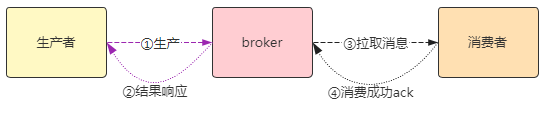
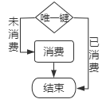
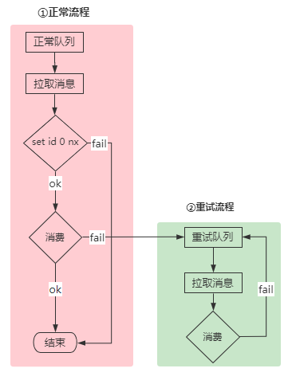
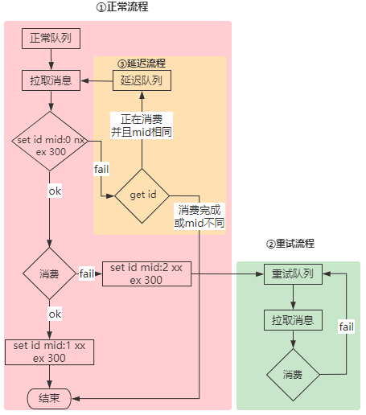
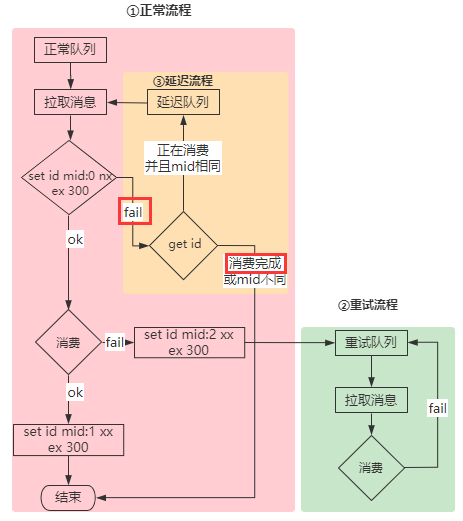
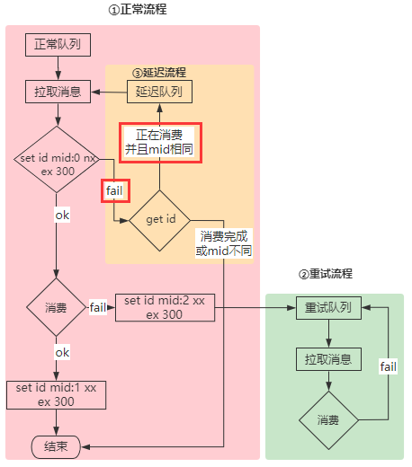

## 一、重复消费的情况

RocketMQ消费的时候支持At least Once ，即每个消息必须投递一次。

简单看下生产消费流程图，就可以知道了：

从消费流程③④可以看出，**消费者只有消费成功，才会向broker返回ack，保障了消息至少成功消费一次**。

但是RocketMQ消费并不支持Exactly Only Once，即允许消费重复的消息。

那么上面流程哪些地方可能导致重复消费的情况？

- 发送的消息重复

  - 参考①流程，当生产者发送消息到达broker，由于网络或客户端原因，导致②响应失败。

    此时，生产者可能进行重试发送，导致出现重复的消息。

- 消息重复投递

  - 参考③流程，当消费者拉取到消息，消费完毕后，由于网络或客户端等原因，导致④ack失败。

    此时，当网络或客户端恢复等，broker可能重复投递已经被成功消费的消息，导致重复消费。

- 负载均衡导致重复消费

  - broker更新、扩容等重启，或客户端重启都会导致消费重新均衡，此时可能会重复消费消息。

## 二、消息去重

RocketMQ推荐在业务端自己实现幂等业务，但是除非业务有强烈的幂等要求，否则一般希望消息尽量不重复。

要想实现消息去重，需要以**唯一键**作为去重标识，类似如下：

**当检查到某消息已经消费时，直接结束，即可保证重复的消息只消费一次**。

*这里说一下唯一键的选择，RocketMQ消息具有Message ID字段，其具有唯一性，其组成如下：*

*ip+pid+类加载器hash+系统时间戳+自增序号*

*无论是否在在同一jvm内，并发生成，也不存在重复的可能。但是不建议作为唯一键进行去重，因为生产者如果发送消息进行重试，可能相同的消息对应的Message ID不同。* 

由于消费者是分布式的，所以需要将所有的消息唯一键存储起来，比如redis，参见下图：

上面有两个流程：

- ①正常流程就是带去重功能的消费流程，只是消费前需要判断该消息是否消费过，若已消费过，直接结束；若未消费过，进入正常的消费流程。
- ②重试流程是如果消息消费失败，则进入重试队列，重试的消息不再走去重逻辑。(*因为考虑到业务已经消费过一次，并且失败了，需要重试流程保障其一定消费成功。*)

这里可能有个问题，就是在①正常流程中，如果某个消费者设置消费标识成功，但是在消费消息成功之前退出了，那么该消息虽未消费成功却被认为已经消费了，岂不是丢失了消息？

所以要保证此消息一定消费成功，增加**③延迟消费流程**作为正常流程的补充，如下：

相对于之前的流程，做了两点修改：

1. redis中缓存的值存储为mid(可以理解为消息的唯一标识，即使MessageId一样，mid也不一样)，并且携带过期时间和消费状态。
2. 当某个消息正在消费中时，由于broker更新等导致消费者重新平衡，此消息被分配到了其他消费者，那么该消息会进入**③延迟流程**中，该消息将被投递到延迟队列，等待被重新消费。

这样就保障了未确认消费状态的消息一定会被成功消费。

## 三、去重情况

这里来看一下，针对**一、重复消费的情况**的三种情况是否能够去重：

1. 发送的消息重复，即重复的消息

   因为重复的消息id相同，但是mid不同，故它们将在下面的步骤中被去重：

   

2. 消息重复投递，即broker重复投递消费者已经消费成功的消息

   因为消息已经消费完成，所以它们将在下面的步骤中被去重：

   

3. 负载均衡导致重复消费

   此种情况即同一条消息被投递到多个消费者，那么它们也将在如下步骤中被去重：

   

   即无论此消息被某个消费者消费成功或失败，都将不被其他消费者消费。

当然，这里依然还存在某些问题，比如：

      1. redis不可用时，去重功能将失效。
      2. 消息消费失败时，去重功能也将失效。
      3. 消费消费时间过长，消费状态超时自动删除，去重功能失效。

   但是，**去重和保障成功消费本来就是一对矛盾体，只能权衡保障大部分情况满足要求**。
