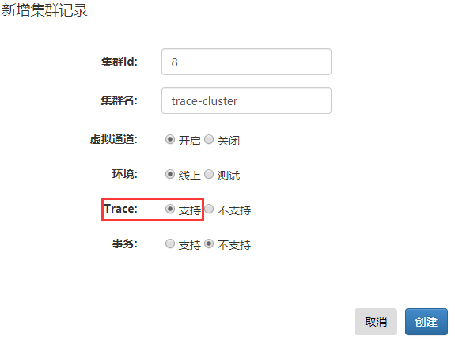
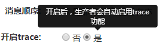
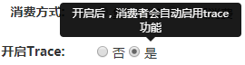
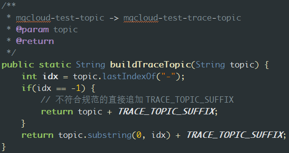
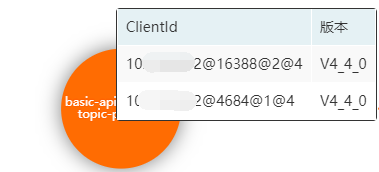
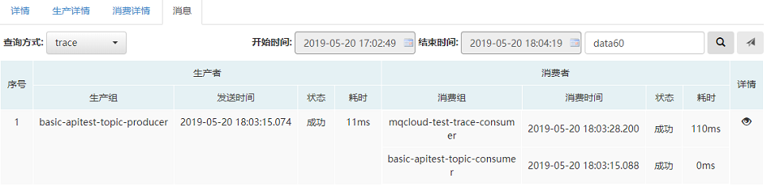
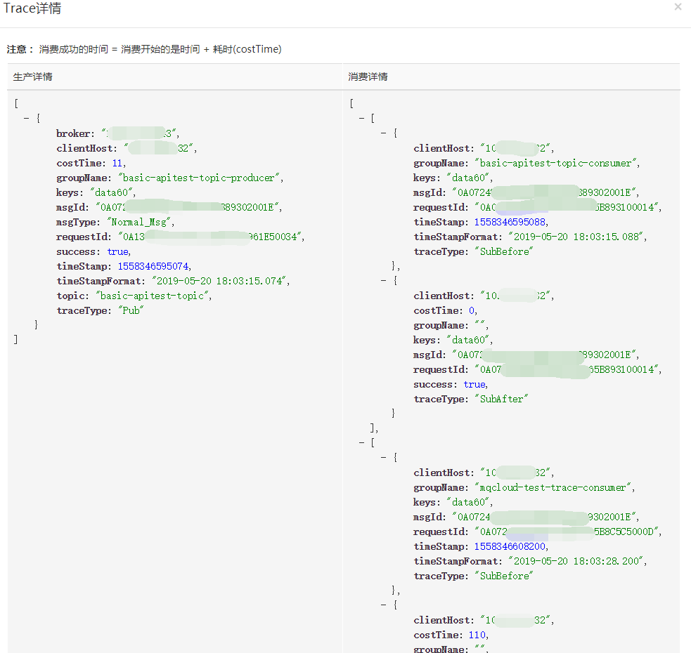

## 一、背景

RocketMQ从4.4.0起提供了消息的trace功能（不支持事务消息），默认其使用了与普通topic在同一集群的Name Server集群。而broker端如果启用了trace功能，默认创建一个RMQ_SYS_TRACE_TOPIC的topic，trace的数据将会发送到此topic中。

而MQCloud是通过域名方式发现RocketMQ集群的，它可以管理多个Name Server集群，所以MQCloud对官方的trace功能进行了部分适配，以便能够自动的将trace数据发到单独的broker集群，而且和MQCloud无缝整合。

## 二、后台适配

管理员可以通过`集群发现`菜单，创建一个新的Name Server集群，指定开启trace：

之后通过`集群管理`菜单正常部署broker即可。

## 三、前台适配

针对用户申请新建topic时，通过`我要生产消息`菜单，其中的如下选项：

用户开启后，将会把用户的业务topic对应的trace topic创建在trace集群上，具体步骤参见：[有关Trace消息](https://github.com/sohutv/mqcloud/wiki/%E6%9C%89%E5%85%B3Trace%E6%B6%88%E6%81%AF)

同样，消费者消费消息时，也会提供相应是否开启trace的选项：

用户开启后，将会在客户端进行自动trace。

## 四、客户端适配

生产者或消费者启动时，将会从MQCloud拉取配置信息，其中就包括了是否开启了trace支持。针对开启了trace要求的客户端，MQCloud会根据用户指定的topic构建一个对应的trace topic生产者，因为规则是固定的：

然后再根据trace topic到MQCloud查询其配置信息，进行初始化，之后用来替换官方提供的`org.apache.rocketmq.client.trace.AsyncTraceDispatcher`中的`DefaultMQProducer`，从而实现完美适配。

另外，MQCloud针对生产者和消费者的trace客户端单独设置了instanceName，在构建clientId（参见[2.客户端]里的Client ID部分）时将其构建了进去，这样，同一个jvm里针对同一个topic的trace客户端可以很容易区分出来：

释义：各项含义是 ip@pid@role@clusterId

其中role=1表示为生产者的trace客户端，role=2表示为消费者的trace客户端

## 五、消息查询

RocketMQ的原生console支持trace消息查询，而MQCloud做了进一步的优化。使用者可以通过自己的业务topic来查询，举个例子说明一下：

比如使用者的topic是mqcloud-test-topic，位于集群1。

而该trace的trace topic：mqcloud-test-trace-topic位于集群2。

那么使用者并不关心trace数据在哪，他只需要通过mqcloud-test-topic的查询页面查询到trace数据就可以，而MQCloud正是这样设计的。

使用者可以通过`消息`tab，查询方式选择`trace`，选择好查询的时间段，输入key进行查询即可：

这里展示了trace的详细信息，点击后面的`详情`的小眼睛，可以看到trace的格式化后的数据：

另外，也可以通过其他查询方式查到结果后，点击`序号`字段，快速跳到trace页面。