# <span id="case">一、RocketMQ快速失败机制案例</span>

### 1 RocketMQ快速失败机制是什么？

RocketMQ的快速失败机制是当broker处理请求过慢时，为了防止客户端请求在broker端堆积，造成broker不能响应，而采取的剔除部分超时客户端请求的机制，其本质是RocketMQ为了保护broker而采取的限流策略。

### 2 RocketMQ快速失败机制引发的问题

某天突然收到多个topic消息生产失败的邮件预警，涉及到整个集群，预警邮件如下：

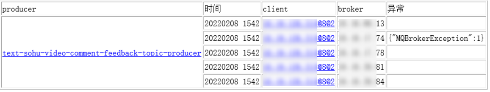

随即查看了生产端的日志，发现了如下异常栈：

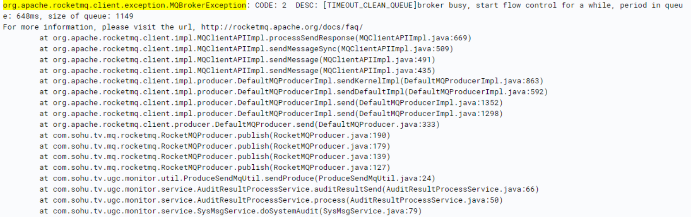

日志中的`[TIMEOUT_CLEAN_QUEUE]broker busy`说明broker压力过大，触发了快速失败机制。

**紧急处理措施：** 由于默认的快速失败机制的阈值为200ms，即发送消息请求若200ms内还未被处理，则直接剔除该请求，故先把阈值调整为2000ms，暂时保障集群正常处理请求。

### 3 问题调查

1. **topic流量调查**

   由于我们已经对所有的topic都进行了流量统计，立马查看了所有的topic流量，并没有发现流量突增的情况。

2. **broker流量调查**

   查看出现问题的broker的消息写入量，发现了问题：

   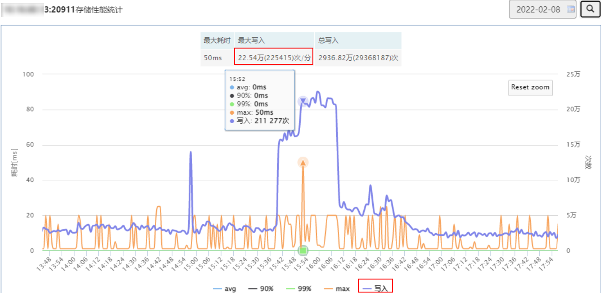

   从上图可以看出，消息写入量从之前的平均3万/分钟暴涨到了22.54万/分钟，流量瞬间暴涨了近8倍。这个写入量虽然出现暴涨，但是对于broker来说抗这点量应该不是问题，随即调查了问题机器的负载情况，如下图：

   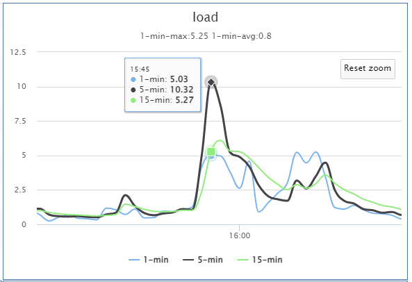

   从上图可以看出来，机器5分钟负载已经达到了10.32，而此机器配置较低，仅为4核，而集群中其他broker的流量同样较高，但是load却低于1。

3. **流量暴涨的topic**

   现在需要调查到底是哪个topic发送消息量暴涨，引起了这个问题。

   经过调查broker端的stats.log，发现了如下异常日志：

   ```
   2022-02-08 15:40:00 INFO - [TOPIC_PUT_NUMS] [%RETRY%get-pugc-to-ai-consumer] Stats In One Minute, SUM: 47119 TPS: 785.32 AVGPT: 1.00
   ```

   即get-pugc-to-ai-consumer的重试topic出现了大量消息写入，%RETRY%是RocketMQ为每个消费者创建的重试topic，而RocketMQ会把消费失败的消息重新发送到这个重试topic中，以便消费者能够重新消费。

4. **重试消息暴涨的原因**

   经过调查业务端get-pugc-to-ai-consumer的消费代码发现，消费端使用的语言是Python，由于业务端对RocketMQ-Python不熟悉，编码不规范，导致消费消息后没有返回ACK标识，致使RocketMQ认为消费失败了，从而导致将所有消费过的消息都重新发送到了重试topic中：

   ```
   def callback(msg):
       print(msg.id, msg.body)
       return ConsumeStatus.CONSUME_SUCCESS // 此ACK语句丢失
   ```
### 4 问题结论

该问题实际上是由于编码不规范，导致大量消息重发到broker，而突增的流量导致配置较低的broker负载过高，触发了快速失败机制，而快速失败机制是不区分topic的，从而造成了其他topic消息发送失败。

# <span id="think">二、RocketMQ快速失败机制的思考</span>

这里以本次消息发送失败事件为参考，看一下快速失败机制原理，下面是broker通信层的线程模型：

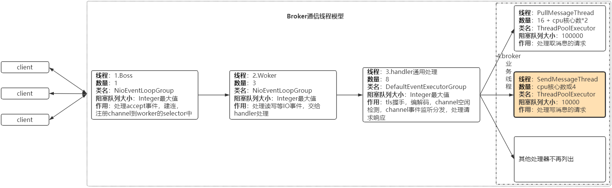

broker通信层采用netty实现，而netty作为异步的、事件驱动的网络框架，在broker中其线程模型如上图所示：

1. Boss线程：用于处理accept事件，建立连接，注册channel到woker的selector中。
2. Woker线程：用于处理读写IO事件，并转交给后的handler处理。
3. handler通用处理线程：broker用于实现tls握手，编解码，channel事件监听分发，处理请求响应等。
4. broker业务线程：用于各种功能实现，比如消息写入请求处理，消息拉取请求处理等等。

而broker的快速失败机制正是在`broker业务线程`的`SendMessageThread`中实现的，该机制会检测线程的ThreadPoolExecutor的阻塞队列，即当阻塞队列的请求在队列中停留时间超过200ms还未被处理，将会被移除掉。

broker的快速失败机制，本意为保护broker，即防止在broker存储过慢或负载过高时，大量请求堆积，导致broker崩溃。

此机制的目的虽然没有错，但是其保护粒度显然有些过于粗糙。

针对本案例，由于某一个消费者大量发送重试消息，导致其他topic的写消息请求别拒绝，显然有些不合理。

# <span id="solution">三、RocketMQ快速失败机制的优化方案</span>

针对本案例，可以采取如下两种方案进行优化：

1. 采用单独的线程池来处理重试消息发送请求，即跟正常topic写消息请求的线程池隔离开，防止重试消息影响正常消息。
2. 针对ip或topic采取限流策略，防止某个ip或topic大量写消息请求影响其他topic。

**第一种方案的优劣：**

* 优点：实现简单，可以保障重试消息不影响正常的消息发送。
* 缺点：
  * 该方案不通用，只适用于重试消息与普通消息。
  * 突然暴增的重试消息流量依然会影响其他消费者发送重试消息。

**第二种方案的优劣：**

* 优点：以ip或topic为维度，实行细粒度的控制，可以很好的防止某个ip或topic的流量影响整个集群。
* 缺点：需要单独开发，以及远程实时控制ip或topic级别的限流。

很明显，使用第二种方案更优一些。

那么，限流资源该如何选取呢？

* ip，针对ip和端口进行限流
  * 优点：可以防止某个ip的写请求量暴增。
  * 缺点：若业务存在发送消息到多个topic的情况，可能存在误伤。
* topic（重试消息可以针对consumerGroup）
  * 优点：多个客户端往一个topic发送消息依然可以触发限流。
  * 缺点：限流的阈值不好确定。

显然，针对topic限流更符合业务端的情况，所以采用topic维度的限流更合适。

**综上**：由于一个业务往往使用的topic不是很多，而RocketMQ集群可以支撑上万个topic，所以一个RocketMQ集群通常是为多个业务提供支撑，也就是说实际情况往往是多个业务共用同一个RocketMQ集群，所以采用topic维度的限流的策略更适用于这个场景。

# <span id="impl">四、RocketMQ Topic维度限流的实现</span>

### 1 在哪里进行限流？

结合上面提到的`broker通信层的线程模型`, 如果要采取限流，就需要在`3.handler通用处理线程`层来做，因为不能让消息写入事件传播到`broker业务线程`的`SendMessageThread`中，否则依然可能会触发快速失败机制。

针对netty的处理器链模式，在broker的`handler通用处理线程`增加前置处理器，专门针对写请求进行限流，当写请求触发限流时，直接返回响应，不再让事件往后传播，采取限流的位置如下图所示：

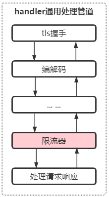

如上图所示，在broker的`handler通用处理管道`中，处理完通用的事件后，比如tls握手，编解码等，增加限流处理器即可。

### 2 限流处理器注意事项

**第一点：** 限流处理器运行于netty的ChannelPipeline中，需要采用单独的线程池，不能共用broker的`handler通用处理线程`来处理，防止限流处理器影响handler通用处理线程的业务。

**第二点：** 如若因为限流逻辑或性能等问题导致限流异常，直接跳过限流策略，执行后续的handler，防止影响正常请求。

**第三点：** 限流器采用本地限流，限流阈值支持实时修改生效。 

针对上面三点注意事项，首先是限流处理器在通信层所处的位置设计。

### 3 限流处理器线程池详细设计

**首先**，需要看一下broker(netty)的请求响应线程模型：

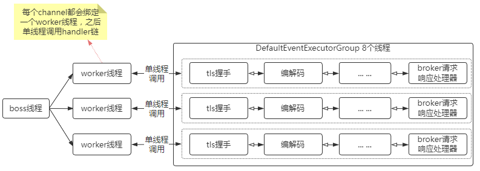

netty4的链接建立后，channel的事件都是单线程处理的，整体上是并行的。

broker端针对通用handler管道设置了单独的线程池，即DefaultEventExecutorGroup，默认8个线程。

限流处理器不可以使用DefaultEventExecutorGroup，防止对通用的事件处理有影响，所以针对限流处理器采用单独的线程池，如下：

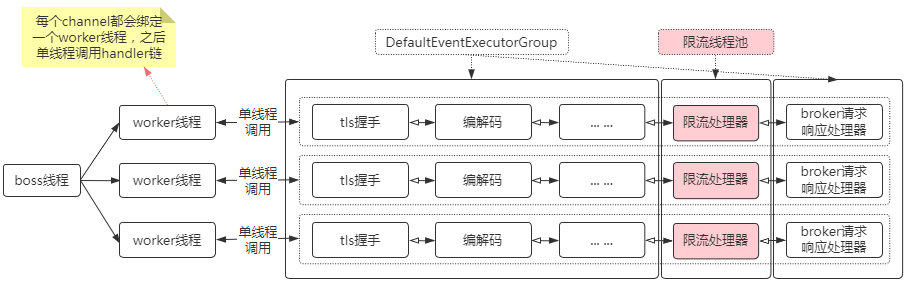

**其次**，针对限流处理器的线程池，需要单独定制拒绝策略。

由于netty重新实现了jdk的Executor，它的线程池的阻塞队列为每个线程单独所有，即任务来了先往阻塞队列放，如果线程阻塞，可能会影响channel读写，故针对限流处理器的线程池需要单独定制拒绝策略，当任务被拒绝时，直接执行task，如下：

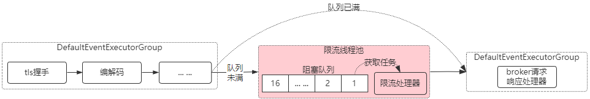

如上图，即如果限流处理器的线程池繁忙而拒绝执行任务，则直接跳过限流处理器，而不影响事件的传播。拒绝策略代码如下：

```
public void rejected(Runnable task, SingleThreadEventExecutor executor) {
    log.error("RateLimitHandler reject task, {} pendingTasks:{}", getThreadName(executor),
            executor.pendingTasks());
    task.run(); // 直接在拒绝策略中执行任务
}
```

然后，在task中判断是否是当前线程，如果不是当前线程，则是当前任务队列满了，直接通知下一个handler：

```
protected void channelRead0(ChannelHandlerContext ctx, RemotingCommand cmd) throws Exception {
    // 非当前线程池直接触发下一个事件
    if (!ctx.executor().inEventLoop()) {
        ctx.fireChannelRead(cmd);
        return;
    }
}
```

这样，即使限流处理器线程池出现问题而无法执行任务时，也会将事件传播到下一个处理器，不影响broker后续的事件流程。

### 4 限流处理器之限速器的选择

限流处理器的核心就是限速。而目前流行的限速策略有如下几种：

1. 计数器：java的Semaphore计数来限制并发。
2. 漏桶或令牌桶算法：guava限速器。
3. 滑动窗口限速：sentinel、hystrix等集限速，熔断降级等功能于一体的开源组件。

既然限速器的优秀实现有很多，这里就没有必要再造轮子了，选择合适的就行。

**到底什么样的限速器更适用于这种场景呢？**

**首先**，由于broker topic + 重试topic较多，单个broker支持上万个topic，所以以topic为维度进行限速时尽量不用sentinel或hystrix的限速器，因为其针对每个topic采用滑窗机制，消耗内存较大。

**其次**，采用Semaphore来限制并发的话，其需要在请求执行完毕时release，在netty的事件机制中到处传播Semaphore不太靠谱，并且channel可能关闭等，若不能保障正确释放Semaphore，可能造成限速错误。

**最后**，采用guava的限速器，理由：设计的轻量，精巧，其内部虽然有锁，经过测试单线程qps可达千万，8线程qps达800万，满足性能要求。

但是，这里还有一个问题，**guava的限速器并不完全满足topic维度限速的需求**。

这里需要先看一下guava限速器的原理：

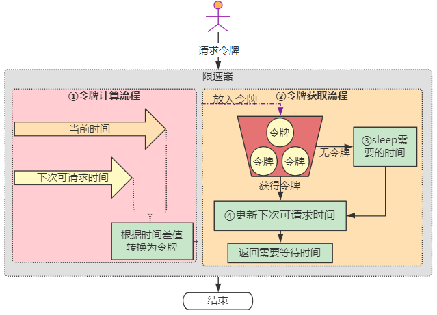

如上图所示，guava限速器实现主要分为两个部分：

1. **令牌的计算流程**

   用户请求令牌时，如果当前时间大于**下次可请求时间**，说明限速器比较空闲，需要将时间差值转换为令牌放入令牌桶。
   由于限速器的qps是初始化时设置的，故根据时间差可以很容易计算出空闲令牌

2. **令牌的获取流程**

   如果能够获取到令牌，那么直接返回。
   关键是流程④，需要根据获取的令牌量计算出需要等待的时间，加到**下次可请求时间**上。

这里不能满足topic维度限速的需求是由于如下两个问题：

1. 在流程③获取不到令牌时，进行sleep

   而broker流控时，希望获取不到令牌时，马上返回，通知客户端已经超过流控阈值，而不是卡主流程。

2. 获取不到令牌时，**下次可请求时间**可能增加到很大，影响后续请求

   举个例子，比如qps限制为1，当请求量为10时，只能通过一个，**下次可请求时间**会在当前时间基础上加9秒，后续9秒内的请求都被流控了。

### 5 限流处理器之限速器的改造

针对guava限速器存在的两个问题，进行如下的改造优化：

1. 流程③获取不到令牌时，进行sleep

   针对这点，移除sleep代码，直接执行后续逻辑

2. 获取不到令牌时，**下次可请求时间**可能增加到很大，影响后续请求

   针对这个问题，本质原因是guava的限速器不满足broker限流需求。

   broker限流需求是当某个topic被限流后，应该处于熔断状态，在熔断状态期间，请求都会直接返回，不被放行。但是熔断期过后，需要自动放开，不能因为某一次大量请求，影响后续请求

   故增加**熔断层**，即当guava限速器无法获取令牌时，触发熔断，不再增加**下次可请求时间**，并且当检测到超过熔断时间阈值时，再关闭熔断，改造如下：

   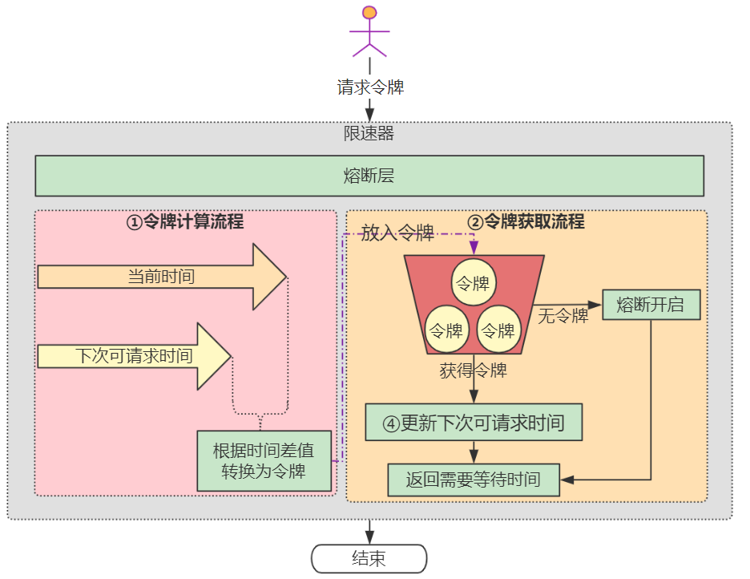

   如上图所示，当限速器触发限速时，会自动熔断，所有的请求直接返回。当熔断超过阈值（默认1秒），自动关闭熔断，继续执行正常的限速流程。

部分限速器改造代码如下：

```
/**
 * 令牌桶限速器-改造自guava
 * 增加熔断机制，超阈值自动熔断ns后恢复
 */
public class TokenBucketRateLimiter {
    /**
     * 获取令牌
     */
    public boolean acquire(int permits) {
        synchronized (this) {
            // 获取启动以来的时间
            long nowMicros = readMicros();
            // 熔断器打开
            if (circuitBreakerOpen) {
                // 当前时间超过可以预支的时间阈值后，流量放开
                if (nowMicros - nextFreeTicketMicros >= circuitBreakerOpenTimeInMicros) {
                    circuitBreakerOpen = false;
                }
            }
            // 熔断器未打开
            if (!circuitBreakerOpen) {
                // 获取需要等待的时间
                lastNeedWaitMicrosecs = reserveAndGetWaitLength(permits, nowMicros);
                // 需要等待证明熔断器打开
                if (lastNeedWaitMicrosecs > 0) {
                    circuitBreakerOpen = true;
                    // 记录限流时间戳
                    lastRateLimitTimestamp = System.currentTimeMillis();
                }
            }
            // 熔断器未打开，则可以获取令牌
            return !circuitBreakerOpen;
        }
    }
}
```

限流处理器部分代码如下：

```
/**
 * 限流处理器
 */
@ChannelHandler.Sharable
public class RateLimitHandler extends SimpleChannelInboundHandler<RemotingCommand> {
    private static final InternalLogger log = InternalLoggerFactory.getLogger(RemotingHelper.ROCKETMQ_REMOTING);
    // 默认限流
    private double defaultLimitQps = 2000;
    // 重试消息限流
    private double sendMsgBackLimitQps = 100;
    // 1秒的微妙
    private static final int MICROSECONDS = 1000000;

    // 限流器map
    private ConcurrentMap<String, TokenBucketRateLimiter> rateLimiterMap = new ConcurrentHashMap<>();
    
    // 是否禁用
    private volatile boolean disabled;

    // 限流器处理线程池
    private EventExecutorGroup rateLimitEventExecutorGroup;

    @Override
    protected void channelRead0(ChannelHandlerContext ctx, RemotingCommand cmd) throws Exception {
        // 非当前线程池直接触发下一个事件
        if (!ctx.executor().inEventLoop()) {
            ctx.fireChannelRead(cmd);
            return;
        }
        if (disabled || cmd == null || cmd.getType() != RemotingCommandType.REQUEST_COMMAND) {
            ctx.fireChannelRead(cmd);
            return;
        }
        // 获取限流资源
        String resource = getResource(cmd);
        if (resource == null) {
            ctx.fireChannelRead(cmd);
            return;
        }
        // 限流流量
        double limitQps = defaultLimitQps;
        if (cmd.getCode() == RequestCode.CONSUMER_SEND_MSG_BACK) {
            limitQps = sendMsgBackLimitQps;
        }
        final double finalLimitQps = limitQps;
        // 获取或创建限流器
        TokenBucketRateLimiter rateLimiter = rateLimiterMap.computeIfAbsent(resource, k -> new TokenBucketRateLimiter(finalLimitQps));
        boolean acquired = rateLimiter.acquire();
        // 不需要限流
        if (acquired) {
            ctx.fireChannelRead(cmd);
            return;
        }
        // 需要限流，打印限流日志
        long lastNeedWaitMicrosecs = rateLimiter.getLastNeedWaitMicrosecs();
        log.warn("{}:{} code:{} RateLimit needWait:{}microsecs",
                RemotingHelper.parseChannelRemoteAddr(ctx.channel()), resource, cmd.getCode(), lastNeedWaitMicrosecs);
        // 响应客户端
		RemotingCommand response = RemotingCommand.createResponseCommand(RemotingSysResponseCode.SYSTEM_BUSY,
				"[RateLimit] for " + resource + " need wait:" + lastNeedWaitMicrosecs + "microsecs");
		response.setOpaque(cmd.getOpaque());
		ctx.writeAndFlush(response);
    }
}
```

### 6 限流处理器之远程访问

限流处理器需要具备远程实时修改和访问的功能，以便能够根据某个topic的流量进行调整，避免重启broker。

通过扩展RocketMQ的通信协议，支持限流处理器的属性获取和修改，实现了在web端进行实时查看和修改，如下图所示：


# <span id="summary">五、总结</span>

由于某个业务发送大量的重试消息请求，触发了broker的快速失败机制，导致其他业务的消息写入请求受到了影响。

Broker的快速失败机制本质是为了保护broker，而进行的整体性限流，然而该限流机制的粒度显然过于粗糙。

因为通常情况下，broker是多个业务共用的，不能因为某个业务流量的突增而影响整体的可用性，所以，应该以更为精细的粒度来进行限流保护。

通过在broker的通信层增加额外的限流处理器，进行topic维度的限流保护，并针对限流处理器的线程池制定合适的拒绝策略，保障该限流处理器即使无法执行时，也会将事件传播到下一个处理器，不影响整体事件流程。

另外，改造guava的限速器，支持熔断及实时响应，以满足broker限流的需求，从而避免了某个topic流量过大对其他topic的影响，提升了整体集群的稳定性。

# <span id="ref">六、参考文献</span>

1. [RocketMQ开发指南](https://github.com/apache/rocketmq/tree/develop/docs/cn)
2. [guava限流原理](https://zhuanlan.zhihu.com/p/60979444)

