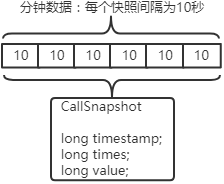
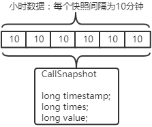
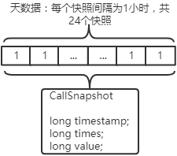
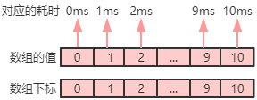
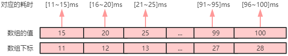
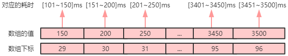
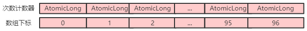
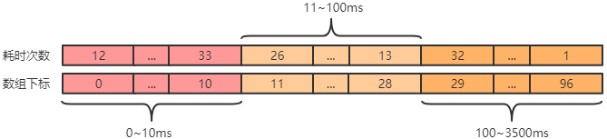
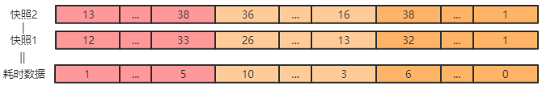

## 一、<span id="stat">统计</span>

要想做监控，必须先做统计，为了更好的知道RocketMQ集群的运行状况，MQCloud做了大量的统计工作，主要包括如下几项：

1. 每分钟topic的生产流量：用于绘制topic生产流量图及监控预警。
2. 每分钟消费者流量：用于绘制消费流量图及监控预警。
3. 每10分钟topic生产流量：用于按照流量展示topic排序。
4. 每分钟broker生产、消费流量：用于绘制broker生产消费流量图。
5. 每分钟broker集群生产、消费流量：用于绘制broker集群的生产流量图。
6. 每分钟生产者百分位耗时、异常统计：以ip维度绘制每个生产者的耗时流量图及监控预警。
7. 机器的cpu，内存，io，网络流量，网络连接等统计：用于服务器的状况图和监控预警。

下面来分别介绍每项统计是如何收集的：

1. <span id="topicTraffic">**每分钟topic的生产流量**</span>

   此数据来自于RocketMQ broker端[BrokerStatsManager](https://github.com/apache/rocketmq/blob/master/store/src/main/java/org/apache/rocketmq/store/stats/BrokerStatsManager.java)，其提供了统计功能，统计项如下：

   1. TOPIC_PUT_NUMS：某topic消息生产条数，向某个topic写入消息成功才算

      *写入成功包括四种状态：PUT_OK，FLUSH_DISK_TIMEOUT，FLUSH_SLAVE_TIMEOUT，SLAVE_NOT_AVAILABLE*

   2. TOPIC_PUT_SIZE：某topic消息生产大小，向某个topic写入消息成功才算

   RocketMQ实现的统计逻辑较为精巧，这里做简单描述，首先介绍几个对象：

   1. StatsItemSet主要字段及方法如下：

      ```
      ConcurrentMap<String/* statsKey */, StatsItem> statsItemTable; // statsKey<->StatsItem
      // 针对某个数据项进行记录
      public void addValue(final String statsKey, final int incValue, final int incTimes) {
          StatsItem statsItem = this.getAndCreateStatsItem(statsKey);
          statsItem.getValue().addAndGet(incValue);
          statsItem.getTimes().addAndGet(incTimes);
      }
      // 获取并创建StatsItem
      public StatsItem getAndCreateStatsItem(final String statsKey) {
          StatsItem statsItem = this.statsItemTable.get(statsKey);
          if (null == statsItem) {
              statsItem = new StatsItem(this.statsName, statsKey);
              this.statsItemTable.put(statsKey, statsItem);
          }
          return statsItem;
      }
      ```

   2. StatsItem主要字段及方法如下：

      ```
      AtomicLong value; // 统计数据：比如消息条数，消息大小
      AtomicLong times; // 次数
      LinkedList<CallSnapshot> csListMinute; // 每分钟快照数据
      LinkedList<CallSnapshot> csListHour; // 每小时快照数据
      LinkedList<CallSnapshot> csListDay; // 每天快照数据
      // 分钟采样
      public void samplingInSeconds() {
          synchronized (csListMinute) {
              csListMinute.add(new CallSnapshot(System.currentTimeMillis(), times.get(), value.get()));
              if (csListMinute.size() > 7) {
                  csListMinute.removeFirst();
              }
          }
      }
      // 小时采样
      public void samplingInMinutes() {
        // ...代码省略
      }
      // 天采样
      public void samplingInHour() {
        // ...代码省略
      }
      ```

   3. CallSnapshot主要字段如下：

      ```
      long times; // 次数快照
      long value; // 统计数据快照
      long timestamp; //快照时间戳
      ```

   上面三个对象如何配合进行数据统计呢？举个例子，比如统计topic名字为test_topic的消息生产大小：

   只要进行类似如下调用即可：

   ```
   StatsItemSet.addValue("test_topic", 123125123, 1)
   ```

   即表示发送了1次消息到test_topic，消息大小为123125123。

   那如何进行数据采样呢？StatsItemSet内置了定时任务，比如其每10秒调用一次StatsItem.samplingInSeconds()。这样StatsItem就会持有60秒的数据，类似如下结构：

   

   那么，最后一个10秒的快照 - 第一个10秒的快照 = 当前60秒的数据，当然根据时间戳差值可以得到耗时了。

   类似，小时数据每10分钟进行一次快照，类似如下结构：

   

   天数据每1小时进行一次快照，类似如下结构：

   

   MQCloud每分钟遍历查询集群下所有broker，通过api：[MQAdminExt.viewBrokerStatsData(String brokerAddr, String statsName, String statsKey)](api#viewBrokerStatsData)来查询RocketMQ统计好的分钟数据，然后进行存储。

2. <span id="consumerTraffic">**每分钟消费者流量**</span>

   与[每分钟topic的生产流量](#topicTraffic)一样，也采用RocketMQ统计好的数据。

3. **每10分钟topic生产流量**

   采用数据库已经统计好的每分钟topic流量进行累加，统计出10分钟流量。

4. <span id="brokerTraffic">**每分钟broker生产、消费流量**</span>

   由于统计[1.每分钟topic的生产流量](#topicTraffic)和[2.每分钟消费者流量](#consumerTraffic)时是跟broker交互获取的，所以知道broker ip，故直接按照broker维度存储一份数据即可。

5. **每分钟broker集群生产、消费流量**

   采用[4.每分钟broker生产、消费流量](#brokerTraffic)数据，按照集群求和即可。

6. <span id="clientStat">**每分钟生产者百分位耗时、异常统计**</span>

   由于RocketMQ并没有提供生产者的流量统计（*只提供了topic，但是并不知道每个生产者的情况*），所以MQCloud实现了对生产者数据进行统计（*通过RocketMQ的回调钩子实现*），主要统计如下信息：

   1. 客户端ip->broker ip
   2. 发送消息耗时
   3. 消息数量
   4. 发送异常

   统计完成后，定时发送到MQCloud进行存储，并做实时监控和展示。

   关于统计部分有一点说明，一般耗时统计有最大，最小和平均值，而通常99%(即99%的请求耗时都低于此数值)的请求的耗时情况才能反映真实响应情况。99%请求耗时统计最大的问题是如何控制内存占用，因为需要对某段时间内所有的耗时做排序后才能统计出这段时间的99%的耗时状况。而对于流式数据做这样的统计是有一些算法和数据结构的，例如[t-digest](https://github.com/tdunning/t-digest)，但是MQCloud采用了非精确的但是较为简单的[分段统计](https://github.com/sohutv/mqcloud/blob/master/mq-client-common-open/src/main/java/com/sohu/tv/mq/stats/TimeSectionStats.java)的方法，具体如下：

   1. 创建一个按照最大耗时预哈希的时间跨度不同的**耗时分段数组**：

      1. 第一段：耗时范围0ms~10ms，时间跨度为1ms。

         

      2. 第二组：耗时范围11ms~100ms，时间跨度5ms。

         

      3. 第三组：耗时范围101ms~3500ms，时间跨度50ms。

         

      *优点：此种分段方法占用内存是固定的，比如最大耗时如果为3500ms，那么只需要空间大小为96的数组即可*

      *缺点：分段精度需要提前设定好，且不可更改*

   2. 针对上面的分段数组，创建一个大小对应的AtomicLong的**计数数组**，支持并发统计：

      

   3. 耗时统计时，计算耗时对应的**耗时分段数组**下标，然后调用**计数数组**进行统计即可，参考下图：

      

      1. 例如某次耗时为18ms，首先找到它所属的区间，即归属于[16~20]ms之间，对应的数组下标为12。
      2. 根据第一步找到的数组下标12，获取对应的计数数组下标12。
      3. 获取对应的计数器进行+1操作，即表示18ms发生了一次调用。

      这样，从**计数数组**就可以得到实时耗时统计，类似如下：

      

   4. 然后定时采样任务会每分钟对**计数数组**进行快照，产生如下**耗时数据**：

      

   5. 由于上面的**耗时数据**天然就是排好序的，可以很容易计算99%耗时，90%耗时，平均耗时等数据了。

   *另外提一点，由于RocketMQ 4.4.0新增的trace功能也使用hook来实现，与MQCloud的统计有冲突，MQCloud已经做了兼容。*

   *Trace和统计是两种维度，trace反映的是消息从生产->存储->消费的流程，而MQCloud做的是针对生产者状况的统计，有了这些统计数据，才可以做到生产耗时情况展示，生产异常情况预警等功能。*

7. **机器统计**

   关于集群状况收集主要采用了将[nmon](http://nmon.sourceforge.net/pmwiki.php)自动放置到/tmp目录，定时采用ssh连接到机器执行nmon命令，解析返回的数据，然后进行存储。

## 二、<span id="consumeAccumulate">消费堆积预警</span>

RocketMQ针对消费者的消费情况提供了一种[监控实现](https://github.com/apache/rocketmq/blob/master/tools/src/main/java/org/apache/rocketmq/tools/monitor/MonitorService.java)，MQCloud基于此增加了多Name Server集群的[支持](https://github.com/sohutv/mqcloud/blob/master/mq-cloud/src/main/java/com/sohu/tv/mq/cloud/task/monitor/MonitorService.java)。这里来阐明一下此种监控方式的实现流程：

1. 从Name Server获取到所有的topic。（api为：[MQAdminExt.fetchAllTopicList()](api#fetchAllTopicList)）

2. 遍历找出其中%RETRY%开头的topic

   *集群消费模式，会自动创建一个%RETRY%ConsumerGroup的topic，用于消费者消费失败时发送重试消息，所以此监控方式**只监控集群消费模式**的消费者。* 

3. 检测消息堆积情况

   1. 检测此消费者的链接状况：（api为[MQAdminExt.examineConsumerConnectionInfo(String consumerGroup)](api#examineConsumerConnectionInfo)）

      *该api本质是从broker上查找消费者的订阅信息，链接信息等，消费者通过心跳向broker上报这些数据。*

   2. 获取此消费者订阅topic的每个队列的如下信息：（api为[MQAdminExt.examineConsumeStats(String consumerGroup](api#examineConsumeStats)）

      1. broker端偏移量
      2. 消费者偏移量
      3. 消费者消费的最新的消息的存储时间（*可以认为消费者消费到了此时间*）

      据此，可以计算出消费者消费的消息堆积了多少，堆积了多久。

      *该维度主要是通过broker上的数据情况来检测消费者消息的堆积情况。*


## 三、<span id="clientBlock">客户端阻塞预警</span>

与[二、消费堆积预警](#consumeAccumulate)检测方式一样，MQCloud通过如下项来进行客户端阻塞检测：

1. 从Name Server获取到所有的topic。（api为：MQAdminExt.fetchAllTopicList()；）

2. 遍历找出其中%RETRY%开头的topic

3. 检测客户端情况

   获取客户端运行时信息，类似如下：（api为[MQAdminExt.getConsumerRunningInfo](api#getConsumerRunningInfo) *该api本质为broker反调客户端，主要获取客户端的*）
   1. 订阅信息（*检测该项可以得知一个消费者是否订阅多个topic*）

   2. 每个队列的消息消费时间

      据此，可以检测一个消费者订阅多个topic的情况，也可以检测客户端阻塞的情况。

      *该维度主要是通过消费者自身的数据情况来检测消费者的阻塞情况。*

[二、消费堆积预警](#consumeAccumulate)和[三、客户端阻塞预警](#clientBlock)两个维度的预警虽然一个从broker出发，一个从consumer出发，但是一般同时发生。因为如果消费者消费的慢，或者消费阻塞时，会直接导致消息的堆积，所以经常会有业务会同时收到**消费堆积**和**客户端阻塞**的预警。

## 四、<span id="produceError">生产失败预警</span>

使用了[6.每分钟生产者百分位耗时、异常统计](#clientStat)中的统计数据，MQCloud会定时扫描异常表，然后进行预警。

## 五、<span id="consumeError">消费失败预警</span>

MQCloud使用了broker端[BrokerStatsManager](https://github.com/apache/rocketmq/blob/master/store/src/main/java/org/apache/rocketmq/store/stats/BrokerStatsManager.java)提供的状态统计数据，数据项为SNDBCK_PUT_NUMS：该项代表某个消费者发送重试消息的条数。MQCloud定时获取该值，并进行预警（消费者需要开启重试机制）。

## 六、<span id="offsetError">偏移量错误预警</span>

RocketMQ内置一个名字为OFFSET_MOVED_EVENT的topic，当消费者拉取消息时，发生下面几种情况，RocketMQ会往该topic发送消息：

1. 对于某个队列来说，消费者请求的最小偏移量小于broker上的最小偏移量。
2. 对于某个队列来说，消费者请求的最大偏移量大于broker上的最大偏移量。

上面的情况都是消费者请求的偏移量发生了错误，不可能拉取到消息。MQCloud参考RocketMQ的[监控实现](https://github.com/apache/rocketmq/blob/master/tools/src/main/java/org/apache/rocketmq/tools/monitor/MonitorService.java)，针对这种偏移量错误进行预警。

## 七、<span id="otherWarn">其他监控预警</span>

1. Name Server集群监控

   针对每个Name Server，通过调用api：[MQAdminExt.getNameServerConfig(List<String> nameServers)](api#getNameServerConfig)来探测Name Server是否可以响应。

2. Broker集群监控

   通过每个broker，通过调用api：[MQAdminExt.fetchBrokerRuntimeStats(String brokerAddr)](api#fetchBrokerRuntimeStats)来探测broker是否可以响应。

3. 服务器监控

   针对采集的服务器状态数据，检测各个状态值是否超过后台配置的服务器阈值，然后进行预警。