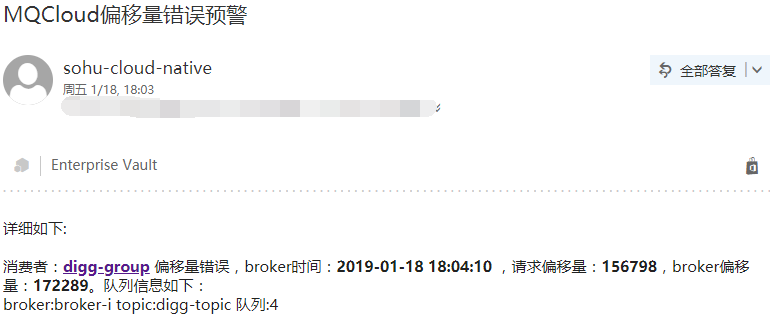
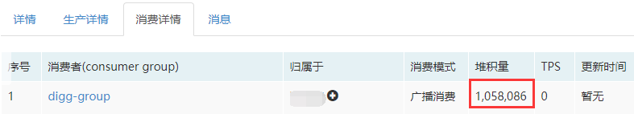
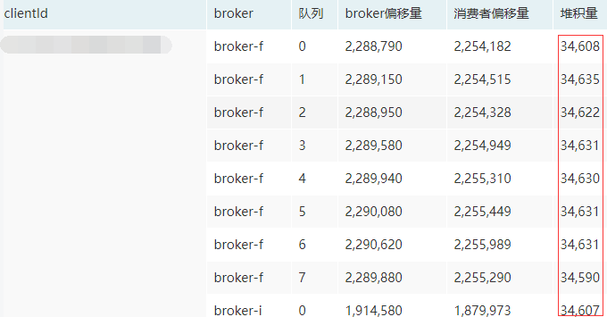
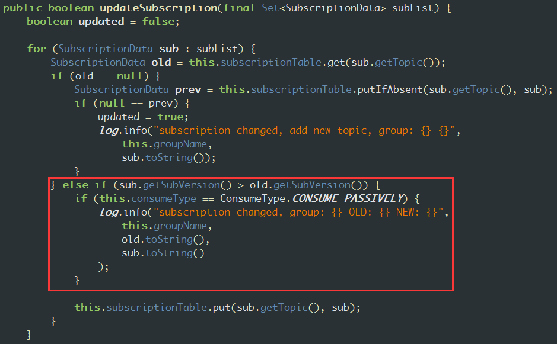
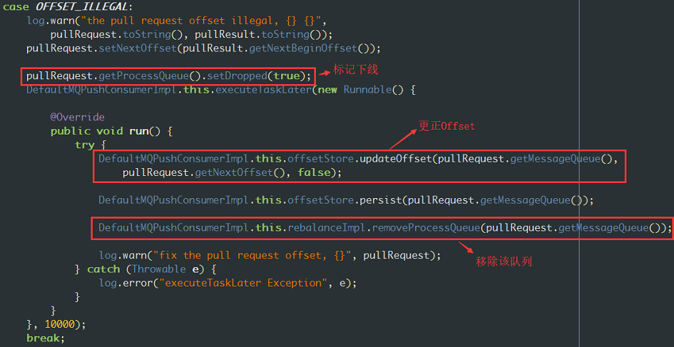
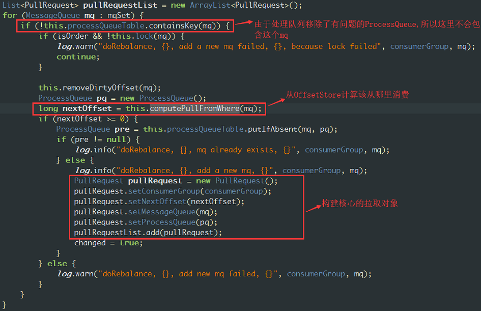
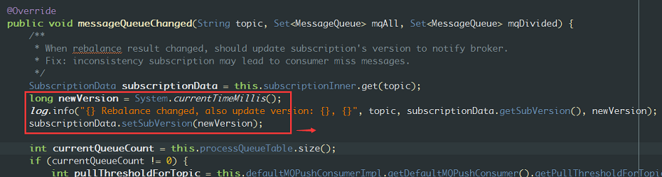

## <span id="state">一、现象</span>
mqcloud持续发送topic为digg-topic的消费者digg-group发生偏移量错误的预警邮件，详细预警如下：



即：digg-group请求从偏移量**156798**开始消费，但是broker上最小的消息偏移量是**172289**，也就是说，**消费者想请求消费的消息，在broker上已经不存在了。**

*解释：rocketmq会将此种情况当做一个事件消息发送到内置的topic：OFFSET_MOVED_EVENT中，mqcloud会订阅并消费该topic，并会以固定频率进行预警。*

## <span id="monitor">二、mqcloud监控情况</span>

顺着预警邮件的链接，到mqcloud里看下消费者的具体情况，发现digg-group消费有堆积，详细如下：



点开查看每个客户端的消费情况，定位到某个机器消费有堆积：



## <span id="broker">三、broker表现</span>

找到对应的broker的某个实例，查看broker.log日志，发现很多类似如下的日志：

```
2019-01-18 19:24:01 INFO PullMessageThread_49 - the request offset too small. group=digg-group, topic=digg-topic, requestOffset=156798, brokerMinOffset=172289, clientIp=/10.*.*.*:54437
2019-01-18 19:24:01 WARN PullMessageThread_49 - PULL_OFFSET_MOVED:correction offset. topic=digg-topic, groupId=digg-group, requestOffset=156798, newOffset=172289, suggestBrokerId=0
2019-01-18 19:24:18 INFO ClientManageThread_27 - subscription changed, group: digg-group OLD: SubscriptionData [classFilterMode=false, topic=digg-topic, subString=*, tagsSet=[], codeSet=[],
 subVersion=1547810638588, expressionType=null] NEW: SubscriptionData [classFilterMode=false, topic=digg-topic, subString=*, tagsSet=[], codeSet=[], subVersion=1547810658600, expressionType
=null]
。。。 。。。 
2019-01-18 19:24:38 INFO ClientManageThread_29 - subscription changed, group: digg-group OLD: SubscriptionData [classFilterMode=false, topic=digg-topic, subString=*, tagsSet=[], codeSet=[],
 subVersion=1547810658600, expressionType=null] NEW: SubscriptionData [classFilterMode=false, topic=digg-topic, subString=*, tagsSet=[], codeSet=[], subVersion=1547810678611, expressionType
=null]
```

第一条日志含义：

```
the request offset too small. group=digg-group, topic=digg-topic, requestOffset=156798, brokerMinOffset=172289, clientIp=/10.*.*.*:54437
```

客户端请求消费的消息offset太小了，即消息不存在。

第二条日志含义：

```
PULL_OFFSET_MOVED:correction offset. topic=digg-topic, groupId=digg-group, requestOffset=156798, newOffset=172289, suggestBrokerId=0
```

与第一条相同，只是把这次请求事件当做一条消息发送到了OFFSET_MOVED_EVENT中。

第三条日志含义：（简化下日志）

```
subscription changed, group: digg-group OLD: SubscriptionData [topic=digg-topic, subVersion=1547810638588] NEW: SubscriptionData [topic=digg-topic, subVersion=1547810658600]
```

此日志表明消费者的订阅关系发生了改变，其上报心跳到broker，broker检测到关系变化，打印该日志。

中间省略符号：

省略了重复的日志。

第四条日志含义：

在20秒过后，又重复打印类似第三条日志内容，该日志对应broker的`org.apache.rocketmq.broker.client.ConsumerGroupInfo` 的如下代码：



证明消费者的subVersion发生了更新。

综上：**消费者确实发送的offset过小，之后消费者更新了subVersion。**

但是，有几个问题：

1. **为什么消费者的subVersion会每隔20秒，就发生一次更新？**
2. **broker告诉消费者正确的offset后，消费者为什么没有采用，还是发送之前错误的offset？**

## <span id="consumerCode">四、消费者代码跟踪</span>

带着上面两个问题，来捋一下消费者的代码。

首先看第2个问题：`2. broker告诉消费者正确的offset后，消费者为什么没有采用，还是发送之前错误的offset？` ，针对consumer请求偏移量过小的情况，broker会响应ResponseCode.PULL_OFFSET_MOVED的状态码，消费者会转换为PullStatus.OFFSET_ILLEGAL，`DefaultMQPushConsumer`对应的行为是更新`OffsetStore`为broker返回的正确值，接着标记该`ProcessQueue`下线，再从处理队列中移除掉，即不再消费这个队列，对应代码如下：



那么，不消费这个队列的话，肯定会导致堆积，那怎么才能重新消费这个队列呢？

奥秘就在于再平衡过程，查看`org.apache.rocketmq.client.impl.consumer.RebalanceService` ，它会将topic的队列分配给对应的`ProcessQueue` 对象，然后封装成PullRequest进行消息拉取，具体如下图：

1. rebalance过程

2. 相关对象结构

   

对这块有疑问的同学请参考我之前的文章：[8.consumer](https://blog.csdn.net/a417930422/article/details/52585548)。

了解这块代码就可以知道，无论是路由关系：topic<->broker<->队列关系发生变化，还是consumer的消费关系：比如移除`ProcessQueue` 发生变化，都会进行再平衡：即对所有队列进行重新分配消费，包括有问题的队列。

那么还是之前的问题，**为什么重新消费有问题的队列offset取的还是旧的呢？**

难道是重新分配消费时没有取到正确的offset吗？看下rebalance对应的代码：`org.apache.rocketmq.client.impl.consumer.RebalanceImpl.updateProcessQueueTableInRebalance`



关键的代码是`long nextOffset = this.computePullFromWhere(mq)`,它会从`OffsetStore`读取offset并作为起始偏移量进行消息消费，对于broadcasting模式的消费者来说，offset存储在本地文件，即`LocalFileOffsetStore`，存储位置默认为启动程序的用户主目录下的`~/.rocketmq_offsets`下。来跟踪一下`computePullFromWhere(mq)`，简化代码如下：

```
long lastOffset = offsetStore.readOffset(mq, ReadOffsetType.READ_FROM_STORE);
```

offsetStore.readOffset简化代码如下：

```
public long readOffset(final MessageQueue mq, final ReadOffsetType type) {
    switch (type) {
        case READ_FROM_STORE: {
            OffsetSerializeWrapper offsetSerializeWrapper;
            try {
                offsetSerializeWrapper = this.readLocalOffset();
            } catch (MQClientException e) {
                return -1;
            }
            if (offsetSerializeWrapper != null && offsetSerializeWrapper.getOffsetTable() != null) {
                AtomicLong offset = offsetSerializeWrapper.getOffsetTable().get(mq);
                if (offset != null) {
                    this.updateOffset(mq, offset.get(), false);
                    return offset.get();
                }
            }
        }
    }
}
```

this.readLocalOffset代码如下：

```
private OffsetSerializeWrapper readLocalOffset() throws MQClientException {
    String content = null;
    try {
        content = MixAll.file2String(this.storePath);
    } catch (IOException e) {
        log.warn("Load local offset store file exception", e);
    }
    if (null == content || content.length() == 0) {
        return this.readLocalOffsetBak();
    } else {
        OffsetSerializeWrapper offsetSerializeWrapper = null;
        try {
            offsetSerializeWrapper =
                OffsetSerializeWrapper.fromJson(content, OffsetSerializeWrapper.class);
        } catch (Exception e) {
            log.warn("readLocalOffset Exception, and try to correct", e);
            return this.readLocalOffsetBak();
        }

        return offsetSerializeWrapper;
    }
}
```

即直接从`~/.rocketmq_offsets`下读取对应的文件，返回相应的偏移量。

我们已经知道broker如果响应`ResponseCode.PULL_OFFSET_MOVED`，消费者会更新`OffsetStore`为broker返回正确值。而`OffsetStore`是会定时将内存的offset持久化到硬盘上的，也就是说**可能持久化有问题，导致偏移量无法更新**。

## <span id="consumer">五、消费者表现</span>

**联系业务同学，发现rocketmq offset文件所在磁盘故障，导致offset无法写入**。由于消费者没有增加rocketmq相关的日志配置，所以没有更详细的日志输出，建议消费者一定加上[日志配置](https://github.com/sohutv/sohu-tv-mq/tree/master/mq-cloud/src/main/resources/static/file)。

到这里，还有一个遗留问题，就是`1. 为什么消费者的subVersion每隔20秒，就发生一次更新？`查看`org.apache.rocketmq.client.impl.consumer.RebalanceService` 果然发现其执行频率为20秒一次：

`long waitInterval = Long.parseLong(System.getProperty("rocketmq.client.rebalance.waitInterval", "20000"))`。

当`四、消费者代码跟踪`中发生再平衡后，会导致订阅关系发生更新，参考`org.apache.rocketmq.client.impl.consumer.RebalancePushImpl`如下代码：



## <span id="conclusion">六、总结</span>

1. broadcasting模式消费者，偏移量存储在本地，如果本地磁盘有问题，导致不可写，此时重启的话，offset会从本地磁盘读取，可能会导致消费停滞。
2. 另外，针对docker，建议设置`rocketmq.client.localOffsetStoreDir=/持久化路径`即，将offset写到可以持久化的存储里，否则重启消费者会导致消费时跳过部分消息。