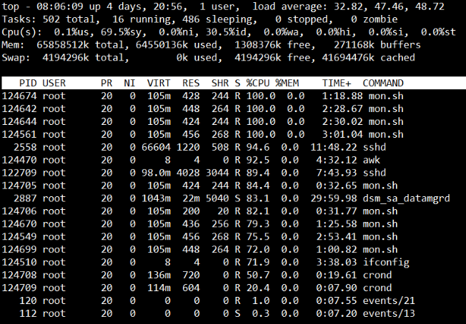
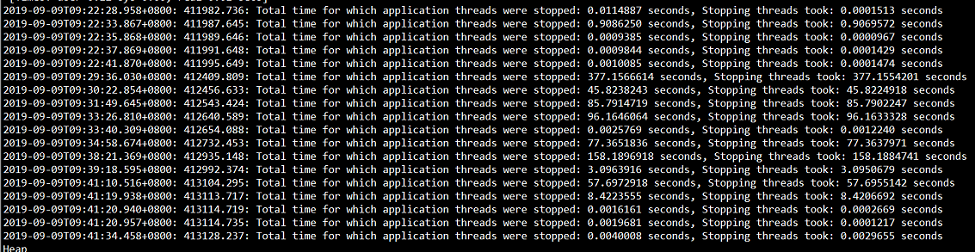
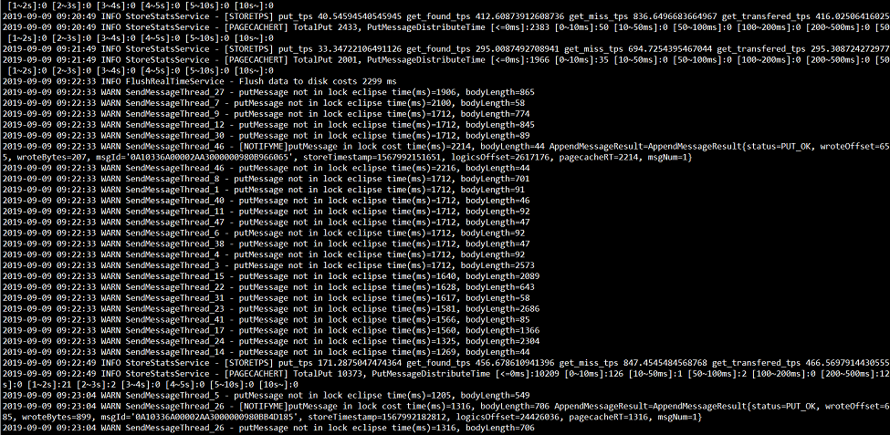
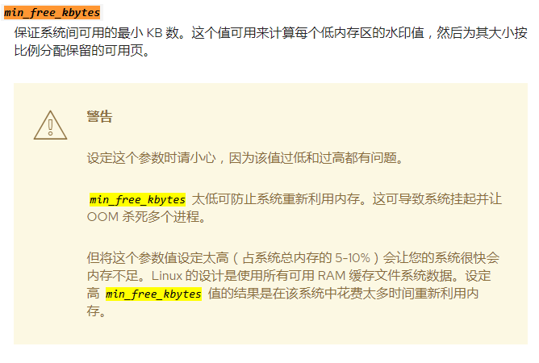

## <span id="state">一、现象</span>

集群中两台broker机器分别出现load飙至60%的情况，导致系统无法登陆，引起mqcloud发送失败预警。

## <span id="process">二、处理</span>

1. 首先登陆问题机器，发现无法链接，但是能ping同，证明机器基本处于hang住的状态。

2. 在mqcloud后台进行停写，由于ns和broker部署在一块，虽然显示停写成功，但是问题机器上的ns状态应该没有置为只读。

3. 偶尔能登录上时，进行截图如下：

   

   上面截图显示，mon.sh和sshd等进程消耗了cpu。但是这应该只是表象，sy高达69.5%，这是系统内核cpu使用率。

4. 根据以上猜测，首先killall java，看看系统能不能恢复，结果一段时间之后，系统恢复了。

## <span id="improve">三、改进</span>

1. 首先，将ns单独部署。防止跟broker部署到一块，出问题时，ns也没响应，问题节点无法切掉。
2. 将slave部署到单独的docker机器，跟master分开，观察到底是哪出的问题。

## <span id="investigate">四、调查</span>

首先怀疑硬件问题，经过机房同学检测后，说硬件没问题。

那么开始怀疑rocketmq的问题，经过调查问题时间段的broker日志，发现如下异常：

1. gc日志：

   

   可以看到broker问题时间段出现大量非gc的暂停。

2. broker.log

   

   消息存储出现大量刷新数据耗时过长，此日志putMessage not in lock eclipse对应的代码如下：

   ```
   long beginTime = this.getSystemClock().now();
   PutMessageResult result = this.commitLog.putMessage(msg);
   long eclipseTime = this.getSystemClock().now() - beginTime;
   if (eclipseTime > 500) {
       log.warn("putMessage not in lock eclipse time(ms)={}, bodyLength={}", eclipseTime, msg.getBody().length);
   }
   ```

   即，消息存储消耗了大量时间。由于broker配置的是异步broker，并不会触发实际刷新，除非内存不够。

3. 搜索github

   发现有人反馈类似[问题](https://github.com/apache/rocketmq/issues/721)，但是他们是有大量的定时消息，最后通过设置vm.min_free_kbytes = 1000000解决问题，而出问题的机器vm.min_free_kbytes = 90112，即留给内核最少88M内存。

4. 经过查询系统日志，发现如下问题：

   ```
   Sep  9 09:26:53 bxxxx kernel: INFO: task java:10226 blocked for more than 120 seconds.
   Sep  9 09:26:53 bxxxx kernel:      Not tainted 2.6.32-431.el6.x86_64 #1
   Sep  9 09:26:53 bxxxx kernel: "echo 0 > /proc/sys/kernel/hung_task_timeout_secs" disables this message.
   Sep  9 09:26:53 bxxxx kernel: java          D 000000000000000d     0 10226   9979 0x00000000
   Sep  9 09:26:53 bxxxx kernel: ffff880e5c1cbe18 0000000000000086 0000000000000000 ffff8810739188c0
   Sep  9 09:26:53 bxxxx kernel: 0000000000000d28 0000000094dae43d ffff880e5c1cbd98 0000000000000000
   Sep  9 09:26:53 bxxxx kernel: ffff88073dbd9098 ffff880e5c1cbfd8 000000000000fbc8 ffff88073dbd9098
   Sep  9 09:26:53 bxxxx kernel: Call Trace:
   Sep  9 09:26:53 bxxxx kernel: [<ffffffff81529f85>] rwsem_down_failed_common+0x95/0x1d0
   Sep  9 09:26:53 bxxxx kernel: [<ffffffff8152a0e3>] rwsem_down_write_failed+0x23/0x30
   Sep  9 09:26:53 bxxxx kernel: [<ffffffff8128e883>] call_rwsem_down_write_failed+0x13/0x20
   Sep  9 09:26:53 bxxxx kernel: [<ffffffff815295e2>] ? down_write+0x32/0x40
   Sep  9 09:26:53 bxxxx kernel: [<ffffffff81152386>] sys_mprotect+0xe6/0x250
   Sep  9 09:26:53 bxxxx kernel: [<ffffffff8100b072>] system_call_fastpath+0x16/0x1b
   Sep  9 09:28:53 bxxxx kernel: INFO: task java:10226 blocked for more than 120 seconds.
   Sep  9 09:28:53 bxxxx kernel:      Not tainted 2.6.32-431.el6.x86_64 #1
   Sep  9 09:28:53 bxxxx kernel: "echo 0 > /proc/sys/kernel/hung_task_timeout_secs" disables this message.
   Sep  9 09:28:53 bxxxx kernel: java          D 000000000000000d     0 10226   9979 0x00000000
   Sep  9 09:28:53 bxxxx kernel: ffff880e5c1cbe18 0000000000000086 0000000000000000 ffff8810739188c0
   Sep  9 09:28:53 bxxxx kernel: 0000000000000d28 0000000094dae43d ffff880e5c1cbd98 0000000000000000
   Sep  9 09:28:53 bxxxx kernel: ffff88073dbd9098 ffff880e5c1cbfd8 000000000000fbc8 ffff88073dbd9098
   Sep  9 09:28:53 bxxxx kernel: Call Trace:
   Sep  9 09:28:53 bxxxx kernel: [<ffffffff81529f85>] rwsem_down_failed_common+0x95/0x1d0
   Sep  9 09:28:53 bxxxx kernel: [<ffffffff8152a0e3>] rwsem_down_write_failed+0x23/0x30
   Sep  9 09:28:53 bxxxx kernel: [<ffffffff8128e883>] call_rwsem_down_write_failed+0x13/0x20
   Sep  9 09:28:53 bxxxx kernel: [<ffffffff815295e2>] ? down_write+0x32/0x40
   Sep  9 09:28:53 bxxxx kernel: [<ffffffff81152386>] sys_mprotect+0xe6/0x250
   Sep  9 09:28:53 bxxxx kernel: [<ffffffff8100b072>] system_call_fastpath+0x16/0x1b
   ```

   经过搜索，发现有类似[文章](https://www.cnblogs.com/dongqingswt/)记录，基本可以确定可能是内存引起的。

   而rocketmq的初始化脚本os.sh中已经把`sudo sysctl -w vm.min_free_kbytes=1000000`注释掉了，可以尝试打开，再部署broker看看情况。

5. 继续调查sa日志，当查到内存使用情况时，发现如下问题：

   **从06:40开始**:

   ```
   12:00:01 AM  pgpgin/s pgpgout/s   fault/s  majflt/s  pgfree/s pgscank/s pgscand/s pgsteal/s    %vmeff
   12:05:01 AM      0.03   1511.88    976.37      0.00    561.88      0.00   7675.74     40.29      0.52
   12:10:01 AM      0.01   1224.37    758.77      0.00    453.19      0.00    979.23     34.59      3.53
   12:15:01 AM      0.01   1306.93    921.99      0.00    517.41      0.00   1341.93     31.96      2.38
   12:20:01 AM      0.00   1450.45    794.11      0.00    484.10      0.00   4745.97     40.96      0.86
   12:25:01 AM      0.01   1373.22    939.79      0.00    527.71      0.00    615.00     37.11      6.03
   12:30:01 AM      0.00    357.27    592.52      0.00    285.55      0.00    153.84      4.03      2.62
   12:35:01 AM      0.00    452.60    760.86      0.00    370.47      0.00   1316.40     10.54      0.80
   12:40:01 AM      0.00    421.20    609.35      0.00    305.10      0.00    703.81      6.29      0.89
   12:45:01 AM      0.00    347.31    727.99      0.00    345.06      0.00    679.49      4.34      0.64
   12:50:01 AM      0.01    313.91    587.15      0.00    281.29      0.00    559.88      6.59      1.18
   12:55:01 AM      0.00    352.68    746.77      0.00    342.32      0.00    412.85      6.71      1.62
   01:00:01 AM      0.00    297.08    584.79      0.00    275.82      0.00     53.29      4.33      8.13
   01:05:01 AM      0.00    463.18    777.44      0.00    392.89      0.00    935.99      8.54      0.91
   01:10:01 AM      0.00    349.12    588.56      0.00    296.93      0.00    287.39      4.58      1.59
   01:15:01 AM      0.00    265.74    734.28      0.00    342.09      0.00    577.25      4.39      0.76
   01:20:01 AM      0.00    222.02    561.40      0.00    266.91      0.00     59.71      3.90      6.53
   01:25:01 AM      0.00    320.86    739.52      0.00    347.19      0.00    630.36      6.21      0.98
   01:30:01 AM      0.00    260.57    576.84      0.00    352.38      0.00      0.00      0.00      0.00
   01:35:01 AM      0.00    307.25    736.19      0.00    335.50      0.00      0.00      0.00      0.00
   01:40:01 AM     23.86    275.12    576.45      0.00    361.39      0.00      0.00      0.00      0.00
   01:45:01 AM      0.00    342.17    743.02      0.00    349.32      0.00      0.00      0.00      0.00
   01:50:01 AM      0.01    163.08    554.63      0.00    260.12      0.00      0.00      0.00      0.00
   01:55:01 AM      0.00    268.64    732.09      0.00    321.65      0.00      0.00      0.00      0.00
   02:00:01 AM      0.00    242.26    573.13      0.00    264.43      0.00      0.00      0.00      0.00
   02:05:01 AM      0.00    354.20    765.70      0.00    361.09      0.00      0.00      0.00      0.00
   02:10:01 AM      0.00    263.42    583.00      0.00    266.19      0.00      0.00      0.00      0.00
   02:15:01 AM      0.00    263.37    728.40      0.00    325.70      0.00      0.00      0.00      0.00
   02:20:01 AM      0.00    218.09    566.64      0.00    264.56      0.00      0.00      0.00      0.00
   02:25:01 AM      0.00    263.33    722.00      0.00    336.78      0.00      0.00      0.00      0.00
   02:30:01 AM      0.00    222.36    572.46      0.00    264.64      0.00      0.00      0.00      0.00
   02:35:01 AM      0.00    257.19    729.16      0.00    329.62      0.00      0.00      0.00      0.00
   02:40:01 AM      0.00    211.45    573.84      0.00    272.83      0.00      0.00      0.00      0.00
   02:45:01 AM      0.01    325.62    740.38      0.00    351.34      0.00      0.00      0.00      0.00
   02:50:01 AM      0.00    134.85    547.97      0.00    258.14      0.00      0.00      0.00      0.00
   02:55:01 AM      0.00    230.54    726.39      0.00    321.49      0.00      0.00      0.00      0.00
   03:00:01 AM      0.00    199.59    569.16      0.00    264.82      0.00     17.34      2.18     12.60
   03:05:01 AM      0.00    330.85    767.68      0.00    365.14      0.00    615.49      7.20      1.17
   03:10:01 AM      0.00    225.90    578.59      0.00    274.93      0.00      0.00      0.00      0.00
   03:15:01 AM      2.32    261.80   1053.64      0.03    480.25      0.00    149.69      3.06      2.05
   03:20:01 AM      0.00    112.93    562.40      0.00    274.73      0.00    351.07      7.35      2.09
   03:25:01 AM      0.00    297.87    730.10      0.00    336.78      0.00      0.00      0.00      0.00
   03:30:01 AM      0.00    204.00    569.94      0.00    269.86      0.00    607.90      4.45      0.73
   03:35:01 AM      0.00    271.85    733.10      0.00    340.89      0.00    559.42      4.80      0.86
   03:40:01 AM      0.00    216.30    564.76      0.00    277.46      0.00    187.75      4.91      2.61
   03:45:01 AM      0.00    337.65    749.27      0.00    359.72      0.00    333.59      5.06      1.52
   03:50:01 AM      0.00    170.62    569.02      0.00    263.58      0.00     14.55      1.06      7.28
   03:55:01 AM      0.00    182.79    705.64      0.00    321.67      0.00    343.80      3.61      1.05
   04:00:01 AM      0.00    198.01    571.51      0.00    268.09      0.00    520.14      4.22      0.81
   04:05:01 AM      0.11    330.21    753.09      0.00    437.55      0.00      0.00      0.00      0.00
   04:10:01 AM      0.43    244.20    583.66      0.00    275.61      0.00      0.00      0.00      0.00
   04:15:01 AM      0.00    247.98    727.44      0.00    331.43      0.00      0.00      0.00      0.00
   04:20:01 AM      0.00    208.26    572.53      0.00    351.10      0.00      0.00      0.00      0.00
   04:25:01 AM      0.00    245.17    725.18      0.00    332.78      0.00      0.00      0.00      0.00
   04:30:01 AM      0.00    144.54    540.70      0.00    257.25      0.00      0.00      0.00      0.00
   04:35:01 AM      0.00    255.61    739.38      0.00    332.32      0.00      0.00      0.00      0.00
   04:40:01 AM      0.00    199.38    573.71      0.00    273.10      0.00      0.00      0.00      0.00
   04:45:01 AM      0.00    364.29    747.14      0.00    359.28      0.00      0.00      0.00      0.00
   04:50:01 AM      0.00    241.45    577.62      0.00    275.88      0.00      0.00      0.00      0.00
   04:55:01 AM      0.00    271.32    732.42      0.00    330.12      0.00      0.00      0.00      0.00
   05:00:01 AM      0.00    176.64    552.95      0.00    265.78      0.00      0.00      0.00      0.00
   05:05:01 AM      0.00    346.08    757.67      0.00    362.32      0.00      0.00      0.00      0.00
   05:10:01 AM      0.00    272.02    584.56      0.00    286.44      0.00      0.00      0.00      0.00
   05:15:01 AM      0.00    306.17    734.15      0.00    347.45      0.00      0.00      0.00      0.00
   05:20:01 AM      0.56    264.07    682.07      0.01    314.15      0.00      0.00      0.00      0.00
   05:25:01 AM      0.00    263.23    727.79      0.00    330.92      0.00      0.00      0.00      0.00
   05:30:01 AM      0.00    227.91    577.38      0.00    275.86      0.00     14.56      0.93      6.39
   05:35:01 AM      0.01    264.24    712.84      0.00    345.54      0.00    296.77      4.85      1.63
   05:40:01 AM      3.50    311.18    588.01      0.12    295.71      0.00    214.97      5.30      2.46
   05:45:01 AM      1.31    331.78    737.63      0.04    357.10      0.00    459.07      7.55      1.64
   05:50:01 AM      0.01    280.02    584.92      0.00    284.60      0.00    895.19      5.18      0.58
   05:55:01 AM      0.00    322.86    742.88      0.00    344.04      0.00  10058.84      5.41      0.05
   06:00:01 AM      0.00    261.42    581.37      0.00    281.44      0.00    815.84      4.44      0.54
   06:05:01 AM      0.01    306.56  24426.16      0.00   8476.97      0.00  36700.79      6.56      0.02
   06:10:01 AM      0.00    337.03    587.37      0.00    297.98      0.00    483.71      5.22      1.08
   06:15:01 AM      0.00    382.45    747.44      0.00    366.23      0.00   1450.11      7.08      0.49
   06:20:01 AM      0.00    305.43    585.16      0.00    286.67      0.00      9.63      3.69     38.26
   06:25:01 AM      0.24    356.29    746.18      0.00    354.71      0.00     26.19      8.02     30.61
   06:30:01 AM      0.01    317.25    588.17      0.00    291.10      0.00     14.23      4.22     29.65
   06:35:01 AM      1.53    446.63    752.84      0.07    372.67      0.00   4412.56      9.17      0.21
   06:40:01 AM      2.05    370.78    580.29      0.11    313.45      0.00  27517.67     11.00      0.04
   06:47:27 AM      2.08    218.60    316.38      0.11    270.71      0.00 2540818.47      3.04      0.00
   06:50:02 AM      1.42      6.77     71.69      0.04     88.76      0.00 3783039.09      0.12      0.00
   06:56:13 AM      0.39     83.84    473.30      0.01    249.12      0.00 3594090.16      1.26      0.00
   07:01:02 AM      0.10    221.64    210.26      0.01    184.98      0.00 3497943.45      0.50      0.00
   07:10:29 AM      0.14    215.75    399.51      0.00    281.05      0.00 3535085.92      0.13      0.00
   07:15:26 AM      0.00    194.42    263.86      0.00    338.64      0.00 3621787.17      0.00      0.00
   07:17:15 AM      7.71     12.77    593.38      0.33    273.38      0.00 3713070.80      0.00      0.00
   07:23:04 AM      0.00     30.11    265.17      0.00    143.79      0.00 3688985.33      0.00      0.00
   07:26:31 AM      0.00    311.08    521.07      0.00    597.17      0.00 3697476.36      0.00      0.00
   07:30:03 AM      1.72    120.94   1026.93      0.00    499.32      0.00 3705785.49      2.26      0.00
   07:38:29 AM     80.63    252.13    451.36      0.01    513.87      0.00 3693216.53      5.04      0.00
   07:42:20 AM      0.24    200.52    246.88      0.00    291.70      0.00 3701548.84     23.29      0.00
   07:48:10 AM      0.57    101.01    419.37      0.03    308.70      0.00 3703993.69      6.71      0.00
   07:51:23 AM      0.17    239.13    560.76      0.01    426.98      0.00 3705386.89     32.75      0.00
   07:55:51 AM      0.13    212.12    383.84      0.00    217.60      0.00 3690028.54      0.03      0.00
   08:03:42 AM      0.07     64.02    490.53      0.00    358.13      0.00 3690904.54      3.70      0.00
   08:10:50 AM      0.02    171.62    344.63      0.00    261.25      0.00 3713863.30     16.23      0.00
   08:13:41 AM      0.07     55.98    525.44      0.01    237.73      0.00 3723153.55      4.47      0.00
   08:23:40 AM      2.88    391.18    514.09      0.03    451.02      0.00 3681591.61     23.94      0.00
   08:25:35 AM      0.00     39.08    104.85      0.00     83.68      0.00 3789807.72      0.00      0.00
   08:35:02 AM     55.34    260.42    363.84      0.02    570.85      0.00 3776228.62     17.65      0.00
   08:40:42 AM      0.04    476.31    215.82      0.01    342.16      0.00 3735779.34      3.38      0.00
   08:49:23 AM      0.12    351.44    302.84      0.00    476.57      0.00 3660380.82     12.21      0.00
   08:51:59 AM      0.05     58.58    854.76      0.00    413.49      0.00 3692283.02      0.05      0.00
   09:05:01 AM      0.61    367.19    665.78      0.01   7009.15      0.00 2922881.80     35.34      0.00
   09:10:02 AM      0.69      2.33    548.06      0.02    190.04      0.00      0.00      0.00      0.00
   09:15:01 AM     10.24      2.50    699.82      0.00    247.17      0.00      0.00      0.00      0.00
   09:20:01 AM     26.59      3.19    607.08      0.00    209.08      0.00      0.00      0.00      0.00
   09:25:01 AM     11.82      3.17    738.20      0.00    255.11      0.00      0.00      0.00      0.00
   09:30:01 AM      0.00      2.13    545.59      0.00    187.11      0.00      0.00      0.00      0.00
   09:35:01 AM     13.40      3.88    818.07      0.08    296.12      0.00      0.00      0.00      0.00
   ```

   几个关键项释义如下：

   ```
   pgscank/s: Number of pages scanned by the kswapd daemon per second.
   pgscand/s: Number of pages scanned directly per second.
   pgsteal/s: Number of pages the system has reclaimed from cache (pagecache and swapcache) per second to satisfy its memory demands.
   ```

   **psand：** 内存不足，程序直接扫描内存页，试图找到可以释放的缓存。

   **pgsteal：** 找到内存并不一定能释放，越低释放的越少。

   另外ssh，执行命令啥的都需要内存，内存分配不过来会导致系统僵死状态。这里有篇[文章](https://www.jianshu.com/p/ea7ed85918ac)，对上述参数解释的比较详细。

   **为啥free还有剩余内存，会导致这个问题?** 跟numa架构有关，当时可能某核cpu内存已经吃紧，参考[文章](http://mp.weixin.qq.com/s/hXtCzSnlVfo9Cq92538ipw)中的`numa机制内存分配策略对竞争的影响`。

6. 可以尝试先把`min_free_kbytes设置为524288=512M，参考如下：`

   

   对于线上是64g内存，512M/64*1024=0.78%，未达到5%。

   另外发现，机器重启后，之前设置的rocketmq优化内核的参数失效了，需要重新设置，如下：

   ```
   sudo sysctl -w vm.overcommit_memory=1
   sudo sysctl -w vm.drop_caches=1
   sudo sysctl -w vm.zone_reclaim_mode=0
   sudo sysctl -w vm.max_map_count=655360
   sudo sysctl -w vm.dirty_background_ratio=50
   sudo sysctl -w vm.dirty_ratio=50
   sudo sysctl -w vm.dirty_writeback_centisecs=360000
   sudo sysctl -w vm.page-cluster=3
   sudo sysctl -w vm.swappiness=1
   sudo sysctl -w vm.min_free_kbytes=524288
   ```

   ​