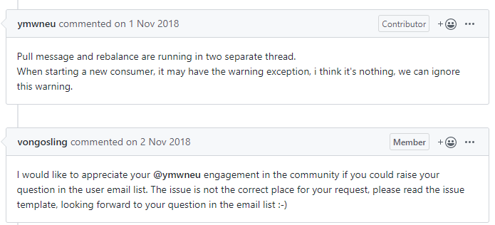
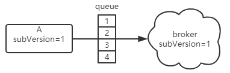
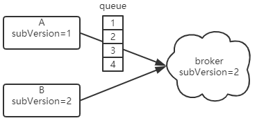
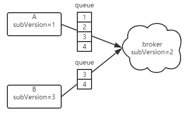
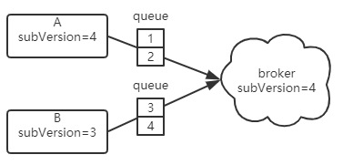

## <span id="background">一、背景</span>

集群消费者启动时，经常发现如下日志：

```
2019-12-11 09:57:47 WARN NettyClientPublicExecutor_1 - execute the pull request exception
org.apache.rocketmq.client.exception.MQBrokerException: CODE: 25  DESC: the consumer's subscription not latest
For more information, please visit the url, http://rocketmq.apache.org/docs/faq/
        at org.apache.rocketmq.client.impl.MQClientAPIImpl.processPullResponse(MQClientAPIImpl.java:645) ~[rocketmq-client-4.4.1-sohu.jar!/:4.4.1-sohu]
        at org.apache.rocketmq.client.impl.MQClientAPIImpl.access$3(MQClientAPIImpl.java:627) ~[rocketmq-client-4.4.1-sohu.jar!/:4.4.1-sohu]
        at org.apache.rocketmq.client.impl.MQClientAPIImpl$2.operationComplete(MQClientAPIImpl.java:597) ~[rocketmq-client-4.4.1-sohu.jar!/:4.4.1-sohu]
        at org.apache.rocketmq.remoting.netty.ResponseFuture.executeInvokeCallback(ResponseFuture.java:54) [rocketmq-remoting-4.4.1-sohu.jar!/:4.4.1-sohu]
        at org.apache.rocketmq.remoting.netty.NettyRemotingAbstract$2.run(NettyRemotingAbstract.java:309) [rocketmq-remoting-4.4.1-sohu.jar!/:4.4.1-sohu]
        at java.util.concurrent.Executors$RunnableAdapter.call(Executors.java:511) [na:1.8.0_202]
        at java.util.concurrent.FutureTask.run(FutureTask.java:266) [na:1.8.0_202]
        at java.util.concurrent.ThreadPoolExecutor.runWorker(ThreadPoolExecutor.java:1149) [na:1.8.0_202]
        at java.util.concurrent.ThreadPoolExecutor$Worker.run(ThreadPoolExecutor.java:624) [na:1.8.0_202]
        at java.lang.Thread.run(Thread.java:748) [na:1.8.0_202]
```

即，消费者拉取消息时，broker发现消费者的版本大于自己存储的版本，就会返回消费者的订阅并不是最新的提示，对应的broker的[PullMessageProcessor](https://github.com/apache/rocketmq/blob/master/broker/src/main/java/org/apache/rocketmq/broker/processor/PullMessageProcessor.java#L197)如下代码：

```
if (subscriptionData.getSubVersion() < requestHeader.getSubVersion()) {
    log.warn("The broker's subscription is not latest, group: {} {}", requestHeader.getConsumerGroup(),
        subscriptionData.getSubString());
    response.setCode(ResponseCode.SUBSCRIPTION_NOT_LATEST);
    response.setRemark("the consumer's subscription not latest");
    return response;
}
```

首先搜索一下github发现相应的issue：

1. [when consumer start，the order of “pullMessage” and “rebalance notify brokers” is not strongly controlled](https://github.com/apache/rocketmq/issues/363)
2. [code: 25 desc: the consumer's subscription not latest](https://github.com/apache/rocketmq/issues/370)
3. [The consumer's subscription not latest?](https://github.com/apache/rocketmq/issues/588)

已经有人反馈过，官方并不认为此问题是bug，参见：



所以，最新版本4.6.0此问题依旧存在。虽然不影响正常消费，可是此异常堆栈确实会带来一些疑惑。

## <span id="analyse">二、分析</span>

这里来分析一下该问题的原因：

1 首先，有一个关键的概念subVersion是何物？它来自哪里？它有何作用？

subVersion是一个long类型的时间戳。它来自客户端订阅topic时，创建的[SubscriptionData](https://github.com/apache/rocketmq/blob/master/common/src/main/java/org/apache/rocketmq/common/protocol/heartbeat/SubscriptionData.java#L36)对象中。它的作用就是标识订阅的版本，即消费者何时订阅了某个topic。

2 那么，更深一层的意义呢？

这个要首先理解集群模式的消费者是如何发现其他消费者并均分队列进行消费的，可以参考[rebalance介绍](https://blog.csdn.net/a417930422/article/details/52585548)。

理解这个流程后，就发现，客户端定时向broker发送心跳时，会携带subVersion。同时broker端会存储subVersion，参考[ConsumerGroupInfo](https://github.com/apache/rocketmq/blob/master/broker/src/main/java/org/apache/rocketmq/broker/client/ConsumerGroupInfo.java#L38)的如下结构：

```
ConcurrentMap<String/* Topic */, SubscriptionData> subscriptionTable
```

当消费者的各个实例向broker发送心跳时，broker会更新subVersion：

```
if (sub.getSubVersion() > old.getSubVersion()) {
    if (this.consumeType == ConsumeType.CONSUME_PASSIVELY) {
        log.info("subscription changed, group: {} OLD: {} NEW: {}",
            this.groupName,
            old.toString(),
            sub.toString()
        );
    }
    this.subscriptionTable.put(sub.getTopic(), sub);
}
```

即，broker上只存储最新的subVersion。

3 客户端的subVersion何时更新？

客户端一开始持有的subVersion是订阅时的时间戳，如果发生了rebalance，那么subVersion会更新为最新的时间戳，参考[RebalancePushImpl](https://github.com/apache/rocketmq/blob/master/client/src/main/java/org/apache/rocketmq/client/impl/consumer/RebalancePushImpl.java#L51)的如下代码： 

```
public void messageQueueChanged(String topic, Set<MessageQueue> mqAll, Set<MessageQueue> mqDivided) {
    /**
     * When rebalance result changed, should update subscription's version to notify broker.
     * Fix: inconsistency subscription may lead to consumer miss messages.
     */
    SubscriptionData subscriptionData = this.subscriptionInner.get(topic);
    long newVersion = System.currentTimeMillis();
    log.info("{} Rebalance changed, also update version: {}, {}", topic, subscriptionData.getSubVersion(), newVersion);
    subscriptionData.setSubVersion(newVersion);
}
```

什么会导致发生rebalance？比如broker实例数量发生变化，或broker的队列数量发生的变化，或consumer某个实例下线等等，反正发生了需要消费者重新分配队列的情况。

4 当客户端的subVersion大于broker端的subVersion意味着什么呢？

意味着客户端的订阅关系较新（可能有其他客户端实例订阅关系还是旧的），此时需要重新分配队列消费，否则可能消费混乱。客户端收到broker的SUBSCRIPTION_NOT_LATEST响应码后，会休息3秒后继续拉取消息。

5 举个例子

1. 假设某个消费者消费了某个topic，topic共有4个队列，消费着有两个实例，分别为A和B。

   实例A先启动，它得到全部的队列进行消费。此时其subVersion=1，broker端存储的subVersion也是1：

   

2. 此时实例B也启动了，其上报心跳到broker，broker更新最新的subVersion为2：

   

3. 由于A，B为集群消费，B进行rebalance分配了队列3，4进行消费，此时B的subVersion更新为3（此时尚未发送心跳到broker，所以broker的subVersion并未更新）：

   

4. B经过rebalance后，会拉取队列3和4的消息，这些拉取消息的请求会携带subVersion=3;

   而broker收到这些请求后，发现其subVersion大于自己存储的subVersion，就知道A还没有进行rebalance，它会禁止B拉取消息，因为A此时也在消费队列3,4。

5. A进过rebalance后，A和B心跳最终会使broker上的subVersion更新为A，B中最大的subVersion:

   

**由于心跳任务，rebalance任务，消息拉取任务是不同的线程，无法确定其执行的顺序，故可能导致此问题的发生。** 

对于只启动一个消费者实例，依然打印此异常，原因与上面的类似类似，就是：

1. 消费者发送心跳，broker更新自己的subVersion为消费者的subVersion。
2. 消费者发生rebalance，其更新自己subVersion为当前时间戳。
3. 消费者启动拉取消息任务，携带的subVersion大于broker的subVersion。

## <span id="resolution">三、解决方案</span>

鉴于此问题严格来说并不算是问题，因为其保障了订阅的一致性，异常只是订阅不一致时的提醒，但是为了不影响业务端发现此类异常而认为发生了严重的问题，故修改异常日志代码，如下：

原来的：

```
public void onException(Throwable e) {
    if (!pullRequest.getMessageQueue().getTopic().startsWith(MixAll.RETRY_GROUP_TOPIC_PREFIX)) {
        log.warn("execute the pull request exception", e);
    }

    DefaultMQPushConsumerImpl.this.executePullRequestLater(pullRequest, PULL_TIME_DELAY_MILLS_WHEN_EXCEPTION);
}
```

修改为：

```
public void onException(Throwable e) {
    if (!pullRequest.getMessageQueue().getTopic().startsWith(MixAll.RETRY_GROUP_TOPIC_PREFIX)) {
        if (e instanceof MQBrokerException) {
            MQBrokerException excp = ((MQBrokerException) e);
            if (ResponseCode.SUBSCRIPTION_NOT_LATEST == excp.getResponseCode()) {
                log.warn("consumer:{} execute the pull request, code:{}, message:{}, (might be ok if at rebalancing)",
                        pullRequest.getConsumerGroup(), excp.getResponseCode(), excp.getErrorMessage());
            } else {
                log.warn("execute the pull request exception", e);
            }
        } else {
            log.warn("execute the pull request exception", e);
        }
    }

    DefaultMQPushConsumerImpl.this.executePullRequestLater(pullRequest, PULL_TIME_DELAY_MILLS_WHEN_EXCEPTION);
}
```


经过修改后，发生此种情况时日志打印如下：

```
16:51:43.778 [NettyClientPublicExecutor_2] WARN  RocketmqClient - consumer:mqcloud-json-test-consumer execute the pull request, code:25, message:the consumer's subscription not latest, (might be ok if at rebalancing)
```


