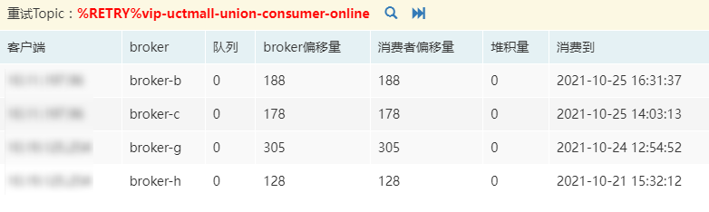
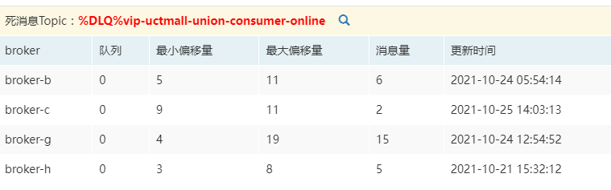
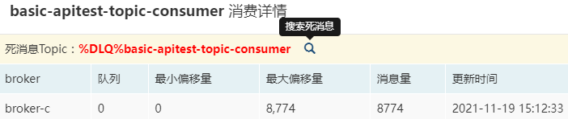
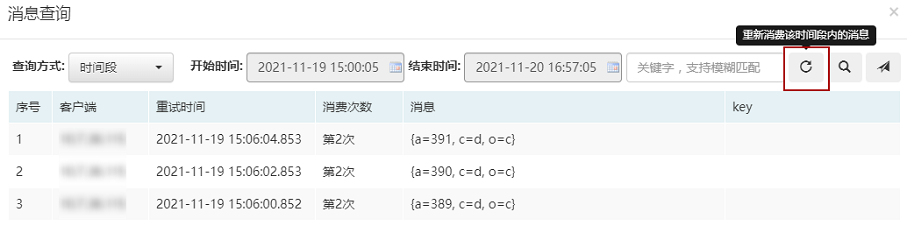
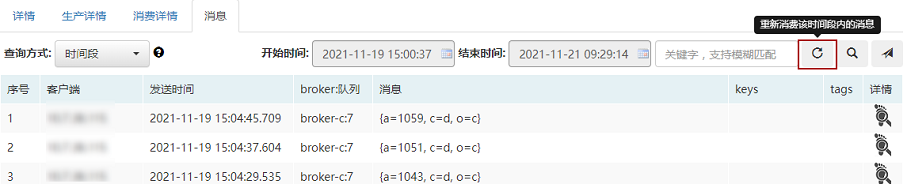

## 一、<span id="spring-boot">初始化之spring-boot方式</span>

```
@Configuration
public class MQConfiguration {

    @Value("${flushCache.consumerGroup}")
    private String flushCacheConsumer;

    @Value("${flushCache.topic}")
    private String flushCacheTopic;
    
    @Bean(initMethod = "start", destroyMethod = "shutdown")
    public ${consumer} flushCacheConsumer(FlushCacheConsumerCallback consumerCallback) {
        ${consumer} consumer = new ${consumer}(flushCacheConsumer, flushCacheTopic);
        consumer.setConsumerCallback(consumerCallback);
        return consumer;
    }
}
```

## 二、<span id="spring-xml"> 初始化之spring xml方式</span>

```
<bean id="consumer" class="com.sohu.tv.mq.rocketmq.${consumer}"
    init-method="start" destroy-method="shutdown">
    <constructor-arg index="0" value="${请从topic详情查询消费者的consumer group}"/>
    <constructor-arg index="1" value="${topic名字}"/>
    <property name="consumerCallback" ref="consumerCallbackBean"/> 
</bean>
```

##  三、<span id="java">初始化之java方式</span>

```
// 消费者初始化 注意：只用初始化一次
${consumer} consumer = new ${consumer}("xxx-consumer", "xxx-topic");
// 设置消费回调
consumer.setConsumerCallback(consumerCallback);
// 注意，只用启动一次
consumer.start();
// 应用退出时
consumer.shutdown();
```

## 四、<span id="consumerCallback">消费回调代码</span>

*注意：如下各种消费代码若抛出异常，则消息将发回rocketmq，进入重试队列。* 

1. <span id="consumeJson">json消费回调代码</span>

   ```
   ConsumerCallback consumerCallback = new ConsumerCallback<String, MessageExt>() {
       public void call(String t, MessageExt k) {
           // 打印日志，以便校验是否收到日志
           logger.info("msgExt:{},msg:{}", k, t);
           // 消费逻辑
       }
   }
   ```

2. <span id="consumeObject">对象消费回调代码（假设对象为Video）</span>

   ```
   ConsumerCallback consumerCallback = new ConsumerCallback<Video, MessageExt>() {
       public void call(Video t, MessageExt k) {
           // 打印日志，以便校验是否收到日志
           logger.info("msgExt:{},msg:{}", k, t);
           // 消费逻辑
       }
   }
   ```

3. map消费回调代码

   ```
   ConsumerCallback consumerCallback = new ConsumerCallback<Map<String, Object>, MessageExt>() {
       public void call(Map<String, Object> t, MessageExt k) {
           // 打印日志，以便校验是否收到日志
           logger.info("msgExt:{},msg:{}", k, t);
           // 消费逻辑
       }
   }
   ```

4. 批量消费

   ```
   // 设置批量消费最大消息数
   consumer.setConsumeMessageBatchMaxSize(32);
   // 设置批量消费BatchConsumerCallback
   consumer.setBatchConsumerCallback(new BatchConsumerCallback<String, ConsumeConcurrentlyContext>(){
       public void call(List<MQMessage<String>> batchMessage, ConsumeConcurrentlyContext context) throws Exception {
           int index = 0;
           try {
               for(; index < batchMessage.size(); ++index) {
                   MQMessage<String> mqMessage = batchMessage.get(index);
                   // 打印日志
                   logger.info("msgExt:{},msg:{}",  mqMessage.getMessageExt(), mqMessage.getMessage());
                   // 消费逻辑
               }
           } catch (Exception e) {
               logger.error("consume err, msgid:{}, msg:{}", batchMessage.get(index).getMessageExt().getMsgId(), batchMessage.get(index).getMessage(), e);
               // 异常处理尤为重要，这里涉及到哪些消息需要重试的问题，分为如下两种情况：
               // ① 若再次将异常抛出，那么本批消息将整体重新消费
               // throw e; 
               // ② 若不抛出异常，设置上ackIndex参数并返回，则ackIndex之后的消息将重新消费
               // context.setAckIndex(index);
               // return;
           }
       }
   });
   ```

   ​

## 五、<span id="offset">广播模式消费者需要注意</span>

广播模式offset默认存储在应用服务器~/.rocketmq_offsets文件夹下，如果应用部署在docker上，重新部署会导致offset文件丢失，丢失后默认会从broker上拉取最新的offset，那么可能会导致部分消息消费不到。可以通过单独指定offset存储的目录来防止这种情况：

```
-Drocketmq.client.localOffsetStoreDir=/data/logs/.rocketmq_offsets
```

## 六、<span id="explain">消费常见问题<span>：

1. 如何控制本地缓存的消息量？

   由于消息是先从broker拉取到本地，然后再进行消费的，那为了防止把本地内存打爆，可以通过如下参数控制：

   1.`pullThresholdForQueue`：每个本地队列缓存的消息数量，默认1000。

   消费者本地缓存的消息数量为：总队列数*`pullThresholdForQueue`

   例如，如下topic总队列数量为：48，那么默认缓存消息数量为48 * 1000 = 4.8万条

   

   2.`pullThresholdForTopic`：针对整个topic限制消息数量，默认无限制。

   此参数优先级高于`pullThresholdForQueue`。

   3.对于以上两个参数，有对应的根据消息大小来设置的参数，分别为`pullThresholdSizeForQueue`(默认为100)和`pullThresholdSizeForTopic`(默认无限制)，其单位为M。

   **以上参数仅仅是设置消费者本地缓存的消息量，达到阈值时，会进行限流操作：即不再从broker拉取消息到本地缓存。**

   4.`pullBatchSize`：控制每个队列每次拉取多少条消息，默认最大32条(broker端有限制)。

   5.`pullInterval(默认为0)`：控制每个队列每隔多长时间从broker拉取一次消息，默认不停拉取。

2. 如何控制消费线程数？

   `consumeThreadMin(默认为20)`和`consumeThreadMax(默认为64)`，默认至少有20个消费线程。

   例如，将`consumeThreadMin`和`consumeThreadMax`同时设置为1，这样就变成单线程消费了。

3. <span id="orderConsumer">如何实现顺序消费？</span>

   以下内容部分摘自rocketmq开发手册。

   1.什么是顺序消息？

   `消费消息的顺序要同发送消息的顺序一致。`

   *在RocketMQ中，主要指的是局部顺序，即一类消息为满足顺序性，生产者必须单线程顺序发送到同一个队列，这样消费者就可以按照生产者发送的顺序去消费消息。*

   如何发送有序消息？请参考[发送有序消息示例](clientProducer#produceOrderMessage)。

   首先需要了解一下两种顺序性：

   2.<span id="normalOrder">普通顺序(局部有序)</span>

   ```
   顺序消息的一种，正常情况下可以保证完全的顺序消息，但是一旦发生通信异常，Broker重启等，由于队列总数发生发化，哈希取模后定位的队列会发化，产生短暂的消息顺序不一致。如果业务能容忍在集群异常情下（比如某个Broker宕机或者重启）下，消息短暂的乱序，使用普通顺序方式比较合适。
   ```

   3.<span id="strictOrder">严格顺序(全局有序)</span>

   ```
   顺序消息的一种，无论正常异常情况都能保证顺序，但是牺牲了分布式Failover特性，即Broker集群中只要有一台机器不可用，则整个集群都不可用，服务可用性大大降低。
   ```

   所以，推荐使用**普通顺序**的消费方式。

   4.消费者如何实现顺序消费？

   前提是消息是生产者以有序的方式生产的，消费者仅需设置`setConsumeOrderly(true)`即可。

   另外，如果使用顺序方式消费，可能会存在如下问题：

   * 消费顺序消息的并行度依赖于队列数量。
   * 队列热点问题，个别队列由于哈希不均导致消息过多，消费速度跟不上，产生消息堆积问题。
   * 遇到消息失败的消息，无法跳过，当前队列消费只能暂停。

4. <span id="limitConsumer">匀速消费？</span>

   如果有如下需求：

   1. 突然大量消息涌入时，希望能够均匀消费，避免服务被消息冲垮；
   2. 较为精准的控制消息消费速率；

   可以在消费者初始化时按照如下方式设置：

   ```
   consumer.setEnableRateLimit(true);
   consumer.setRate(50);
   ```

   rate的含义为每秒消费多少条消息，50即每秒消费50条消息。

   另外，客户端版本在4.6.5及以上，支持不重启服务的情况下，在MQCloud里进行动态开启(MQCloud设置的配置优先级高于本地)：

   

5. <span id="pauseConsumer">暂停消费？</span>

   如果业务端遇到某些问题，需要暂停消息消费，在不重启服务时(客户端版本在4.6.5及以上)，可以在MQCloud里进行动态设置：

   

6. <span id="idempotent">幂等消费</span>

   RocketMQ默认不支持幂等消费，MQCloud采用redis来保障全局唯一，实现了幂等消费(只支持集群模式)。

   如果需要使用幂等功能需要依赖redis客户端，类似如下：

   ```
   <dependency>
       <groupId>redis.clients</groupId>
       <artifactId>jedis</artifactId>
       <version>3.3.0</version>
   </dependency>
   ```

   在消费者启动之前，增加如下代码即可：

   ```
   consumer.setRedis(RedisBuilder.build(jedisCluster, 2100));
   ```

   其中第一个参数是jedis实例（可以为集群或单个），第二个参数为jedis超时的最大时间，更多构建方法请参考`RedisBuilder`。 

   默认情况下，MQCloud采用RocketMQ发送消息时客户端的Message ID来进行去重，其组成如下：

   ```
   ip+pid+类加载器hash+系统时间戳+自增序号
   ```

   即无论是否在在同一jvm内，并发生成，也不存在重复的可能。

   **但是不建议使用它作为唯一键进行去重，因为相同的消息对应的Message ID可能不同。**

   所以建议在发送消息时设置幂等id来保障唯一性，如下：

   ```
   MQMessage<String> message = MQMessage.build("message").setKeys("k1").setIdempotentID("1102123");
   Result<SendResult> result = producer.send(message);
   ```

   比如订单业务，建议使用订单号作为幂等id。

   这里的幂等是有时间窗口的，默认为3分钟，即3分钟内的重复消息只会消费一条，可以修改这个时间窗口：

   ```
   consumer.setDeduplicateWindowSeconds(600);
   ```

   由于幂等实现依赖了redis，为了防止redis故障影响业务方，MQCloud使用了Hystrix隔离了redis操作。

   即当redis故障时，幂等逻辑将失效，消费业务将不受影响，继续消费。

   这里说明一点，MQCloud实现的幂等逻辑的同时保障消息不丢失，所以如下情况幂等逻辑将失效：

   1. redis故障、调用异常、超时等。
   2. 消费失败的消息（其将进入重试队列，为了保障消费成功，此种消息不再执行去重）。
   3. 消费时间超过幂等时间窗口的消息。

7. <span id="retry">重试队列</span>

   消费消息时，如果抛出异常，则消息会进入重试队列，在消费详情可以看到重试队列：

   

   重试队列的名称以%RETRY%开头，点击搜索按钮可以查找重试的消息，并支持跳过重试的消息。

   进入重试队列的消息将以如下衰减频率进行重试消费：

   | 第几次重试 | 距上次重试的间隔时间 |
   | ----- | ---------- |
   | 1     | 10秒        |
   | 2     | 30秒        |
   | 3     | 1分钟        |
   | 4     | 2分钟        |
   | 5     | 3分钟        |
   | 6     | 4分钟        |
   | 7     | 5分钟        |
   | 8     | 6分钟        |
   | 9     | 7分钟        |
   | 10    | 8分钟        |
   | 11    | 9分钟        |
   | 12    | 10分钟       |
   | 13    | 20分钟       |
   | 14    | 30分钟       |
   | 15    | 1小时        |
   | 16    | 2小时        |

   即进入重试队列的消息在总共4小时46分内进行16次重试后（任何一次成功将结束重试机制），仍然失败，将会进入死信队列，死信队列的名称以%DLQ%开头，类似如下：

   

   点击搜索按钮可以查找哪些消息变成了死消息，并可以重新发送消费。

8. <span id="retryTimespan">按照时间段**重新消费**</span>

   当需要重新消费某几条消息时，可以查出来后，选中并发送到MQCloud后台，MQCloud会将需要重发的消息发送到重试队列，客户端会自动消费这些消息。

   但是，如果需要重新消费的消息量很大时，这样操作显然很不方便，为此MQCloud支持按照时间段消费的功能，具体有如下两个入口：

   1. 重新消费死信队列：

      从消费详情，死消息模块，点击搜索按钮：

      

      选择时间段查询，点击重新消费按钮申请重新消费：

      

   2. 重新消费正常队列：

      在消息查询模块，按照时间段搜索死消息后，点击重新消费按钮申请重新消费：

      

   此功能只支持选择一个实例进行消费，后台审核通过后，将从集群的slave节点拉取消息消费。

9. <span id="skipAccumulation">主动跳过堆积</span>

   如果消费发生了堆积，而消息又可以丢弃的情况，可以在消费代码中使用如下逻辑跳过堆积的消息：

   ```
   ConsumerCallback consumerCallback = new ConsumerCallback<String, MessageExt>() {
       public void call(String t, MessageExt m) {
           // 获取队列里面未消费的消息数量
           long queueMessageCount = Long.parseLong(m.getProperty("MAX_OFFSET")) - m.getQueueOffset();
           // 获取消息的延迟时间
           long timeDelay = System.currentTimeMillis() - m.getBornTimestamp();
           // 堆积超过10万条或延迟超过3小时，跳过此消息
           if (queueMessageCount > 100000 || timeDelay > 3 * 60 * 60 * 1000L) {
               return;
           }
           // 消费逻辑
       }
   }
   ```

   ​

   ​

   ​

