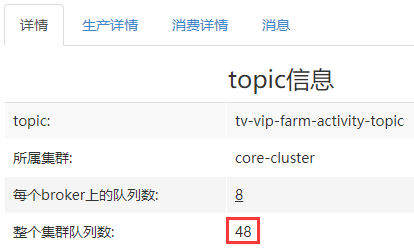
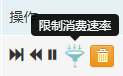
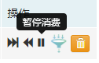

## 一、<span id="spring-boot">初始化之spring-boot方式</span>

**老用户请先通过首页“关联资源”入口关联消费者**

```
@Configuration
public class MQConfiguration {

    @Value("${flushCache.consumerGroup}")
    private String flushCacheConsumer;

    @Value("${flushCache.topic}")
    private String flushCacheTopic;
    
    @Bean(initMethod = "start", destroyMethod = "shutdown")
    public ${consumer} flushCacheConsumer(FlushCacheConsumerCallback consumerCallback) {
        ${consumer} consumer = new ${consumer}(flushCacheConsumer, flushCacheTopic);
        consumer.setConsumerCallback(consumerCallback);
        return consumer;
    }
}
```

## 二、<span id="spring-xml"> 初始化之spring xml方式</span>

```
<bean id="consumer" class="com.sohu.tv.mq.rocketmq.${consumer}"
    init-method="start" destroy-method="shutdown">
    <constructor-arg index="0" value="${请从topic详情查询消费者的consumer group}"/>
    <constructor-arg index="1" value="${topic名字}"/>
    <property name="consumerCallback" ref="consumerCallbackBean"/> 
</bean>
```

##  三、<span id="java">初始化之java方式</span>

```
// 消费者初始化 注意：只用初始化一次
${consumer} consumer = new ${consumer}("xxx-consumer", "xxx-topic");
// 设置消费回调
consumer.setConsumerCallback(consumerCallback);
// 注意，只用启动一次
consumer.start();
// 应用退出时
consumer.shutdown();
```

## 四、<span id="consumerCallback">消费回调代码</span>

1. <span id="consumeJson">json消费回调代码</span>

   ```
   ConsumerCallback consumerCallback = new ConsumerCallback<String, MessageExt>() {
       public void call(String t, MessageExt k) {
               try {
                   // 打印日志
                   logger.info("msg:{}, msgExt:{}", t, k);
                   // 消费逻辑
               } catch (Exception e) {
                   logger.error("consume err, msgid:{}, msg:{}", k.getMsgId(), t, e);
                   // 如果需要重新消费，这里需要把异常抛出，消费失败的消息将发回rocketmq，重试消费
                   throw e;
               }
       }
   }
   ```

2. <span id="consumeObject">对象消费回调代码（假设对象为Video）</span>

   ```
   ConsumerCallback consumerCallback = new ConsumerCallback<Video, MessageExt>() {
       public void call(Video t, MessageExt k) {
               try {
                   // 打印日志
                   logger.info("msg:{}, msgExt:{}", t, k);
                   // 消费逻辑
               } catch (Exception e) {
                   logger.error("consume err, msgid:{}, msg:{}", k.getMsgId(), t, e);
                   // 如果需要重新消费，这里需要把异常抛出，消费失败的消息将发回rocketmq，重试消费
                   throw e;
               }
       }
   }
   ```

3. map消费回调代码

   ```
   ConsumerCallback consumerCallback = new ConsumerCallback<Map<String, Object>, MessageExt>() {
       public void call(Map<String, Object> t, MessageExt k) {
               try {
                   // 打印日志
                   logger.info("msg:{}, msgExt:{}", t, k);
                   // 消费逻辑
               } catch (Exception e) {
                   logger.error("consume err, msgid:{}, msg:{}", k.getMsgId(), t, e);
                   // 如果需要重新消费，这里需要把异常抛出，消费失败的消息将发回rocketmq，重试消费
                   throw e;
               }
       }
   }
   ```

4. 批量消费

   ```
   // 设置批量消费最大消息数
   consumer.setConsumeMessageBatchMaxSize(32);
   // 设置批量消费BatchConsumerCallback
   consumer.setBatchConsumerCallback(new BatchConsumerCallback<String, MessageExt>(){
       public void call(List<MQMessage<String, MessageExt>> batchMessage) throws Exception {
           MQMessage<String, MessageExt> tmpMessage = null;
           try {
               for(MQMessage<String, MessageExt> mqMessage : batchMessage) {
                   tmpMessage = mqMessage;
                   // 打印日志
                   logger.info("msg:{}, msgExt:{}", mqMessage.getMessage(), mqMessage.getMessageExt());
                   // 消费逻辑
               }
           } catch (Exception e) {
               logger.error("consume err, msgid:{}, msg:{}", tmpMessage.getMessageExt().getMsgId(), tmpMessage.getMessage(), e);
               // 如果需要重新消费，这里需要把异常抛出。注意：抛出异常后这批消息将重新消费
               throw e;
           }
       }
   });
   ```

   ​

## 五、<span id="offset">广播模式消费者需要注意</span>

广播模式offset默认存储在应用服务器~/.rocketmq_offsets文件夹下，如果应用部署在docker上，重新部署会导致offset文件丢失，丢失后默认会从broker上拉取最新的offset，那么可能会导致部分消息消费不到。可以通过单独指定offset存储的目录来防止这种情况：

```
-Drocketmq.client.localOffsetStoreDir=/data/logs/.rocketmq_offsets
```

## 六、<span id="explain">消费常见问题<span>：

1. 如何控制本地缓存的消息量？

   由于消息是先从broker拉取到本地，然后再进行消费的，那为了防止把本地内存打爆，可以通过如下参数控制：

   1.`pullThresholdForQueue`：每个本地队列缓存的消息数量，默认1000。

   消费者本地缓存的消息数量为：总队列数*`pullThresholdForQueue`

   例如，如下topic总队列数量为：48，那么默认缓存消息数量为48 * 1000 = 4.8万条

   

   2.`pullThresholdForTopic`：针对整个topic限制消息数量，默认无限制。

   此参数优先级高于`pullThresholdForQueue`。

   3.对于以上两个参数，有对应的根据消息大小来设置的参数，分别为`pullThresholdSizeForQueue`(默认为100)和`pullThresholdSizeForTopic`(默认无限制)，其单位为M。

   **以上参数仅仅是设置消费者本地缓存的消息量，达到阈值时，会进行限流操作：即不再从broker拉取消息到本地缓存。**

   4.`pullBatchSize`：控制每个队列每次拉取多少条消息，默认最大32条(broker端有限制)。

   5.`pullInterval(默认为0)`：控制每个队列每隔多长时间从broker拉取一次消息，默认不停拉取。

2. 如何控制消费并发量？

   1.可以通过如下参数控制消费的线程数：

   `consumeThreadMin(默认为20)`和`consumeThreadMax(默认为64)`，默认至少有20个消费线程。

   例如，将`consumeThreadMin`和`consumeThreadMax`同时设置为1，这样就变成单线程消费了。

   2.可以通过如下参数控制多少条消息作为一批被某个线程消费：

   `consumeMessageBatchMaxSize(默认为1)`，默认表示每条消息需要一个线程来处理。

   **若非有必要不建议修改此值，因为可能产生重复消费。比如修改为3，那么一个线程可以处理3条消息，假如前2条消费成功，第3条消费失败，此时如果抛出异常，将导致这3条再次重新消费。**

   *原因是由于rocketmq针对一批消息使用同一个标识来判断是否消费成功。*

   *当然，如果不依赖rocketmq的消息重试机制可以不用关心这个问题。*

3. 每秒消费最多1000条消息，该如何实现？

   假设broker数量为2，每个broker上8个队列，总队列数为16。

   ```
   pullThresholdForQueue=1000/16≈63
   pullBatchSize=20
   pullInterval=300
   ```

   释义：这样每个队列每秒拉取20*(1000/300)=60条消息，总缓存消息1000条。

   如果不想计算队列数量怎么办？

   可以设置`pullThresholdForTopic=1000`，但是这个不是很准确，因为需要计算队列数，进行均分。

4. <span id="orderConsumer">如何实现顺序消费？</span>

   以下内容部分摘自rocketmq开发手册。

   1.什么是顺序消息？

   `消费消息的顺序要同发送消息的顺序一致。`

   *在RocketMQ中，主要指的是局部顺序，即一类消息为满足顺序性，生产者必须单线程顺序发送到同一个队列，这样消费者就可以按照生产者发送的顺序去消费消息。*

   如何发送有序消息？请参考[发送有序消息示例](clientProducer#produceOrderMessage)。

   首先需要了解一下两种顺序性：

   2.<span id="normalOrder">普通顺序(局部有序)</span>

   ```
   顺序消息的一种，正常情况下可以保证完全的顺序消息，但是一旦发生通信异常，Broker重启等，由于队列总数发生发化，哈希取模后定位的队列会发化，产生短暂的消息顺序不一致。如果业务能容忍在集群异常情下（比如某个Broker宕机或者重启）下，消息短暂的乱序，使用普通顺序方式比较合适。
   ```

   3.<span id="strictOrder">严格顺序(全局有序)</span>

   ```
   顺序消息的一种，无论正常异常情况都能保证顺序，但是牺牲了分布式Failover特性，即Broker集群中只要有一台机器不可用，则整个集群都不可用，服务可用性大大降低。
   ```

   所以，推荐使用**普通顺序**的消费方式。

   4.消费者如何实现顺序消费？

   前提是消息是生产者以有序的方式生产的，消费者仅需设置`setConsumeOrderly(true)`即可。

   另外，如果使用顺序方式消费，可能会存在如下问题：

   * 消费顺序消息的并行度依赖于队列数量。
   * 队列热点问题，个别队列由于哈希不均导致消息过多，消费速度跟不上，产生消息堆积问题。
   * 遇到消息失败的消息，无法跳过，当前队列消费只能暂停。

5. <span id="limitConsumer">匀速消费？</span>

   如果有如下需求：

   1. 突然大量消息涌入时，希望能够均匀消费，避免服务被消息冲垮；
   2. 较为精准的控制消息消费速率；

   可以在消费者初始化时按照如下方式设置：

   ```
   consumer.setEnableRateLimit(true);
   consumer.setRate(50);
   ```

   rate的含义为每秒消费多少条消息，50即每秒消费50条消息。

   另外，客户端版本在4.6.5及以上，支持不重启服务的情况下，在MQCloud里进行动态开启(MQCloud设置的配置优先级高于本地)：

   

6. <span id="pauseConsumer">暂停消费？</span>

   如果业务端遇到某些问题，需要暂停消息消费，在不重启服务时(客户端版本在4.6.5及以上)，可以在MQCloud里进行动态设置：

   

