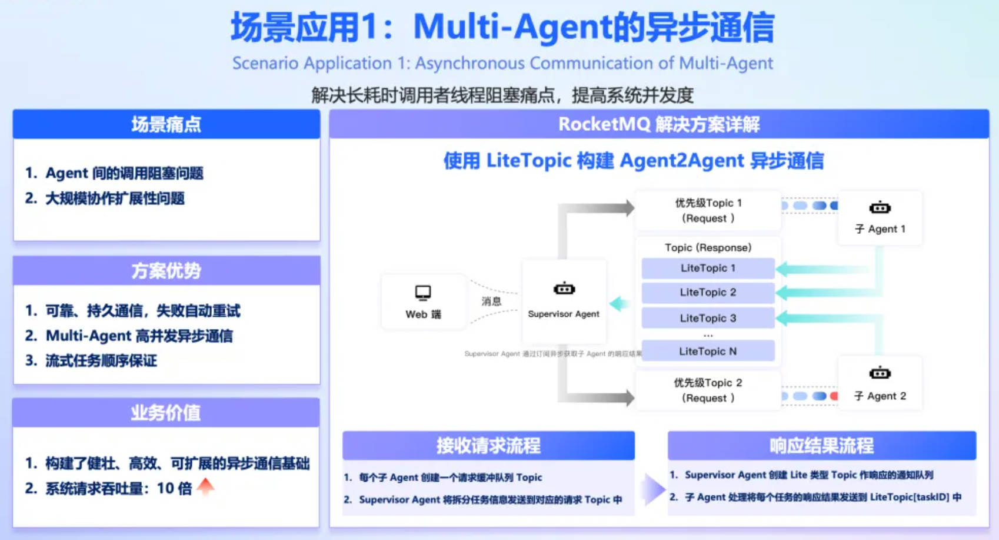
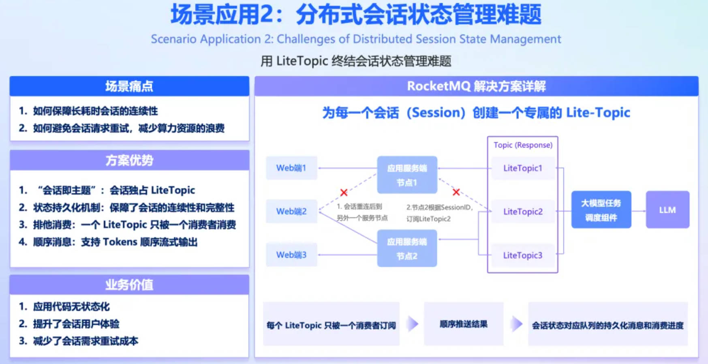

# 一、轻量消息

轻量消息是相对于RocketMQ普通的topic来说的，它具有以下特点：

* 轻量资源：支持在父topic下创建百万数量级的子topic，满足大规模需求。
* 自动化生命周期管理：子topic支持在生产或消费时自动创建，到期自动回收资源。
* 支持常见push/pull消费。


# 二、<span id="produce">新建父Topic</span>

新建topic时选中消息类型为轻量消息，如下：


那么，该topic将作为轻量消息的父topic，发送消息可以任意指定子topic，发送代码如下：

```
MQMessage message = MQMessage.build("message")
        .addLiteTopic("liteTopic1")
        .addLiteTopic("liteTopic2");
Result<SendResult> sendResult = producer.send(message);
if (!sendResult.isSuccess) {
    //失败消息处理
}
```

当子topic最后发送消息时间超过24小时（默认），并且没有消费者消费时，将会回收相关资源。

另外，由于子topic是动态的，不会进行相关监控统计，新建父topic时可以开启trace功能，方便消息追查。

**注意：** 内部存储会以父子topic总长度计算，故建议父子topic名字尽量短，总长度不超过100个字符。


# 三、<span id="consume">消费</span>

消费代码如下：

```
LmqConsumer consumer = new LmqConsumer(String consumerGroup, String parentTopic, String liteTopic)
```

参数含义：

* parentTopic是申请轻量消息时父topic的名字
* consumerGroup是消费组名称，支持动态创建，功能与普通消费者类似。
* liteTopic是轻量topic名，支持动态创建。

其他使用方式与普通消费者一样，默认采用集群方式消费，即同一个consumerGroup下的所有实例平分消息，如果想使用广播模式，可以进行如下设置：

```
consumer.setMessageModelToBroadcasting()
```

**注意**：轻量消费不支持普通的降级重试机制，如果消费失败将按照固定频率（5秒一次）进行重试，达到maxReconsumeTimes（默认为16）次后，不再重试。

# 四、 应用场景介绍

这些场景均来自官方关于LiteTopic的介绍，具体请参考[官方案例](https://mp.weixin.qq.com/s/VwiV5cdhkqEax6q1D4V4RA)：

1. Multi-Agent异步通信

   随着AI需求场景变得更加复杂，大多数单Agent在复杂场景中面临着局限性：缺乏专业化分工、难以对多领域进行整合；无法实现动态协作决策。单Agent应用和单Agent工作流会逐步转向 Multi-Agent 应用。但因为 AI 任务长耗时的特点，同步调用会造成调用者的线程阻塞，存在大规模协作扩展性问题。

   

   如上图所示 Multi-Agent的工作流程为：Supervisor Agent 负责将需求拆分给两个子Agent；两个子Agent负责各自领域问题解答并将结果返回给Supervisor Agent； Supervisor Agent将结果汇总返回给Web端。使用 LiteTopic异步通信方案流程如下：

   1. 在接收请求的流程中
      1. 为每个子Agent创建一个普通Topic用于请求任务的缓冲队列。
      2. Supervisor Agent 将拆分任务信息发送到对应的请求主题中。
   2. 在返回响应结果流程中
      1. Supervisor Agent 创建LiteTopic，可以使用问题ID或任务ID，并订阅。
      2. 子 Agent 处理将每个任务的响应结果发送到专属的LiteTopic中。
      3. Supervisor Agent实时获取结果，然后通过HTTP SSE协议推送给Web端。

   ​

2. 分布式会话状态管理

   AI 应用的交互模式具有特殊性，即长耗时、多轮次且高度依赖高成本计算的会话。当应用依赖 SSE 等长连接时，一旦连接中断（如网关重启、连接超时、网络不稳定触发），不仅会导致当前会话上下文的丢失，更会直接造成已投入的 AI 任务作废，从而浪费宝贵的算力资源。

   

   如上图所示，这里每个LiteTopic可以使用 SessionID 命名，这样会话结果都作为消息在这个主题中有序传递。长连接重连后继续保持会话的连续性的解决方案如下：

   1. Web端2 和 应用服务节点1 建立长链接，创建会话。
   2. 应用服务节点1 监听 LiteTopic [SessionID]。
   3. 大模型任务调度组件，根据请求的SessionID信息，将返回结果发送到 LiteTopic [SessionID]
   4. 由于网络等异常，WebSocket 自动重连到了应用服务节点2。
   5. 应用服务节点1 取消订阅LiteTopic [SessionID]，应用服务节点2 订阅LiteTopic [SessionID]。
   6. LiteTopic [SessionID] 根据之前的消费进度，将后续未消费的消息继续推送给应用服务节点2，保证了会话状态和会话数据的连续性。