## 一、查询方式

目前支持以下查询方式：

1. 按照偏移量查询
2. 按照key查询
3. 按照时间段查询
4. 按照消息id查询
5. 按照trace查询

下面进行一一介绍。

## 二、按照偏移量查询

*由于必须输入broker偏移量，适用于精确查询。*

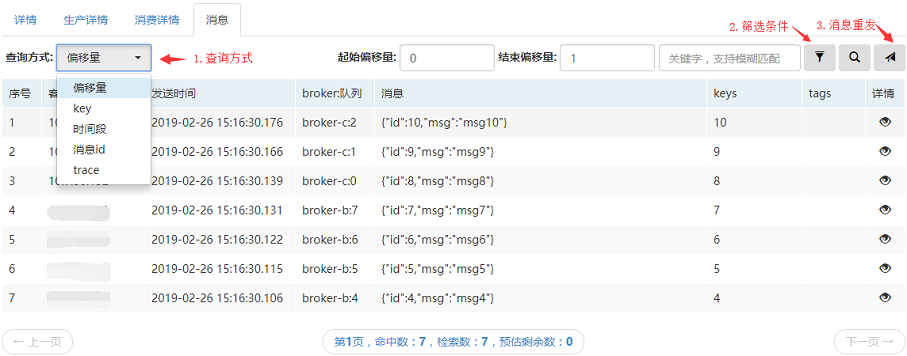

**起始偏移量**：参考生产详情里<a href="topic#produce">broker的最小偏移量</a>。

**结束偏移量**：参考生产详情里<a href="topic#produce">broker的最大偏移量</a>。

**关键字**：如果期望查到的消息包含某些字符，可以在此填入。

**筛选条件**：可以选择在某个broker查询，或者broker的某个队列。

**消息重发**：针对查出来的消息，可以单击选中（支持shfit或ctrl多选），点击重发按钮，即会把选中消息的重发请求发送到管理后台，管理员审核通过后进行重发。

**详情**：点击详情的眼睛图标，可以看到消息的生产消费轨迹（非trace）：

## 三、按照key查询

*适用于生产消息时发送了<a href="clientProducer#produceMessage">keys</a>字段的topic*

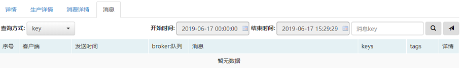

**开始时间**：消息的最小时间。

**结束时间**：消息的最大时间。

**消息key**：发送时传的keys参数。

**建议消费发送方传递参数keys，因为RocketMQ会根据keys建立索引，这样根据keys查询时会很快。**

**例如，keys可以指定为订单号，那么在这里查询时，输入一个订单号，所有此订单相关的消息均会查到。**

## 四、按照时间段查询

*适用于没有传递keys，但是想根据时间来检索消息*

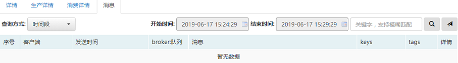

**开始时间**：消息的最小时间。

**结束时间**：消息的最大时间。

**关键字**：如果期望查到的消息包含某些字符，可以在此填入。

*与按照key查询方式不同，这样查询消息没有索引，耗时会比较长。*

## 五、按照消息id查询

*适用于用户知道消息id的情况*

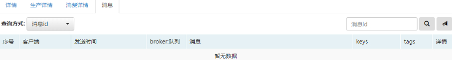

**消息id**：此处的消息id是[SendResult](https://github.com/apache/rocketmq/blob/master/client/src/main/java/org/apache/rocketmq/client/producer/SendResult.java)里的offsetMsgId。

## 六、按照trace查询

*适用于申请新建topic时，开启了trace功能。*

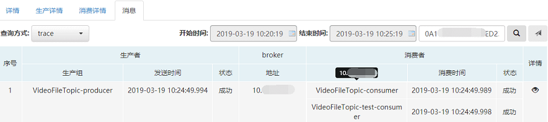

如果该topic开启了trace功能，可以从之前4种查询方式的消息结果页，通过点击消息前的序号跳到此trace页面。

点击详情的眼睛图标，可以看到trace的详细数据：

**生产者trace详情**：

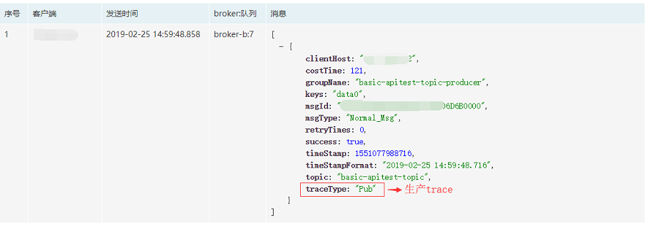

**消费者trace详情**：

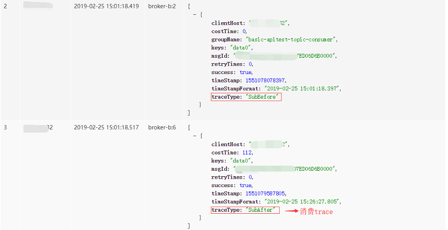

## 七、查询定时消息
*适用于时间轮定时消息查询。*

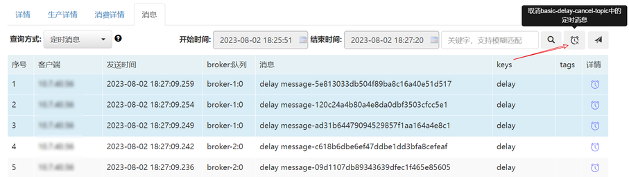

**取消定时消息**

取消定时消息首先需要查询出待取消的定时消息，然后选择需要取消的定时消息，点击取消按钮即可，取消完成后，会在消息列表中标注已取消的消息，如下图所示：

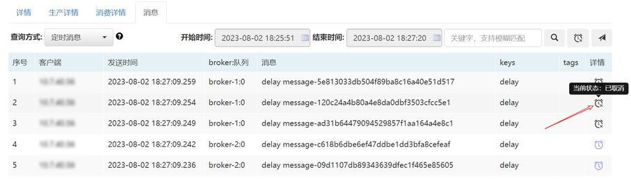

已完成投递的定时消息，可点击序号进入key查询页面，查询消息详情，如下图所示：

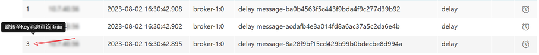

未完成投递或取消状态下的定时消息，可点击序号进入定时消息追踪页面，如下图所示：

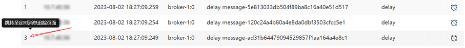

在定时消息追踪页面中可查询定时消息的滚动轨迹，如下图所示：

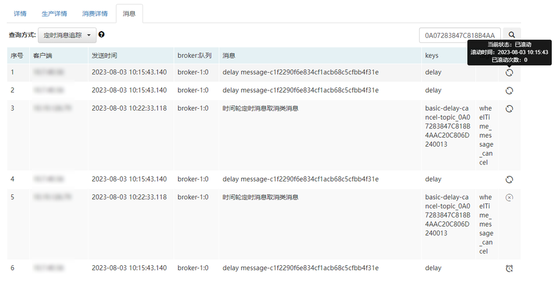

#### 状态说明：

- 图标：
  - 已滚动：表示当前定时消息延迟时间超过Broker配置的滚动窗口时间，在Broker端发生了滚动写入。
  - 滚动时间：表示当前记录滚动写入的时间。
- 图标：
  - 未生效：表示当前取消类系统消息未生效，即未到达取消时间。
  - 已生效：表示当前取消类系统消息已生效，即已取消目标消息。
  - 生效时间：表示当前系统消息发生取消作用的时间。
- 图标：
  - 已投递：表示当前定时消息投递到真实业务Topic中，已能被消费者感知。
  - 未投递：表示当前定时消息还处于系统定时Topic中，不能被消费者感知。
  - 投递时间：表示当前定时消息投递到真实业务Topic的时间。
- 图标：
  - 已取消：表示当前定时消息取消操作已触发，将不会被消费者消费。
  - 未取消：表示当前定时消息取消操作还未触发，还需等待到达取消时间触发。
  - 原始投递时间：表示该消息初始被设定的定时时间。