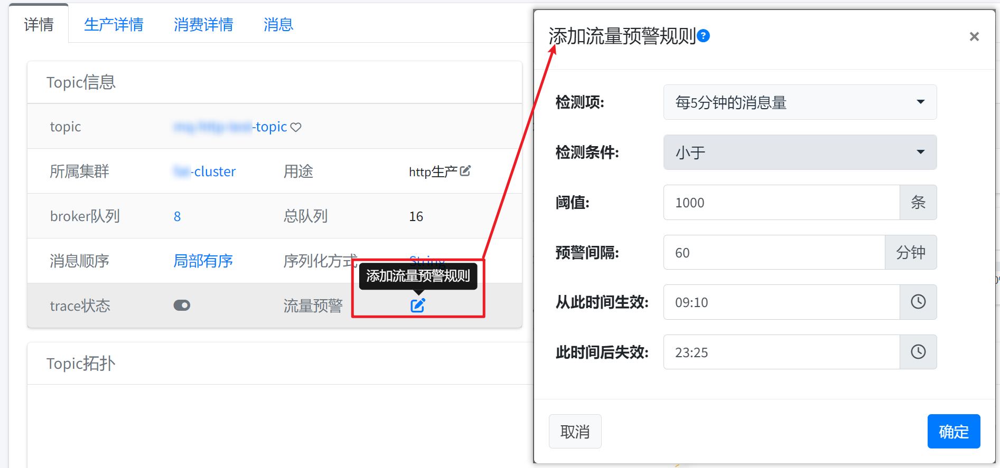
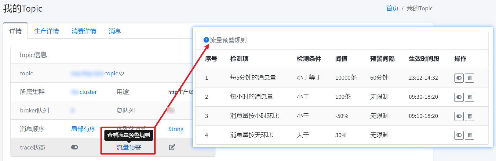

## 一、消费堆积预警

*默认堆积的消息达到10000条并且超过5分钟进行预警，预警一次，一小时最多预警一次。*

## 二、消费阻塞

*只针对push方式局部有序的消费者，默认每5分钟阻塞达到10秒，预警一次，一小时最多预警一次。*

## 三、客户端异常

*使用MQCloud提供的客户端，生产失败的消息会每5分钟预警一次。*

## 四、消费失败

*针对集群消费方式的消费者，每小时消费失败量达到10次，预警一次。*

## 五、偏移量错误

*消费者消费的消息在broker上不存在时，一般是偏移量错误，此时会进行预警，预警频率：实时。*

## 六、订阅错误

*一个消费者订阅了多个topic时，进行预警。*

## 七、流量突增预警

*当检测到topic流量值超过设定的阈值时，进行预警。*

#### 流量统计分析方法介绍
目前采用的方法是基于前x天内每天流量最大值的统计分析。

1. 获取前x天的所有流量值数据。对于每一天的数据，剔除异常值后获取流量值的最大值；前x天
  共获取x条数据，然后对这x条数据取平均值和最大值，记为avgMax和maxMax。
2. 流量检测时，若检测到流量值超过设定的avgMax或maxMax百分比阈值时，进行预警。
3. 剔除异常值的认定标准、avgMax或maxMax百分比阈值等配置请咨询管理员了解具体情况。

## 八、自定义流量预警规则

除了流量突增预警，MQCloud也支持自定义流量预警规则，入口如下：

各个规则项含义如下：

* **检测项** 

  * 每5分钟的消息量：检测任务每5分钟执行一次，检测最近5分钟的消息量。
  * 每小时的消息量：检测任务每整小时执行一次，检测前一小时的消息量。
  * 每天的消息量：检测任务每天执行一次，检测昨日的消息量。
  * 消息量按5分钟环比：检测任务每5分钟执行一次，5分钟环比计算公式：(最近5分钟消息量-上一个5分钟消息量)/上一个5分钟消息量
  * 消息量按小时环比：检测任务每整小时执行一次，时环比计算公式：(最近1小时消息量-上一个1小时消息量)/上一个1小时消息量
  * 消息量按天环比：检测任务每天执行一次，日环比计算公式：(昨天消息量-前天消息量)/前天消息量

* **检测条件**：小于，大于，小于等于和大于等于。

* **阈值**：即和检测项比对的数值，需要注意的是，当检测项为环比时，会自动添加%，例如：

  期望消息量按小时环比阈值为25%，则阈值仅需要填写25即可，因为%会自动添加。

  另外，针对环比来说，阈值为正代表增加，为负代表减少，比如如下规则：

  * 消息量按天环比>50%：含义为昨天消息量比前天增加超过50%
  * 消息量按天环比<-50%：含义为昨天的消息量比前天减少超过50%

* **预警间隔**：在预警间隔时间内最多预警一次，针对不同的检测项请勿设置过低的预警间隔，比如：

  检测项为每小时的消息量，那么预警间隔设置为10分钟将没有意义，因为该规则一小时才会执行一次。

* **从此时间生效**到**此时间后失效**：即规则将在此时间段内预警，如果设置必须开始时间和结束时间都设置，比如：

  * 09:30到18:30：将在早上09:30到下午18:30之间预警
  * 22:10到12:30：将在晚上22:10到中午12:30之间预警

可以自定义多条规则，任意一条规则满足即预警。

可以从如下入口查看规则列表：

## 九、统计，监控，预警

关于这块的内容，感兴趣的可以参考开发指南的[统计监控预警](../developerGuide/statMonitorWarning)部分。