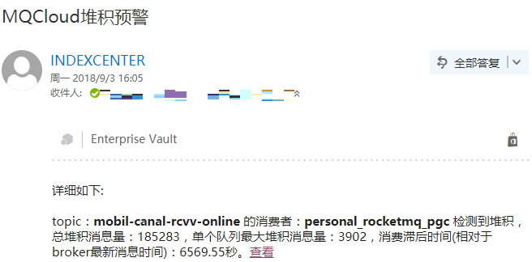
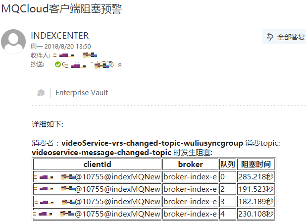
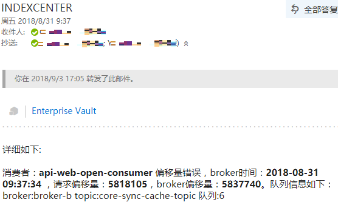

## 一、消费堆积预警

*默认每5分钟消息堆积量达到10000条，预警一次，一小时最多预警一次。广播模式消费者每小时检测并预警一次。*

## 二、客户端阻塞

*只针对push方式局部有序的消费者，默认每5分钟阻塞达到10秒，预警一次，一小时最多预警一次。*

## 三、客户端异常

*使用MQCloud提供的客户端，生产失败的消息会每5分钟预警一次。*

## 四、消费失败

*针对集群消费方式的消费者，每小时消费失败量达到10次，预警一次。*

## 五、偏移量错误

*消费者消费的消息在broker上不存在时，一般是偏移量错误，此时会进行预警，预警频率：实时。*

## 六、订阅错误

*一个消费者订阅了多个topic时，进行预警。*

## 七、流量异常预警

*当检测到topic流量值超过设定的阈值时，进行预警。*

#### 流量统计分析方法介绍
目前采用的方法是基于前x天内每天流量最大值的统计分析。

1. 获取前x天的所有流量值数据。对于每一天的数据，剔除异常值后获取流量值的最大值；前x天
共获取x条数据，然后对这x条数据取平均值和最大值，记为avgMax和maxMax。

2. 流量检测时，若检测到流量值超过设定的avgMax或maxMax百分比阈值时，进行预警。

3. 剔除异常值的认定标准、avgMax或maxMax百分比阈值等配置请咨询管理员了解具体情况。

## 八、统计，监控，预警

关于这块的内容，感兴趣的可以参考开发指南的[统计监控预警](../developerGuide/statMonitorWarning)部分。