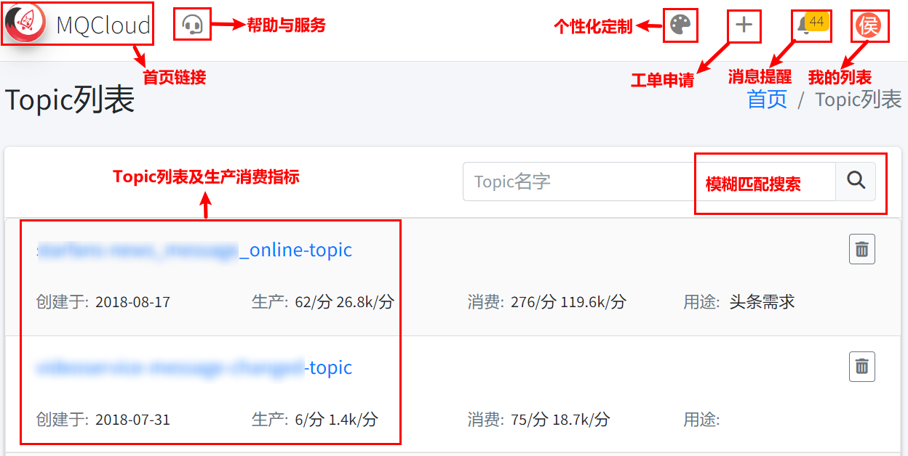
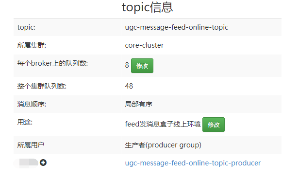
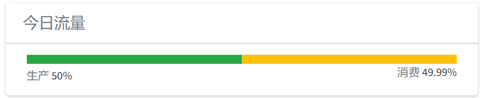
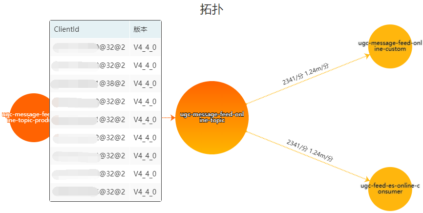
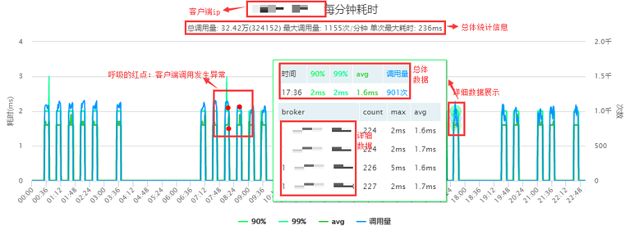
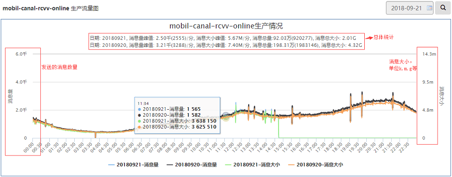
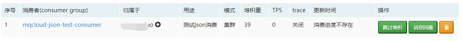
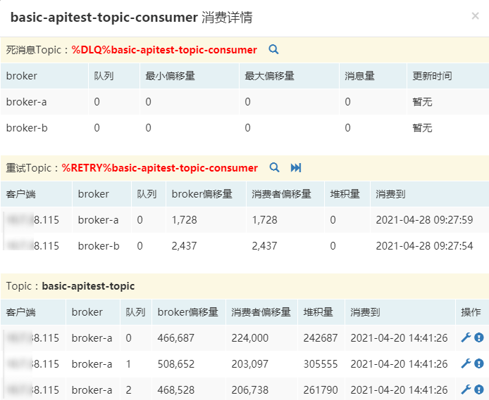
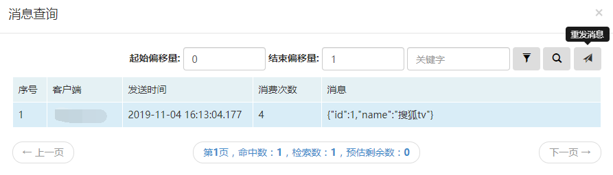
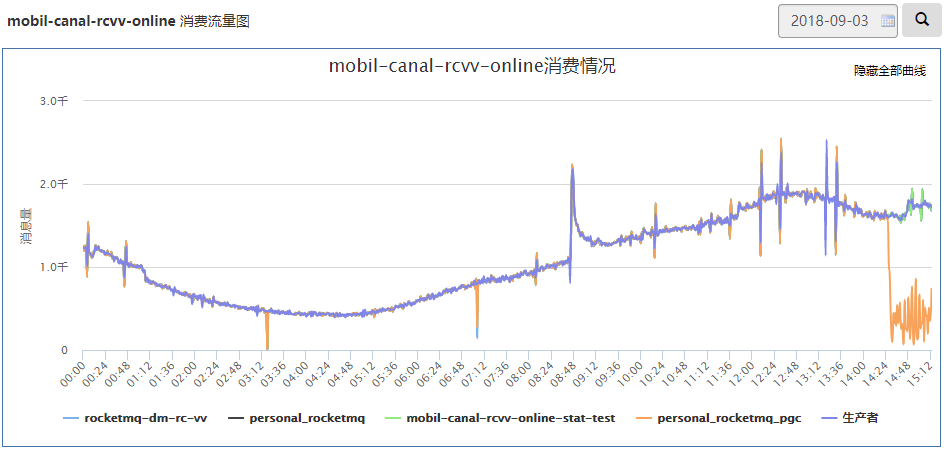

## 一、topic列表

## 二、topic详情

**1 topic概要**

各项释义如下：

**topic**：topic名字。

**所属集群**：topic归属的集群。

**每个broker上的队列数**：该topic在单个broker上的队列数。

**整个集群队列数**：该topic在整个集群上总的队列数。

**消息顺序**：创建topic时指定的选项。

**序列化方式**：目前有Protostuf和String两种类型。

**trace状态**：是否开启trace，生产者可以点击进行修改。

**所属用户**：该topic的申请者，通过下面的<b>+</b>号，可以关联其他生产用户，关联后其他用户可以看到此topic。

**生产者**：即producer group，应用代码里初始化时需要使用此选项。

关于**序列化方式**这里需要说明一下，序列化是mqcloud提供的客户端做的，rocketmq只存储二进制数据。一旦消息发送到了rocketmq，那么消息的序列化方式就定了。针对需要修改topic序列化方式的需求，mqcloud进行了兼容：

Protostuf改为String需要参考如下步骤进行：

1. 联系此topic的消费者，将客户端版本升级至最新版本（若已经是最新版本，忽略此步骤）。
2. 联系管理员修改topic的序列化方式为String。
3. 联系此topic的生产者修改为[String方式的发送代码](clientProducer#produceJson)。
4. 等待消费者把历史Protostuf消息消费完毕，修改为[String方式的消费代码](clientConsumer#consumeJson)。

String改为Protostuf需要参考如下步骤进行：

1. 联系管理员修改topic的序列化方式为Protostuf。
2. 联系此topic的消费者，将客户端版本升级至最新版本并进行重启（若已是最新版本直接重启）。
3. 联系此topic的生产者修改为[Protostuf方式的发送代码](clientProducer#produceObject)。
4. 等待消费者把历史String消息消费完毕，修改为[Protostuf的消费代码](clientConsumer#consumeObject)。

遵照以上步骤，修改topic序列化方式时可以保证消息生产不停止，消费无异常。

**2 今日流量**

展示今日生产和消费的流量占比。此图由于有两个消费者，所以消费流量是生产流量的2倍。

*对于集群消费，消费流量=所有消费组流量之和。*

*对于广播消费，消费流量=所有消费实例流量之和。*

**3 拓扑**

各项释义如下：

从左至右依次为 **生产者**->**topic**->**消费者**。

**生产者和topic，topic和消费者之间连线**：展示的是每分钟的次数和大小流量。

**生产者**和**消费者**：鼠标放到图标上会弹出所有链接的实例，格式为：ip@pid@集群id和版本。

在**生产者**图标上点击，会弹出相关统计数据，如下：

## 三、生产详情

**1 生产概览**

展示发往该topic的每个broker上的消息量及最后更新时间。

**2 生产流量**

展示发往该topic的流量，数据来自于broker端的统计。

## 四、消费详情

**1 消费概览**

展示消费该topic的每个消费者的消费情况，支持修改用途，开启/关闭trace(免审)，跳过堆积，消息回溯，暂停消费，消费限速等。

**2 消费详情**

点击某个消费者的名字，会弹出如下消费详情：

从上至下分为三部分：

第一部分：如果该消费者产生过死消息，这里将进行展示，支持查询死消息。

第二部分：如果该消费者产生过重试消息，这里进行展示，支持查询重试消息。

第三部分：该消费者每个客户端ip消费每个队列的详情。

针对重试消息和死消息，都提供了查询功能，如下展示的死消息的搜索（重试消息类似）：

**死消息提供了重发功能，与普通消息搜索模块一样，支持ctrl和shift进行多选后批量重发。**

针对重试消息，提供了**跳过**功能，如下：

**3 消费流量**

展示消费该topic的每个消费者的流量。